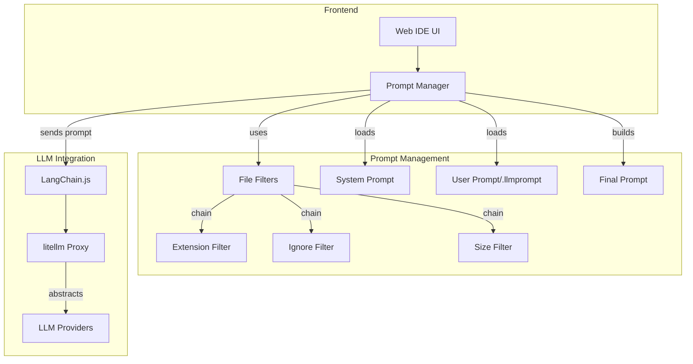
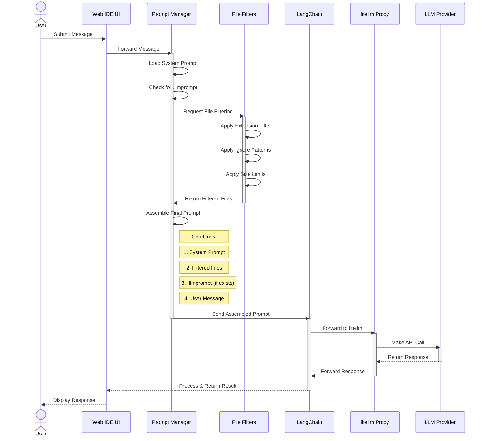
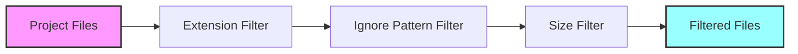
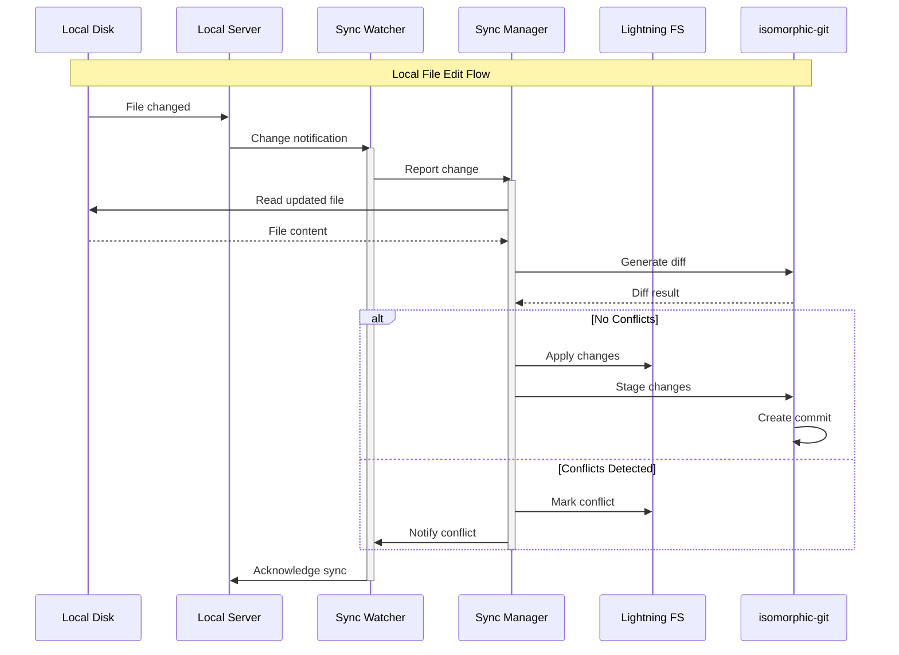
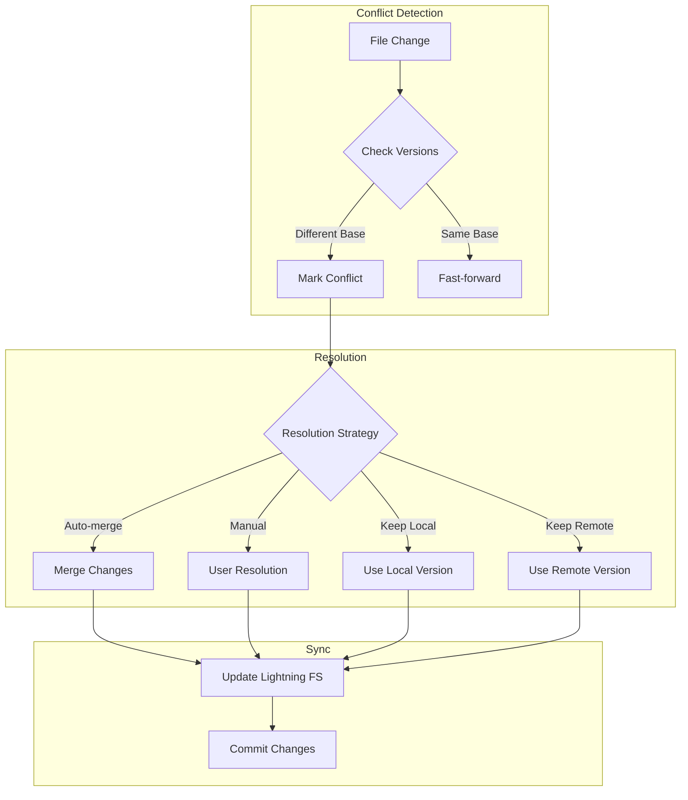
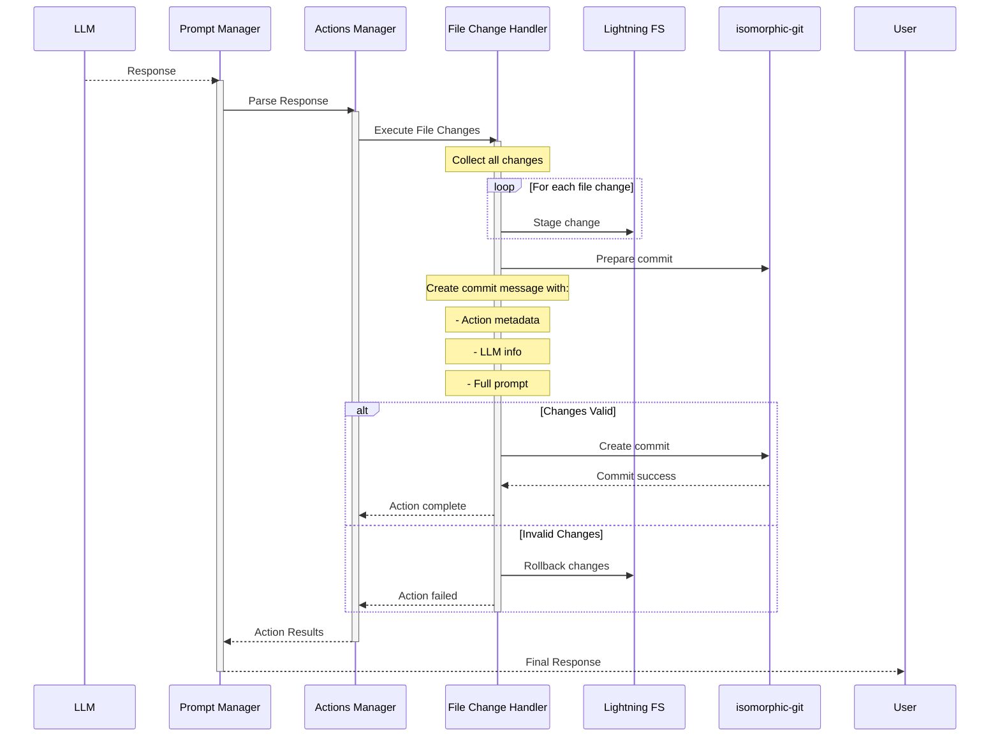
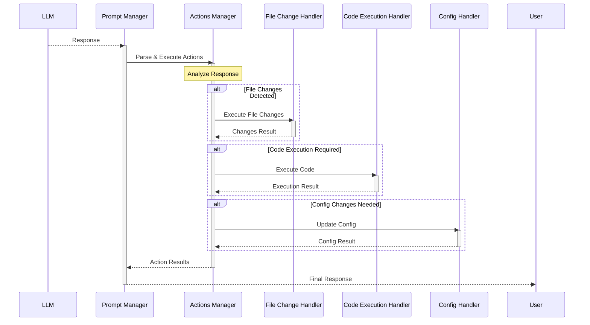
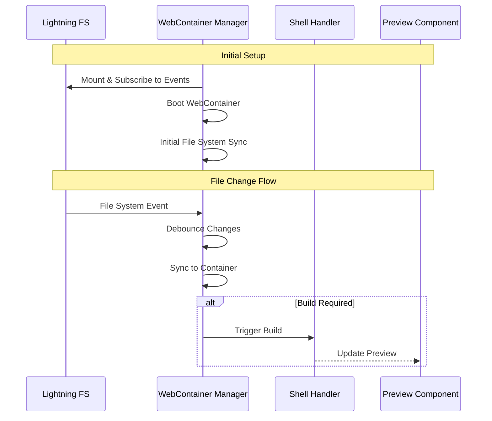

# Web-based IDE Architecture Documentation

## Project Overview

This document describes the architecture of a web-based IDE that implements a prompt-first development paradigm. The system allows developers to create, modify, and execute code primarily through natural language interactions with Large Language Models (LLMs).

### Core Purpose
- Enable prompt-first development workflow
- Provide a web-based IDE interface
- Facilitate LLM-driven code generation and modification
- Support code execution capabilities

### Key Assumptions
1. Multiple LLM providers should be supported without increasing complexity
2. The system should be extensible for future agent implementations
3. Prompt construction requires context from the entire project
4. Users may want to customize prompt behavior through `.llmprompt` files

## System Components

### 1. Prompt Management System

#### Purpose
Manages the construction and organization of prompts sent to LLMs, ensuring consistent formatting and proper context inclusion.

#### Components
1. **Prompt Manager**
   - Responsibilities:
     - Assembles final prompts from multiple sources
     - Manages project file context
     - Coordinates file filtering
     - Handles prompt template loading
   - Key Interfaces:
     ```typescript
     interface PromptManagerConfig {
       systemPromptPath?: string;
       defaultUserPromptPath?: string;
       fileFilters?: FileFilter[];
     }
     ```

2. **File Filtering System**
   - Architecture: Chain of Responsibility pattern
   - Responsibilities:
     - Filter project files based on various criteria
     - Provide extensible filtering mechanism
     - Allow dynamic filter chain construction
   - Available Filters:
     - ExtensionFilter: Filters by file extension
     - IgnorePatternFilter: Excludes files matching patterns
     - SizeFilter: Limits file sizes

3. **Prompt Construction Pipeline**
   - Steps:
     1. Load system prompt (formatting conventions)
     2. Gather filtered project context
     3. Include custom `.llmprompt` if present
     4. Append user message

### 2. LLM Integration Layer

#### Purpose
Provides unified access to multiple LLM providers while maintaining a consistent interface.

#### Components
1. **litellm Proxy**
   - Responsibilities:
     - Abstract different LLM providers
     - Provide OpenAI-compatible interface
     - Handle rate limiting and errors
     - Manage API authentication

2. **LangChain.js Integration**
   - Responsibilities:
     - Manage prompt templates
     - Handle conversation chains
     - Provide foundation for future agents
     - Manage conversation context

## Data Flow

### Prompt Processing Flow
1. User submits prompt through IDE interface
2. Prompt Manager:
   - Loads system prompt
   - Filters project files through filter chain
   - Checks for `.llmprompt` file
   - Assembles final prompt
3. LangChain processes prompt
4. litellm forwards to appropriate LLM
5. Response returned to IDE

### File Filtering Flow
1. Project files passed through filter chain
2. Each filter:
   - Applies its specific filtering logic
   - Passes results to next filter
   - Returns final filtered set

## Security Considerations

1. **Prompt Security**
   - Need for prompt sanitization
   - Content filtering requirements
   - Rate limiting implementation

2. **File Access**
   - Secure file access patterns
   - Prevention of unauthorized file access
   - Handling of sensitive file content

## Future Extensibility

The architecture is designed to support:
1. Additional file filters
2. New LLM providers
3. Advanced agent implementations
4. Custom prompt templates
5. Enhanced context management

## Performance Considerations

1. **File Filtering**
   - Efficient chain execution
   - Caching of filtered results
   - Incremental updates

2. **LLM Integration**
   - Response time optimization
   - Token usage management
   - Request batching capabilities

## Diagrams

### Component Overview



### Message Processing Sequence



### File Filter Chain Structure



The diagrams illustrate:

1. **Component Overview**: Shows the main architectural components and their relationships
2. **Message Processing Sequence**: Details the step-by-step flow of a user message through the system
3. **File Filter Chain**: Demonstrates the chain of responsibility pattern used in file filtering

Key interactions shown:
- User message flow through the system
- Context collection and prompt assembly process
- File filtering pipeline
- LLM integration chain
- Response processing and return path

## File Management System

### Purpose
Provides a robust file management system that works primarily in the browser while maintaining synchronization with the local file system. Uses isomorphic-git and Lightning FS to handle version control and browser-based file storage.

### Components

#### 1. Browser File System (Lightning FS)
- Responsibilities:
  - Provide POSIX-like file system in the browser
  - Store file contents in IndexedDB
  - Handle file read/write operations
  - Manage file metadata
  - Support concurrent operations
- Key Features:
  - Persistent storage across sessions
  - File watching capabilities
  - Directory operations
  - Atomic write operations

#### 2. Git Management (isomorphic-git)
- Responsibilities:
  - Track file versions
  - Handle branching and merging
  - Manage commit history
  - Resolve conflicts
- Operations:
  - Clone repositories
  - Create/manage branches
  - Stage/commit changes
  - Push/pull changes
  - Generate diffs

#### 3. Sync Manager
- Responsibilities:
  - Coordinate synchronization between local and browser filesystem
  - Track file modification states
  - Queue and batch sync operations
  - Handle sync conflicts
- States to Track:
  - In sync
  - Local ahead
  - Browser ahead
  - Conflict
  - Syncing

#### 4. File Watcher
- Responsibilities:
  - Monitor local file system changes
  - Detect browser file system changes
  - Trigger sync operations
  - Maintain change history
- Watch Targets:
  - Local file modifications
  - Browser file modifications
  - Git repository changes
  - Conflict states

### File Synchronization Flow



### Conflict Resolution Flow



### Key Interactions

1. **Local to Browser Sync**
   - Local file system changes detected
   - Changes read and diffed
   - Applied to Lightning FS
   - Git commit created
   - Sync state updated

2. **Browser to Local Sync**
   - Browser file system changes detected
   - Changes written to local file system
   - Git commit created
   - Sync state updated

3. **Conflict Handling**
   - Conflicts detected during sync
   - Resolution strategy determined
   - Changes merged or user prompted
   - Final state committed to both systems

### Performance Considerations

1. **Change Batching**
   - Group multiple changes into single sync operation
   - Debounce rapid changes
   - Optimize commit frequency

2. **Caching Strategy**
   - Cache frequently accessed files
   - Maintain diff history
   - Store recent conflict resolutions

3. **Resource Management**
   - Limit concurrent operations
   - Implement file size restrictions
   - Handle large repository performance

## LLM Change Management

### Purpose
Manages file changes resulting from LLM interactions through the Actions Manager, ensuring atomic operations and proper version control traceability.

### Integration with Actions Manager

#### File Change Handler
- Responsibilities:
  - Process file change actions from LLM responses
  - Manage atomic batch operations
  - Handle git operations
  - Maintain change metadata
- Key Features:
  - Atomic batch processing
  - Rollback capability
  - Change validation
  - Git integration

### File Change Action Flow



### File Change Action Structure
```typescript
interface FileChangeAction extends Action {
  type: 'FILE_CHANGE';
  payload: {
    changes: Array<{
      type: 'CREATE' | 'MODIFY' | 'DELETE';
      path: string;
      content?: string;
    }>;
    commitMessage?: string;
  };
  metadata: ActionMetadata & {
    model: string;
    temperature?: number;
  };
}
```

### Commit Message Structure
```
feat(ai): [action-id] AI-assisted changes

Action: FILE_CHANGE
Prompt: [Full prompt text]

Changes:
- Modified file1.ts
- Created file2.ts
- Deleted file3.ts

Metadata:
- Model: [model-name]
- Temperature: [temp-value]
- Action ID: [unique-action-id]
- Timestamp: [ISO datetime]
```

### Key Features

1. **Action Integration**
   - File changes handled as formal actions
   - Consistent action lifecycle management
   - Integration with other action types
   - Standardized error handling

2. **Atomic Operations**
   - All changes in an action treated as single unit
   - Automatic rollback on action failure
   - Consistent repository state guaranteed

3. **Change Traceability**
   - Action metadata in commit history
   - LLM information preserved
   - Clear audit trail of changes

## Actions Management

### Purpose
Interprets and executes various types of actions derived from LLM responses, providing a pluggable system for different operation types.

### Components

#### 1. Actions Manager
- Responsibilities:
  - Parse LLM responses into executable actions
  - Coordinate action execution
  - Handle action results
  - Manage action lifecycle
- Key Features:
  - Pluggable action handlers
  - Action validation
  - Result aggregation
  - Error handling

#### 2. Action Handlers
1. **File Change Handler**
   - Manages file operations and git commits
   - Implements atomic changes
   - Handles rollbacks
   - Creates git commits with metadata

2. **Code Execution Handler**
   - Runs code in sandbox
   - Captures output
   - Manages execution context

3. **Configuration Handler**
   - Updates IDE settings
   - Manages project configuration
   - Handles environment variables

### Action Flow



### Action Interface
```typescript
interface Action {
  type: ActionType;
  payload: unknown;
  metadata: ActionMetadata;
}

interface ActionHandler<T = unknown> {
  canHandle(action: Action): boolean;
  execute(action: Action): Promise<T>;
  validate(action: Action): Promise<boolean>;
  rollback(action: Action): Promise<void>;
}

interface ActionMetadata {
  source: string;  // LLM identifier
  timestamp: Date;
  prompt: string;
  confidence?: number;
}
```

### Key Features

1. **Extensibility**
   - Pluggable action handler system
   - Custom action type support
   - Middleware capabilities
   - Action composition

2. **Validation & Safety**
   - Pre-execution validation
   - Action authorization
   - Resource limits
   - Rollback support

3. **Monitoring & Logging**
   - Action execution tracking
   - Performance metrics
   - Error reporting
   - Audit trail

## Preview System

### Purpose
Provides a development environment with live preview capabilities by running code through WebContainers, managing shell interactions, and displaying the running application.

### Components

#### 1. WebContainer Manager
- Responsibilities:
  - Boot and manage WebContainer instance
  - Mount file system from Lightning FS
  - Handle container lifecycle
  - Manage environment setup
  - Subscribe to Lightning FS events
  - Handle incremental file updates
  - Manage file system synchronization
- Key Features:
  - Single container instance per session
  - File system synchronization
  - Environment persistence
  - Resource cleanup
  - Direct FS event subscription
  - Incremental sync support
  - Change debouncing

#### 2. Shell Handler
- Responsibilities:
  - Manage terminal instance
  - Execute commands
  - Stream command output
  - Handle user input
- Features:
  - Command history
  - Output streaming
  - Error handling
  - Interactive shell support

#### 3. Preview Component
- Responsibilities:
  - Display running application
  - Handle preview refresh
  - Manage preview state
  - Handle preview errors
- Features:
  - Iframe isolation
  - Port management
  - Live reload
  - Error overlay

### Integration Flow



### Key Interactions

1. **File System to WebContainer**
```typescript
interface WebContainerSync {
  syncFiles(): Promise<void>;
  watchChanges(): void;
  handleFileUpdates(path: string): Promise<void>;
}
```

2. **Shell Command Execution**
```typescript
interface ShellExecution {
  executeCommand(command: string): Promise<CommandResult>;
  startDevServer(): Promise<void>;
  killProcess(pid: number): Promise<void>;
}
```

3. **Preview Management**
```typescript
interface PreviewManager {
  updatePreview(url: string): void;
  handlePreviewError(error: Error): void;
  reload(): Promise<void>;
}
```

### Development Workflow

1. **Initial Setup**
   - Mount Lightning FS contents to WebContainer
   - Initialize development environment
   - Start shell instance

2. **File Changes**
   - Detect changes in Lightning FS
   - Sync to WebContainer
   - Trigger rebuild if needed
   - Update preview

3. **Command Execution**
   - User enters command in shell
   - Execute in WebContainer
   - Stream output to terminal
   - Update preview if needed

### Error Handling

1. **Container Errors**
   - Container boot failures
   - Resource exhaustion
   - Environment issues

2. **Preview Errors**
   - Build failures
   - Runtime errors
   - Connection issues

3. **Shell Errors**
   - Command execution failures
   - Process termination
   - Permission issues

### Performance Considerations

1. **Resource Management**
   - Memory usage monitoring
   - Process cleanup
   - Cache management

2. **Preview Optimization**
   - Debounced updates
   - Incremental builds
   - Resource preloading

3. **File System Performance**
   - Efficient change detection
   - Batched updates
   - Selective synchronization