# Prompt-Driven-Development Environment: Architecture Documentation

## Project Overview

This document describes the architecture of a web-based IDE that implements a prompt-first development paradigm. The system allows developers to create, modify, and execute code primarily through natural language interactions with Large Language Models (LLMs).

### Core Purpose
- Enable prompt-first development workflow
- Provide a web-based IDE interface
- Facilitate LLM-driven code generation and modification
- Support code execution capabilities

### Key Assumptions
1. Multiple LLM providers should be supported without increasing complexity
2. The system should be extensible for future agent implementations
3. Prompt construction requires context from the entire project
4. Users may want to customize prompt behavior specifically for a project
5. A seamless interaction between the local file system and the browser file system as well as easy revisioning is essential for a good DX

## System Overview

### Component Architecture

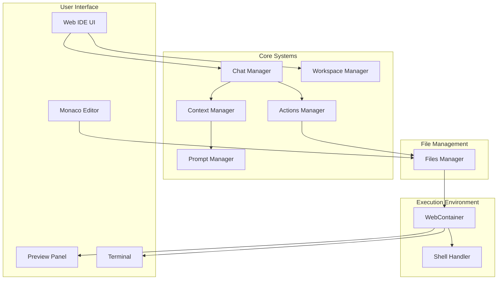
```mermaid
graph TD
    subgraph "User Interface"
        UI[Web IDE UI]
        ED[Monaco Editor]
        PV[Preview Panel]
        TR[Terminal]
    end

    subgraph "Core Systems"
        CHM[Chat Manager]
        CM[Context Manager]
        PM[Prompt Manager]
        AM[Actions Manager]
        WM[Workspace Manager]
    end

    subgraph "File Management"
        FM[Files Manager]
    end

    subgraph "Execution Environment"
        WC[WebContainer]
        SH[Shell Handler]
    end

    UI --> CHM
    UI --> WM
    ED --> FM
    
    CHM --> CM
    CM --> PM
    CHM --> AM
    AM --> FM
    
    FM --> WC
    
    WC --> SH
    WC --> PV
    WC --> TR
```

### Key Interaction Flows

#### 1. LLM-Driven File Modification Flow

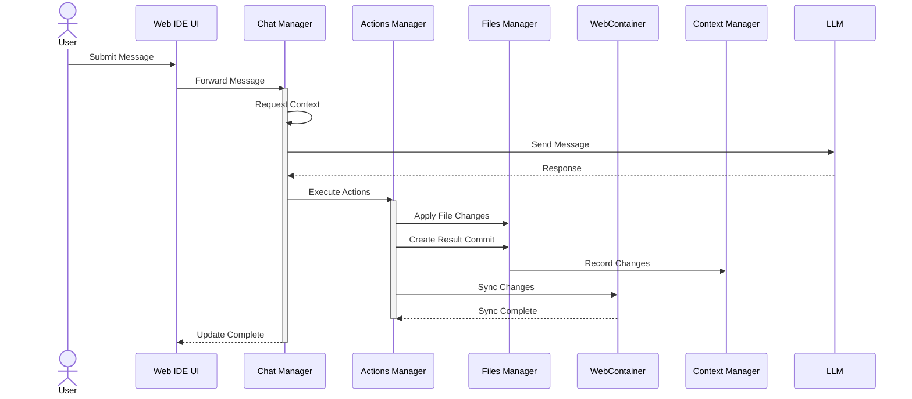
```mermaid
sequenceDiagram
    actor User
    participant UI as Web IDE UI
    participant CHM as Chat Manager
    participant AM as Actions Manager
    participant FM as Files Manager
    participant WC as WebContainer
    participant CM as Context Manager
    
    User->>UI: Submit Message
    UI->>CHM: Forward Message
    
    activate CHM
    CHM->>CHM: Request Context
    CHM->>LLM: Send Message
    LLM-->>CHM: Response
    CHM->>AM: Execute Actions
    
    activate AM
    AM->>FM: Apply File Changes
    AM->>FM: Create Result Commit
    FM->>CM: Record Changes
    AM->>WC: Sync Changes
    WC-->>AM: Sync Complete
    deactivate AM
    
    CHM-->>UI: Update Complete
    deactivate CHM
```

#### 2. Editor to Disk Flow

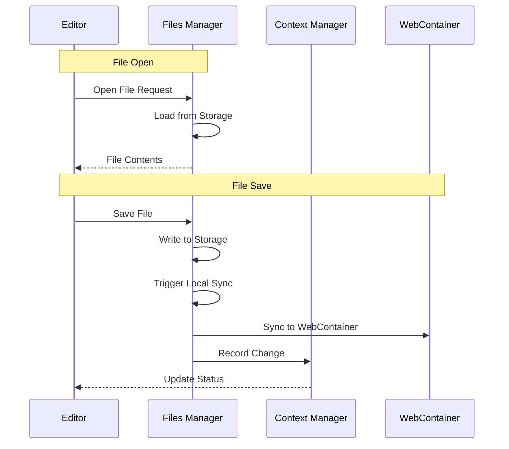
```mermaid
sequenceDiagram
    participant ED as Editor
    participant FM as Files Manager
    participant CM as Context Manager
    participant WC as WebContainer
    
    Note over ED,FM: File Open
    ED->>FM: Open File Request
    FM->>FM: Load from Storage
    FM-->>ED: File Contents
    
    Note over ED,WC: File Save
    ED->>FM: Save File
    FM->>FM: Write to Storage
    FM->>FM: Trigger Local Sync
    FM->>WC: Sync to WebContainer
    FM->>CM: Record Change
    CM-->>ED: Update Status
```

## System Components

### 1. Chat and Context System

#### Purpose
The system is split into two main components: the Chat Manager for handling conversation flow and the Context Manager for comprehensive context assembly and management.

#### Components

1. **Chat Manager**
   - Core Responsibilities:
     - Handle message processing and LLM interaction
     - Coordinate with Context Manager for context needs
     - Process and validate LLM responses
     - Manage conversation flow
     - Route responses to appropriate action handlers

2. **Context Manager**
   - Core Responsibilities:
     - Full ownership of all context required for LLM interactions.
     - Assemble and optimize the complete context for each message, including the compiled prompt obtained from the Prompt Manager.
     - Manage message history and summarization
     - Handle context optimization and relevance
   - Key Operations:
     - Request the compiled prompt from the Prompt Manager.
     - Context assembly and retrieval
     - Message history retrieval and summarization
     - File context filtering and integration
     - Context source prioritization
     - Token budget management
     - Various context type handling (files, docs, chat, workspace)

3. **Prompt Manager**
    - Core Responsibilities:
      - Manage and customize prompts used for LLM interactions.
      - **Construct the compiled prompt for LLM interactions, which may involve combining system prompts, project-specific prompts, and the current user message.**
    - Key Operations:
      - Storing and retrieving prompt templates.
      - Managing system prompts (global and project-specific).
      - Compiling the final prompt based on relevant templates and context.
      - Dynamically generating prompt components.
      - Allowing users to customize prompts.
      - Versioning and potentially evaluating prompts.
      - Providing the compiled prompt to the Context Manager.

#### Key Features

1. **Clear Separation of Responsibilities**
   - Chat Manager focuses on conversation flow and LLM interaction
   - Context Manager handles all context-related operations and prompt assembly
   - Prompt Manager handles everything that it related to the actual user message and intent

2. **Comprehensive Context Management**
   - Full ownership of all context sources
   - Dynamic source prioritization
   - Intelligent context assembly
   - Token budget management
   - Message history summarization

3. **Flexible Context Sources**
   - File context (open files, project files)
   - Documentation context
   - Chat history (potentially with with summarization)
   - Workspace state
   - Custom context providers

### 2. LLM Integration Layer

#### Purpose
Provides unified access to multiple LLM providers while maintaining a consistent interface.

#### Components
1. **litellm Proxy**
   - Responsibilities:
     - Abstract different LLM providers
     - Provide OpenAI-compatible interface
     - Handle rate limiting and errors
     - Manage API authentication

2. **LangChain.js Integration**
   - Responsibilities:
     - Manage prompt templates
     - Handle conversation chains
     - Provide foundation for future agents
     - Manage conversation context

## Data Flow

### Chat Processing Flow
1. User submits message through IDE interface
2. Chat Manager:
   - Coordinates with Context Manager
   - Processes message with LLM
   - Handles response processing
3. LangChain processes message
4. litellm forwards to appropriate LLM
5. Response returned to IDE

### File Filtering Flow
1. Project files passed through filter chain
2. Each filter:
   - Applies its specific filtering logic
   - Passes results to next filter
   - Returns final filtered set

## Security Considerations

1. **Prompt Security**
   - Need for prompt sanitization
   - Content filtering requirements
   - Rate limiting implementation

2. **File Access**
   - Secure file access patterns
   - Prevention of unauthorized file access
   - Handling of sensitive file content

## Future Extensibility

The architecture is designed to support:
1. Additional file filters
2. New LLM providers
3. Advanced agent implementations
4. Custom prompt templates
5. Enhanced context management

## Performance Considerations

1. **File Filtering**
   - Efficient chain execution
   - Caching of filtered results
   - Incremental updates

2. **LLM Integration**
   - Response time optimization
   - Token usage management
   - Request batching capabilities

## File Management System

### Purpose
Provides a robust file management system that works primarily in the browser while maintaining synchronization with the local file system and execution environment.

### Components

#### 1. Browser File System (Lightning FS)
- Responsibilities:
  - Provide POSIX-like file system in the browser
  - Store file contents in IndexedDB
  - Handle file read/write operations
  - Manage file metadata
  - Support concurrent operations
- Key Features:
  - Persistent storage across sessions
  - File watching capabilities
  - Directory operations
  - Atomic write operations

#### 2. Git Management (isomorphic-git)
- Responsibilities:
  - Track file versions
  - Handle branching and merging
  - Manage commit history
  - Resolve conflicts
- Operations:
  - Clone repositories
  - Create/manage branches
  - Stage/commit changes
  - Push/pull changes
  - Generate diffs

#### 3. Sync Manager
- Responsibilities:
  - Coordinate synchronization between local and browser filesystem
  - Track file modification states
  - Queue and batch sync operations
  - Handle sync conflicts
- States to Track:
  - In sync
  - Local ahead
  - Browser ahead
  - Conflict
  - Syncing

#### 4. File Watcher
- Responsibilities:
  - Monitor local file system changes
  - Detect browser file system changes
  - Trigger sync operations
  - Maintain change history
- Watch Targets:
  - Local file modifications
  - Browser file modifications
  - Git repository changes
  - Conflict states

#### 5. WebContainer Sync

While the File watcher handles synchronization with the local file system, the WebContainer Sync does something similar with respect to the WebContainer that provides the preview execution environment.

The WebContainer Sync component is responsible for:
- Maintain synchronization between Files Manager and WebContainer filesystem
- Convert Files Manager events to WebContainer mount/write operations
- Handle WebContainer file changes and sync back to Files Manager
- Key Features:
  - Bidirectional sync
  - File system format conversion
  - Change debouncing
  - Atomic operations

### File Synchronization Flow

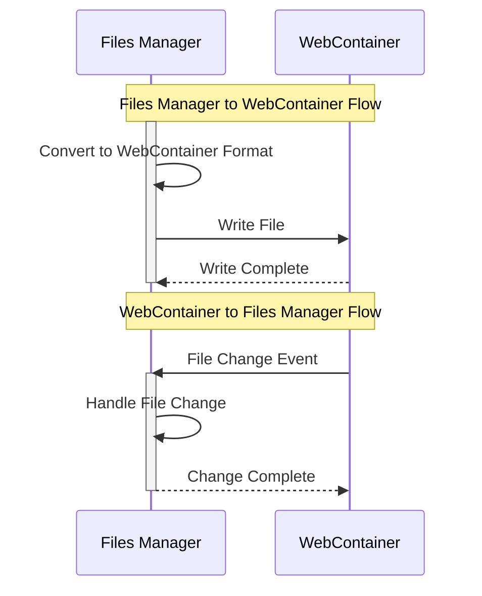
```mermaid
sequenceDiagram
    participant FM as Files Manager
    participant WC as WebContainer
    
    Note over FM,WC: Files Manager to WebContainer Flow
    activate FM
    FM->>FM: Convert to WebContainer Format
    FM->>WC: Write File
    WC-->>FM: Write Complete
    deactivate FM
    
    Note over FM,WC: WebContainer to Files Manager Flow
    WC->>FM: File Change Event
    activate FM
    FM->>FM: Handle File Change
    FM-->>WC: Change Complete
    deactivate FM
```

The Files Manager handles synchronization with WebContainer, managing the different file system representations and ensuring changes are properly propagated in both directions. This maintains the independence of both systems while ensuring data consistency.

Key aspects of the synchronization:
1. Files Manager is the source of truth for the file system
2. WebContainer maintains its own working copy for execution
3. Changes are synchronized bidirectionally through the Files Manager
4. The sync process handles format conversion between the systems

### Editor to File System Flow

#### Purpose
Handles file changes initiated through the Monaco Editor, ensuring proper synchronization with both the browser-based file system and local storage.

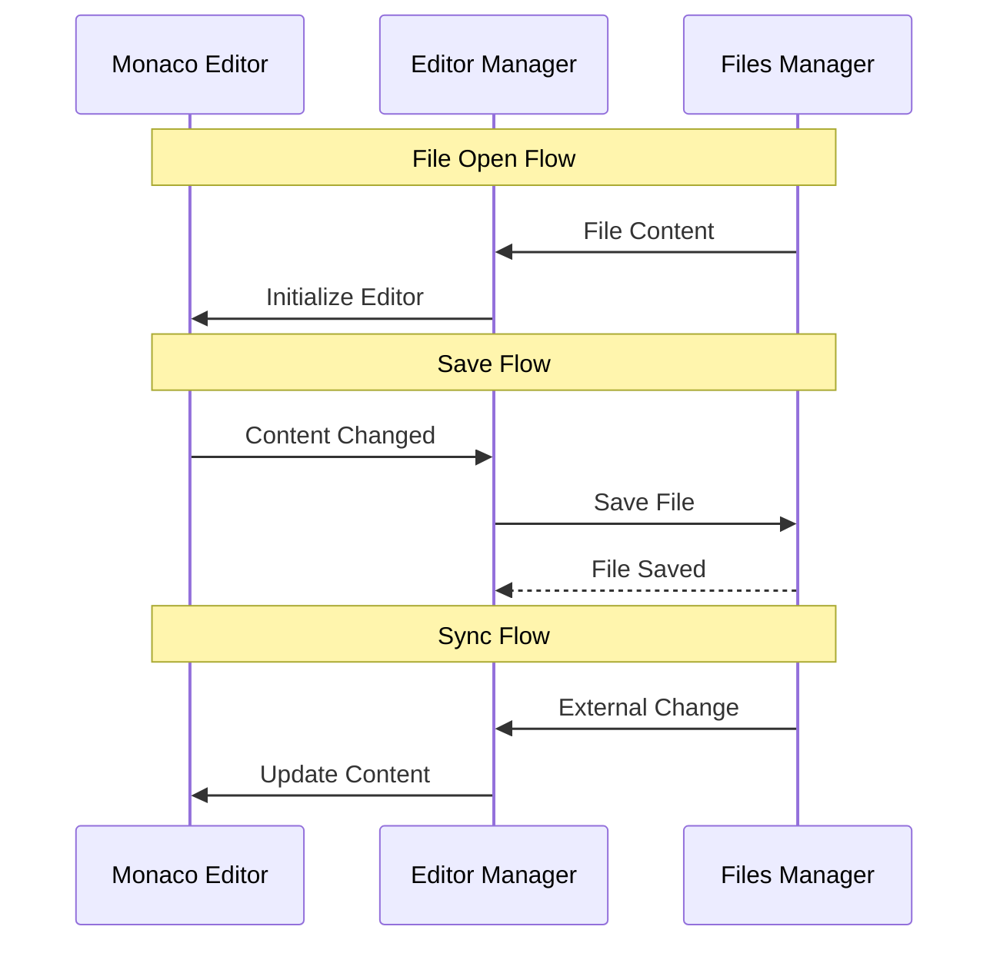
```mermaid
sequenceDiagram
    participant ME as Monaco Editor
    participant EM as Editor Manager
    participant FM as Files Manager
    
    Note over ME,FM: File Open Flow
    FM->>EM: File Content
    EM->>ME: Initialize Editor
    
    Note over ME,FM: Save Flow
    ME->>EM: Content Changed
    EM->>FM: Save File
    FM-->>EM: File Saved
    
    Note over ME,FM: Sync Flow
    FM->>EM: External Change
    EM->>ME: Update Content
```

#### Key Features

1. **Change Management**
   - Debounced save operations
   - Atomic file writes
   - Change detection
   - Editor state synchronization

2. **Git Integration**
   - Optional auto-commit
   - Change staging
   - Commit message generation
   - History tracking

3. **Sync Behavior**
   - Immediate local sync
   - Conflict detection
   - Change queuing
   - Error recovery

#### Implementation Example
```typescript
interface EditorFileSync {
  // Handle editor content changes
  handleChange(path: string, content: string): Promise<void>;
  
  // Sync to file systems
  syncToFileSystems(change: FileChange): Promise<void>;
  
  // Optional git operations
  createCommitForChange(change: FileChange): Promise<string>;
}

// Example usage
editor.onDidChangeContent(async (change) => {
  await editorFileSync.handleChange(
    currentFile.path,
    editor.getValue()
  );
});
```

#### Manual Change Tracking

#### Key Features
1. Changes are available as context for next LLM interaction
2. Context Manager maintains full conversation context
3. Clear separation between action execution (Actions Manager) and context tracking (Context Manager)
4. Changes are properly timestamped for chronological context

### Conflict Resolution Flow

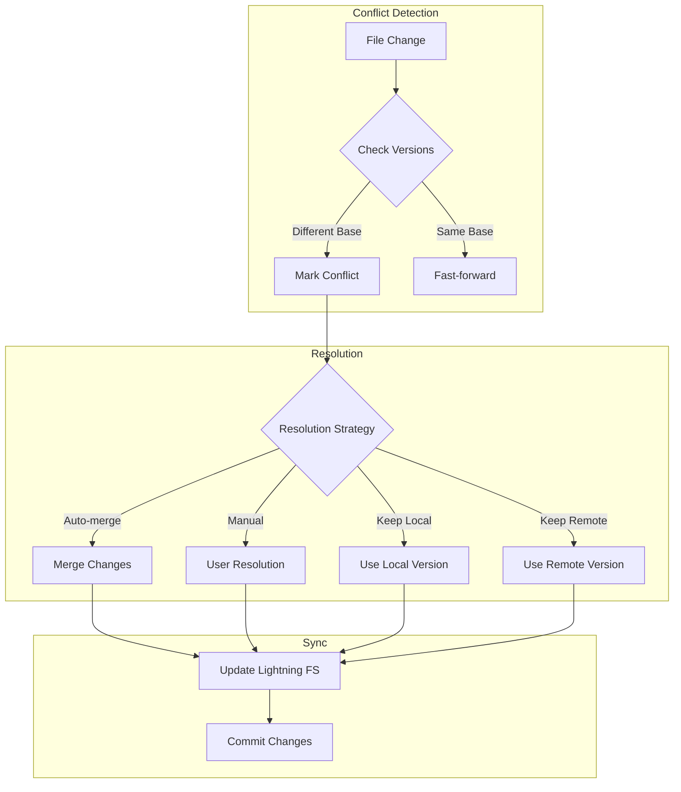
```mermaid
graph TD
    subgraph "Conflict Detection"
        A[File Change] --> B{Check Versions}
        B -->|Different Base| C[Mark Conflict]
        B -->|Same Base| D[Fast-forward]
    end
    
    subgraph "Resolution"
        C --> E{Resolution Strategy}
        E -->|Auto-merge| F[Merge Changes]
        E -->|Manual| G[User Resolution]
        E -->|Keep Local| H[Use Local Version]
        E -->|Keep Remote| I[Use Remote Version]
    end
    
    subgraph "Sync"
        F --> J[Update Lightning FS]
        G --> J
        H --> J
        I --> J
        J --> K[Commit Changes]
    end
```

### Key Interactions

1. **Local to Browser Sync**
   - Local file system changes detected
   - Changes read and diffed
   - Applied to Lightning FS
   - Git commit created
   - Sync state updated

2. **Browser to Local Sync**
   - Browser file system changes detected
   - Changes written to local file system
   - Git commit created
   - Sync state updated

3. **Conflict Handling**
   - Conflicts detected during sync
   - Resolution strategy determined
   - Changes merged or user prompted
   - Final state committed to both systems

### Performance Considerations

1. **Change Batching**
   - Group multiple changes into single sync operation
   - Debounce rapid changes
   - Optimize commit frequency

2. **Caching Strategy**
   - Cache frequently accessed files
   - Maintain diff history
   - Store recent conflict resolutions

3. **Resource Management**
   - Limit concurrent operations
   - Implement file size restrictions
   - Handle large repository performance

## Changing files via LLM interation

### Purpose
Manages file changes resulting from LLM interactions through the Actions Manager, ensuring atomic operations and proper version control traceability.

### Integration with Actions Manager

#### File Change Handler
- Responsibilities:
  - Process file change actions from LLM responses
  - Manage atomic batch operations
  - Handle git operations
  - Maintain change metadata
- Key Features:
  - Atomic batch processing
  - Rollback capability
  - Change validation
  - Git integration

### File Change Action Flow

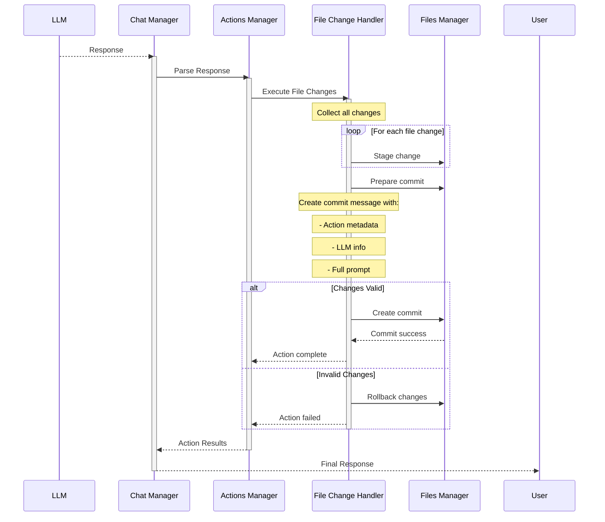
```mermaid
sequenceDiagram
    participant LLM as LLM
    participant CHM as Chat Manager
    participant AM as Actions Manager
    participant FCH as File Change Handler
    participant FM as Files Manager
    
    LLM-->>CHM: Response
    activate CHM
    CHM->>AM: Parse Response
    
    activate AM
    AM->>FCH: Execute File Changes
    
    activate FCH
    Note over FCH: Collect all changes
    
    loop For each file change
        FCH->>FM: Stage change
    end
    
    FCH->>FM: Prepare commit
    Note over FCH: Create commit message with:
    Note over FCH: - Action metadata
    Note over FCH: - LLM info
    Note over FCH: - Full prompt
    
    alt Changes Valid
        FCH->>FM: Create commit
        FM-->>FCH: Commit success
        FCH-->>AM: Action complete
    else Invalid Changes
        FCH->>FM: Rollback changes
        FCH-->>AM: Action failed
    end
    deactivate FCH
    
    AM-->>CHM: Action Results
    deactivate AM
    CHM-->>User: Final Response
    deactivate CHM
```

### File Change Action Structure
```typescript
interface FileChangeAction extends Action {
  type: 'FILE_CHANGE';
  payload: {
    changes: Array<{
      type: 'CREATE' | 'MODIFY' | 'DELETE';
      path: string;
      content?: string;
    }>;
    commitMessage?: string;
  };
  metadata: ActionMetadata & {
    model: string;
    temperature?: number;
  };
}
```

### Commit Message Structure
```
feat(ai): [action-id] AI-assisted changes

Action: FILE_CHANGE
Prompt: [Full prompt text]

Changes:
- Modified file1.ts
- Created file2.ts
- Deleted file3.ts

Metadata:
- Model: [model-name]
- Temperature: [temp-value]
- Action ID: [unique-action-id]
- Timestamp: [ISO datetime]
```

### Key Features

1. **Action Integration**
   - File changes handled as formal actions
   - Consistent action lifecycle management
   - Integration with other action types
   - Standardized error handling

2. **Atomic Operations**
   - All changes in an action treated as single unit
   - Automatic rollback on action failure
   - Consistent repository state guaranteed

3. **Change Traceability**
   - Action metadata in commit history
   - LLM information preserved
   - Clear audit trail of changes

## Actions Management

### Purpose
Interprets and executes various types of actions derived from LLM responses, providing a pluggable system for different operation types.

### Components

#### 1. Actions Manager
- Responsibilities:
  - Parse LLM responses into executable actions
  - Coordinate action execution
  - Handle action results
  - Manage action lifecycle
- Key Features:
  - Pluggable action handlers
  - Action validation
  - Result aggregation
  - Error handling

#### 2. Action Handlers
1. **File Change Handler**
   - Manages file operations and git commits
   - Implements atomic changes
   - Handles rollbacks
   - Creates git commits with metadata

2. **Code Execution Handler**
   - Runs code in sandbox
   - Captures output
   - Manages execution context

3. **Configuration Handler**
   - Updates IDE settings
   - Manages project configuration
   - Handles environment variables

### Action Flow


```mermaid
sequenceDiagram
    participant LLM as LLM
    participant CHM as Chat Manager
    participant AM as Actions Manager
    participant FCH as File Change Handler
    participant CEH as Code Execution Handler
    participant CH as Config Handler
    
    LLM-->>CHM: Response
    activate CHM
    CHM->>AM: Parse & Execute Actions
    
    activate AM
    Note over AM: Analyze Response
    
    alt File Changes Detected
        AM->>FCH: Execute File Changes
        activate FCH
        FCH-->>AM: Changes Result
        deactivate FCH
    end
    
    alt Code Execution Required
        AM->>CEH: Execute Code
        activate CEH
        CEH-->>AM: Execution Result
        deactivate CEH
    end
    
    alt Config Changes Needed
        AM->>CH: Update Config
        activate CH
        CH-->>AM: Config Result
        deactivate CH
    end
    
    AM-->>CHM: Action Results
    deactivate AM
    CHM-->>User: Final Response
    deactivate CHM
```

### Action Interface
```typescript
interface Action {
  type: ActionType;
  payload: unknown;
  metadata: ActionMetadata;
}

interface ActionHandler<T = unknown> {
  canHandle(action: Action): boolean;
  execute(action: Action): Promise<T>;
  validate(action: Action): Promise<boolean>;
  rollback(action: Action): Promise<void>;
}

interface ActionMetadata {
  source: string;  // LLM identifier
  timestamp: Date;
  prompt: string;
  confidence?: number;
}
```

### Key Features

1. **Extensibility**
   - Pluggable action handler system
   - Custom action type support
   - Middleware capabilities
   - Action composition

2. **Validation & Safety**
   - Pre-execution validation
   - Action authorization
   - Resource limits
   - Rollback support

3. **Monitoring & Logging**
   - Action execution tracking
   - Performance metrics
   - Error reporting
   - Audit trail

## Preview System

### Purpose
Provides a development environment with live preview capabilities by running code through WebContainers, managing shell interactions, and displaying the running application.

### Components

#### 1. WebContainer Manager
- Responsibilities:
  - Boot and manage WebContainer instance
  - Mount file system from Lightning FS
  - Handle container lifecycle
  - Manage environment setup
  - Subscribe to Lightning FS events
  - Handle incremental file updates
  - Manage file system synchronization
- Key Features:
  - Single container instance per session
  - File system synchronization
  - Environment persistence
  - Resource cleanup
  - Direct FS event subscription
  - Incremental sync support
  - Change debouncing

#### 2. Shell Handler
- Responsibilities:
  - Manage terminal instance
  - Execute commands
  - Stream command output
  - Handle user input
- Features:
  - Command history
  - Output streaming
  - Error handling
  - Interactive shell support

#### 3. Preview Component
- Responsibilities:
  - Display running application
  - Handle preview refresh
  - Manage preview state
  - Handle preview errors
- Features:
  - Iframe isolation
  - Port management
  - Live reload
  - Error overlay

### Integration Flow

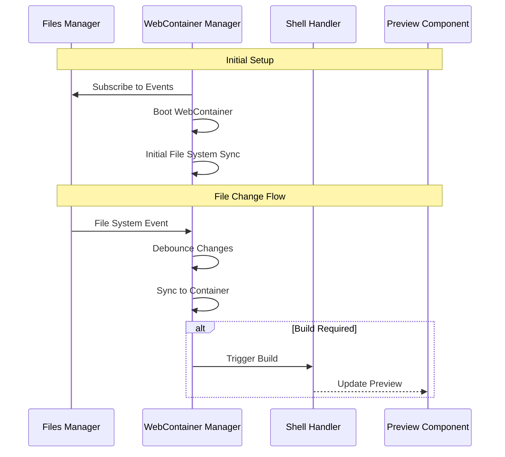
```mermaid
sequenceDiagram
    participant FM as Files Manager
    participant WCM as WebContainer Manager
    participant SH as Shell Handler
    participant PC as Preview Component
    
    Note over FM,PC: Initial Setup
    WCM->>FM: Subscribe to Events
    WCM->>WCM: Boot WebContainer
    WCM->>WCM: Initial File System Sync
    
    Note over FM,PC: File Change Flow
    FM->>WCM: File System Event
    WCM->>WCM: Debounce Changes
    WCM->>WCM: Sync to Container
    
    alt Build Required
        WCM->>SH: Trigger Build
        SH-->>PC: Update Preview
    end
```

### Key Interactions

1. **File System to WebContainer**
```typescript
interface WebContainerSync {
  syncFiles(): Promise<void>;
  watchChanges(): void;
  handleFileUpdates(path: string): Promise<void>;
}
```

2. **Shell Command Execution**
```typescript
interface ShellExecution {
  executeCommand(command: string): Promise<CommandResult>;
  startDevServer(): Promise<void>;
  killProcess(pid: number): Promise<void>;
}
```

3. **Preview Management**
```typescript
interface PreviewManager {
  updatePreview(url: string): void;
  handlePreviewError(error: Error): void;
  reload(): Promise<void>;
}
```

### Development Workflow

1. **Initial Setup**
   - Mount Lightning FS contents to WebContainer
   - Initialize development environment
   - Start shell instance

2. **File Changes**
   - Detect changes in Lightning FS
   - Sync to WebContainer
   - Trigger rebuild if needed
   - Update preview

3. **Command Execution**
   - User enters command in shell
   - Execute in WebContainer
   - Stream output to terminal
   - Update preview if needed

### Error Handling

1. **Container Errors**
   - Container boot failures
   - Resource exhaustion
   - Environment issues

2. **Preview Errors**
   - Build failures
   - Runtime errors
   - Connection issues

3. **Shell Errors**
   - Command execution failures
   - Process termination
   - Permission issues

### Performance Considerations

1. **Resource Management**
   - Memory usage monitoring
   - Process cleanup
   - Cache management

2. **Preview Optimization**
   - Debounced updates
   - Incremental builds
   - Resource preloading

3. **File System Performance**
   - Efficient change detection
   - Batched updates
   - Selective synchronization

## Code Editor System

### Purpose
Provides a full-featured code editing experience integrated with the file system and preview capabilities.

### Components

#### 1. Editor Manager
- Responsibilities:
  - Initialize and configure Monaco instances
  - Handle file opening/closing
  - Manage editor state
  - Coordinate with Lightning FS
  - Handle language services
- Key Features:
  - Multi-file editing
  - Split views
  - Minimap
  - IntelliSense
  - Custom language services

#### 2. Editor Integration Services
1. **File System Integration**
   - Direct integration with Files Manager
   - File change notifications
   - Save operations
   - File creation/deletion

2. **Navigation Services**
   - Built-in Monaco Features:
     - In-file symbol navigation
     - Basic go-to-definition
     - File-level search
     - Simple outline view
   - Extended Capabilities:
     - Recent files tracking
     - Navigation history (back/forward)
     - Custom file tree integration
     - Project-wide search

3. **Future Navigation Enhancements**
   > Note: To be implemented with LSP
   - Cross-file references
   - Project-wide symbol search
   - Advanced go-to-definition
   - Type hierarchy navigation

### Key Features

1. **Editor Capabilities**
   - Syntax highlighting
   - Code completion
   - Error detection
   - Find/Replace
   - Multiple cursors
   - Code folding

2. **Integration Features**
   - Direct file system access
   - Git decoration support
   - Preview integration
   - Terminal integration

3. **Performance Features**
   - Large file handling
   - Lazy loading
   - Worker-based processing
   - Memory management

### Language Services Architecture

#### 1. Initial Implementation: Built-in Monaco Services
- Basic IntelliSense
- Syntax highlighting
- Simple completions
- File-level analysis
- TypeScript/JavaScript language support
- Basic diagnostics

#### 2. Future Enhancements

##### Language Server Protocol (LSP)
> Note: Planned for future implementation
- Advanced capabilities through LSP:
  - Project-wide analysis
  - Advanced type checking
  - Dependency resolution
  - Cross-file refactoring

##### Custom Intelligence System
> Note: Planned for future implementation
- LLM-enhanced capabilities:
  - Context-aware suggestions
  - Natural language interactions
  - Project-specific intelligence
  - Smart diagnostics
  - Interactive assistance

### Initial Language Support Scope
1. **JavaScript/TypeScript**
   - Built-in Monaco support
   - Type definitions
   - Basic refactoring
   - Syntax validation

2. **Common Web Languages**
   - HTML
   - CSS
   - JSON
   - Markdown

3. **Basic Support for Others**
   - Syntax highlighting
   - Basic formatting
   - Simple completions

## Project Management System

### Purpose
Manages multiple independent projects with local-first storage and optional remote synchronization.

### Components

#### 1. Project Manager
- Responsibilities:
  - Manage project lifecycle
  - Handle project configuration
  - Coordinate project resources
  - Manage project metadata
- Key Features:
  - Multi-project support
  - Project isolation
  - Configuration management
  - Resource management

#### 2. Storage System
1. **Local Storage Layer**
   - IndexedDB (via Dexie.js):
     - Project data
     - Chat histories
     - Administrative data
   - Lightning FS:
     - Project files
     - Git objects
   - Key Features:
     - Type-safe queries
     - Observable data
     - Index management
     - Transaction support

### Storage Architecture

> Note: Remote synchronization and PostgreSQL integration are planned for future implementation.

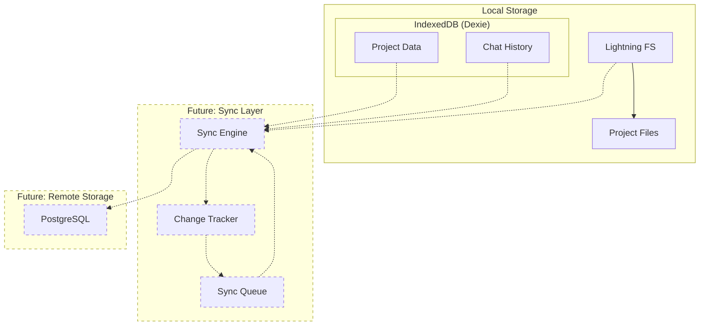
```mermaid
graph TD
    subgraph "Local Storage"
        subgraph "IndexedDB (Dexie)"
            PD[Project Data]
            CH[Chat History]
        end
        LFS[Lightning FS] --> PF[Project Files]
    end
    
    subgraph future_sync["Future: Sync Layer"]
        SE[Sync Engine]
        CT[Change Tracker]
        SQ[Sync Queue]
    end
    
    subgraph future_remote["Future: Remote Storage"]
        PG[PostgreSQL]
    end
    
    PD -.-> SE
    CH -.-> SE
    LFS -.-> SE
    SE -.-> PG
    SE -.-> CT
    CT -.-> SQ
    SQ -.-> SE

    style SE stroke-dasharray: 5 5
    style CT stroke-dasharray: 5 5
    style SQ stroke-dasharray: 5 5
    style PG stroke-dasharray: 5 5
    style future_sync stroke-dasharray: 5 5
    style future_remote stroke-dasharray: 5 5
```

### Initial Storage Implementation
1. **Local Storage Layer**
   - IndexedDB (via Dexie.js):
     - Project data
     - Chat histories
     - Administrative data
   - Lightning FS:
     - Project files
     - Git objects
   - Key Features:
     - Type-safe queries
     - Observable data
     - Index management
     - Transaction support

### Future Storage Enhancements
> Note: Planned for future implementation

1. **Sync Engine**
   - Bidirectional sync
   - Change tracking
   - Conflict resolution
   - Queue management

2. **Remote Storage**
   - PostgreSQL integration
   - Multi-user support
   - Data backup
   - Cross-device sync

### Key Features

1. **Project Isolation**
   - Separate root directories
   - Independent git repositories
   - Isolated chat histories
   - Project-specific configuration

2. **Local-First Operations**
   - Offline capability
   - Local data persistence
   - Fast operations
   - Data integrity

3. **Sync Capabilities**
   - Bidirectional sync
   - Conflict resolution
   - Change tracking
   - Queue management

### Sync Flow

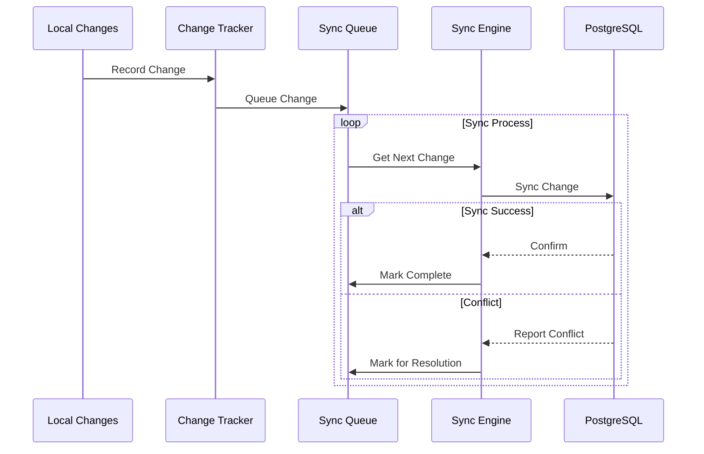
```mermaid
sequenceDiagram
    participant LC as Local Changes
    participant CT as Change Tracker
    participant SQ as Sync Queue
    participant SE as Sync Engine
    participant PG as PostgreSQL

    LC->>CT: Record Change
    CT->>SQ: Queue Change
    
    loop Sync Process
        SQ->>SE: Get Next Change
        SE->>PG: Sync Change
        
        alt Sync Success
            PG-->>SE: Confirm
            SE->>SQ: Mark Complete
        else Conflict
            PG-->>SE: Report Conflict
            SE->>SQ: Mark for Resolution
        end
    end
```

### Chat Branching Flow

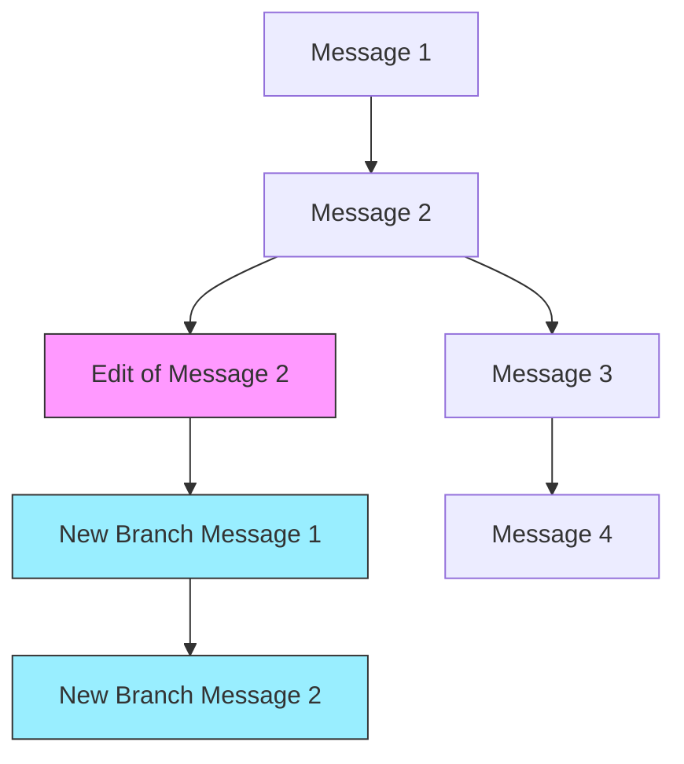
```mermaid
graph TD
    M1[Message 1] --> M2[Message 2]
    M2 --> M3[Message 3]
    M2 --> E1[Edit of Message 2]
    E1 --> B1[New Branch Message 1]
    M3 --> M4[Message 4]
    B1 --> B2[New Branch Message 2]

    style E1 fill:#f9f,stroke:#333
    style B1 fill:#9ef,stroke:#333
    style B2 fill:#9ef,stroke:#333
```

### Branching Scenarios

1. **Message Editing**
   - Creates new branch from edited message
   - Maintains reference to original
   - Previous branch remains intact
   - New messages continue in new branch

2. **Branch Management**
   - Multiple active branches
   - Branch switching
   - Branch merging (future enhancement)
   - Branch archiving

3. **Message Relationships**
   - Parent-child relationships
   - Branch lineage tracking
   - Version history
   - Cross-branch references

### Project Scaffolding Action

#### Purpose
Provides AI-driven project initialization and scaffolding through the Actions system, allowing natural language description of desired project structure.

#### Scaffolding Handler
```typescript
interface ScaffoldingAction extends Action {
  type: 'SCAFFOLD_PROJECT';
  payload: {
    description: string;      // User's project description
    preferences?: {
      framework?: string;
      testing?: string;
      styling?: string;
      // ... other preferences
    };
    constraints?: {
      maxFiles?: number;
      requiredFeatures?: string[];
      // ... other constraints
    }
  };
  metadata: ActionMetadata;
}
```

#### Scaffolding Flow

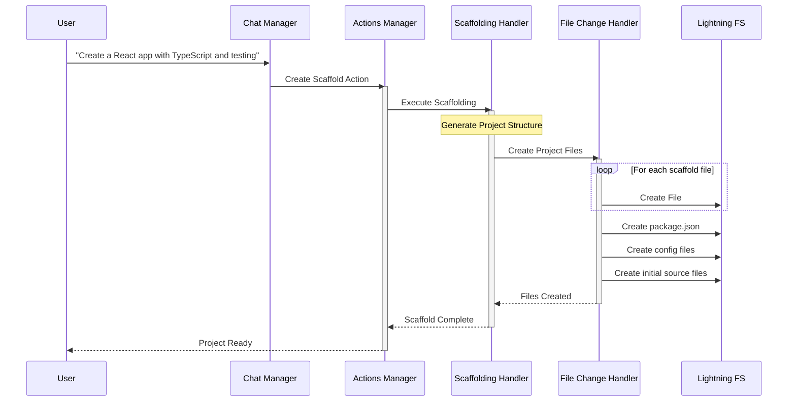
```mermaid
sequenceDiagram
    participant User
    participant CHM as Chat Manager
    participant AM as Actions Manager
    participant SH as Scaffolding Handler
    participant FCH as File Change Handler
    participant LFS as Lightning FS

    User->>CHM: "Create a React app with TypeScript and testing"
    CHM->>AM: Create Scaffold Action
    
    activate AM
    AM->>SH: Execute Scaffolding
    
    activate SH
    Note over SH: Generate Project Structure
    
    SH->>FCH: Create Project Files
    activate FCH
    
    loop For each scaffold file
        FCH->>LFS: Create File
    end
    
    FCH->>LFS: Create package.json
    FCH->>LFS: Create config files
    FCH->>LFS: Create initial source files
    
    FCH-->>SH: Files Created
    deactivate FCH
    
    SH-->>AM: Scaffold Complete
    deactivate SH
    
    AM-->>User: Project Ready
    deactivate AM
```

#### Key Features

1. **Intelligent Structure Generation**
   - Framework detection
   - Best practice adherence
   - Convention following
   - Dependency management

2. **Context-Aware Scaffolding**
   - Project type recognition
   - Technology stack awareness
   - Testing framework selection
   - Style system integration

3. **Progressive Enhancement**
   - Start with basic structure
   - Add features through conversation
   - Refine through iterations
   - Adapt to user preferences

4. **Template Learning**
   - Learn from existing projects
   - Adapt to user patterns
   - Improve over time
   - Share common patterns

## Workbench

### Purpose
Manages the overall IDE workspace state, persisting user preferences and session information across browser refreshes.

### Components

1. **Workbench**
   - Responsibilities:
     - Layout configuration (split panels, sizes)
     - Open files and tabs
     - Terminal sessions
     - Preview states
     - Active project context
     - Recent files/actions
     - Scroll positions
     - Collapsed folders in file tree
     - Panel visibility states
     - Trigger project-global actions (like import/export/sync)

### State Persistence Flow

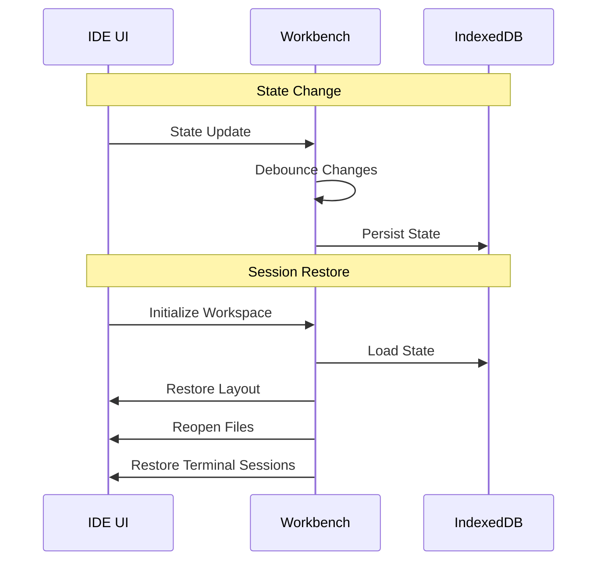
```mermaid
sequenceDiagram
    participant UI as IDE UI
    participant WM as Workbench
    participant IDB as IndexedDB
    
    Note over UI,IDB: State Change
    UI->>WM: State Update
    WM->>WM: Debounce Changes
    WM->>IDB: Persist State
    
    Note over UI,IDB: Session Restore
    UI->>WM: Initialize Workspace
    WM->>IDB: Load State
    WM->>UI: Restore Layout
    WM->>UI: Reopen Files
    WM->>UI: Restore Terminal Sessions
```

### Key Features

1. **State Persistence**
   - Automatic state saving
   - Session recovery
   - Layout persistence
   - Cross-session continuity

2. **Layout Management**
   - Panel configurations
   - Split views
   - Size preferences
   - View states

3. **Session Context**
   - Open files tracking
   - Active terminals
   - Preview states
   - Recent actions

## Status & Notification System

### Purpose
Provides a centralized system for managing, aggregating, and displaying status updates and notifications from various system components, with special handling for long-running and streaming operations.

### Components

1. **Status Manager**
   - Responsibilities:
     - Aggregate status updates
     - Manage notification lifecycle
     - Handle stream subscriptions
     - Coordinate status display
   - Key Features:
     - Stream aggregation
     - Priority management
     - Status persistence
     - Progress tracking

2. **Notification Hub**
   - Responsibilities:
     - Display notifications
     - Manage notification lifecycle
     - Group related notifications
     - Handle notification actions
   - Key Features:
     - Notification grouping
     - Priority-based display
     - Action handling
     - Progress tracking

### Status Flow

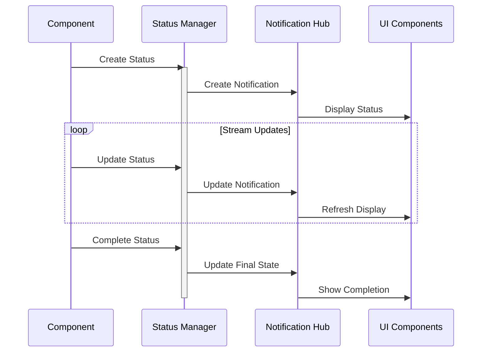
```mermaid
sequenceDiagram
    participant C as Component
    participant SM as Status Manager
    participant NH as Notification Hub
    participant UI as UI Components
    
    C->>SM: Create Status
    activate SM
    SM->>NH: Create Notification
    NH->>UI: Display Status
    
    loop Stream Updates
        C->>SM: Update Status
        SM->>NH: Update Notification
        NH->>UI: Refresh Display
    end
    
    C->>SM: Complete Status
    SM->>NH: Update Final State
    NH->>UI: Show Completion
    deactivate SM
```

### Error Handling Strategy

#### Purpose
Provides a simple, git-based approach to error handling and recovery, particularly focused on LLM interactions.

#### Core Concepts

1. **Safety Commits**
   - Create automatic safety points before LLM changes
   - Store interaction metadata in commit messages
   - Enable clean rollback points

2. **Error Recovery**
   - Reset to last known good state via git
   - Clean up any partial changes
   - Provide clear user feedback

#### Error Categories

1. **Recoverable via Git**
   - Failed LLM actions
   - Invalid file changes
   - Syntax errors
   - Partial completions

2. **System Errors** (non-recoverable)
   - Git system failures
   - Storage corruption
   - Browser crashes
   - Hardware limitations

#### Recovery Flow

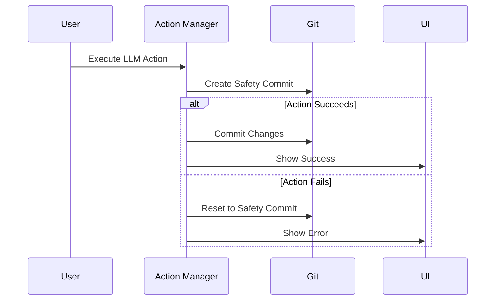
```mermaid
sequenceDiagram
    participant User
    participant AM as Action Manager
    participant Git
    participant UI

    User->>AM: Execute LLM Action
    AM->>Git: Create Safety Commit
    
    alt Action Succeeds
        AM->>Git: Commit Changes
        AM->>UI: Show Success
    else Action Fails
        AM->>Git: Reset to Safety Commit
        AM->>UI: Show Error
    end
```