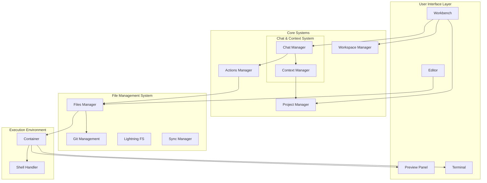
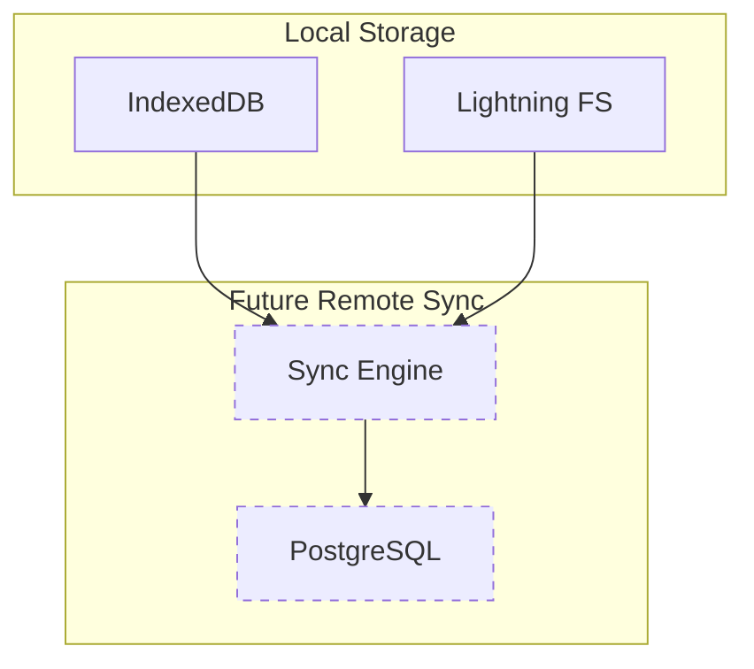
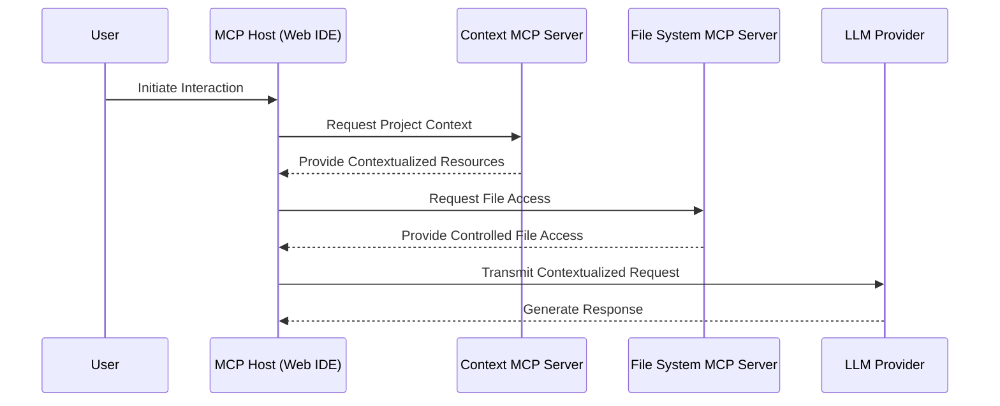

# Arc42 Architecture Description

## 1. Introduction and Goals

### 1.1 Requirements Overview

- Enable prompt-first development workflow.
- Provide a web-based IDE interface.
- Facilitate LLM-driven code generation and modification.
- Support code execution capabilities.

### 1.2 Quality Goals

- Best-in-class developer experience with a local-first approach and optimistic UI.
- Efficient LLM interaction to minimize latency and maximize throughput.
- Extensibility for future agent implementations.
- Seamless interaction between local and browser file systems.

### 1.3 Stakeholders

- **Developers**: Primary users of the IDE, requiring a seamless and efficient development experience.
- **LLM Operators**: Responsible for ensuring efficient and effective LLM interactions.
- **Peer developers**: Might collaborate on the same project.

## 2. Constraints

- Support multiple LLM providers without increasing complexity.
- Ensure prompt construction requires context from the entire project.
- Allow users to customize prompt behavior for specific projects.

## 3. Context and Scope

### 3.1 Business Context

- The system is a web-based IDE that allows developers to interact with code using natural language.

### 3.2 Technical Context

- The system integrates with multiple LLM providers and supports a web-based execution environment.
- The system is designed local-first, with optional remote sync for backup and collaboration.

## 4. Solution Strategy

- Use a modular architecture with clear separation of responsibilities.
- Implement a robust file management system with synchronization capabilities.
- Provides a runtime to preview the project in the browser.
- Provide a unified interface for LLM interactions.

## 5. Building Block View

### 5.1 Detailed Component Architecture

### 5.2 Core Systems Detailed Responsibilities

#### 5.2.1 Chat and Context System

##### Chat Manager

- **Primary Responsibilities:**
  - Coordinate conversation flow with LLM
  - Process and validate LLM responses
  - Manage interaction lifecycle
  - Route responses to appropriate action handlers

##### Context Manager

- **Context Assembly Strategy:**
  - Comprehensive context collection from multiple sources
  - Intelligent context prioritization
  - Token budget management
  - Context optimization for LLM interaction

**Context Sources Prioritization:**

1. **Immediate File Context** (Highest Priority)

   - Currently open files
   - Recently modified files
   - Files in current project scope

2. **Project-Level Context**

   - Project configuration
   - Dependency information
   - Project-specific settings

3. **Chat History Context**

   - Recent conversation history
   - Summarized previous interactions
   - Context from previous messages

4. **Workspace-Level Context**
   - Global IDE settings
   - User preferences
   - Cross-project configurations

##### Prompt Manager

- **Core Responsibilities:**
  - Manage prompt templates (global and project-specific)
  - Construct compiled prompts
  - Handle prompt customization
  - Provide versioning for prompts
  - Support dynamic prompt generation

#### 5.2.2 File Management System

##### Files Manager

- **Key Responsibilities:**
  - Coordinate file operations across browser and local filesystem
  - Manage file synchronization
  - Handle file watching and change detection
  - Provide atomic file operations

##### Git Management

- **Version Control Integration:**
  - Track file versions
  - Manage commit history
  - Handle branching and merging
  - Provide change tracking

##### Lightning FS

- **Browser-Based File System:**
  - POSIX-like file system in browser
  - Persistent storage via IndexedDB
  - Support for file metadata
  - Concurrent file operation handling

##### Sync Manager

- **Synchronization Capabilities:**
  - Coordinate sync between local and browser filesystems
  - Manage sync conflicts
  - Track file modification states
  - Implement sync queuing

#### 5.2.3 Project Management System

##### Project Manager

- **Project Lifecycle Management:**
  - Handle multiple independent projects
  - Manage project configurations
  - Coordinate project resources
  - Provide project isolation

##### Storage System

- **Local Storage Architecture:**
  - IndexedDB for project metadata
  - Lightning FS for project files
  - Support for future remote synchronization

#### 5.2.4 Error Resolution System

##### Error Resolution Manager

- **Primary Responsibilities:**
  - Capture and normalize errors from various sources
  - Create structured error context
  - Coordinate with Actions Manager for resolution
  - Track resolution attempts
  - Maintain error history
  - Provide error context to LLM interactions
  - Handle rollbacks if resolution fails

##### Error Collectors

1. **Container Collector**

   - Runtime errors
   - Build failures
   - Package manager issues
   - Process crashes
   - Resource exhaustion

2. **Editor Collector**

   - Syntax errors
   - Type errors
   - Linting issues
   - Formatting problems

3. **Action Collector**
   - LLM action failures
   - File operation errors
   - Git operation issues
   - Invalid state transitions

##### Integration Strategy

- **Context Manager Integration**

  - Error context as first-class context type
  - Priority handling in context assembly
  - Error history tracking
  - Resolution attempt history

- **Actions Manager Integration**

  - Error-specific action types
  - Rollback coordination
  - Resolution validation
  - State recovery

- **Chat Manager Integration**
  - Error-focused prompts
  - Resolution suggestions
  - Progressive refinement
  - Context continuity

## 5.3 Storage Architecture

**Storage Strategy:**

- **Local-First Approach**
  - Primary data storage in browser
  - Offline-capable
  - Fast, responsive interactions
- **Future Remote Sync**
  - Optional cloud synchronization
  - Bidirectional change tracking
  - Conflict resolution mechanism

## 6. Runtime View and MCP Integration

### 6.1 Model Context Protocol (MCP) Integration

#### Purpose of MCP Integration

The Model Context Protocol (MCP) provides a standardized mechanism for:

- Seamless integration between LLM applications and external data sources
- Flexible context transmission
- Secure and controlled access to project resources

#### MCP Architecture Components

##### 6.1.1 MCP Hosts

- **Web IDE Interface**: Primary MCP host
- **Capabilities**:
  - Initiate connections to MCP servers
  - Manage multiple server connections
  - Handle context retrieval and transmission

##### 6.1.2 MCP Servers

1. **Context Server**

   - Exposed by Context Manager
   - Provides project-wide context resources
   - Supports fine-grained context retrieval

2. **File System Server**

   - Exposed by Files Manager
   - Enables secure file access and manipulation
   - Implements access control and sanitization

3. **Prompt Server**
   - Managed by Prompt Manager
   - Exposes prompt templates and generation capabilities
   - Supports dynamic prompt customization

#### MCP Communication Flow

#### Key Integration Patterns

##### 6.2.1 Resource Exposure

- Standardized resource discovery
- Metadata-rich context providers
- Dynamic capability negotiation

##### 6.2.2 Security Mechanisms

- **Authentication**
  - OAuth 2.0 support
  - Fine-grained access controls
- **Context Sanitization**
  - Remove sensitive information
  - Implement access restrictions

##### 6.2.3 Transport Mechanisms

- Support for multiple protocols
  - Standard I/O
  - HTTP with Server-Sent Events
  - WebSocket

#### Future Roadmap

##### 6.4.1 Planned Enhancements

- Remote MCP server support
- Advanced service discovery
- Machine learning-based context optimization
- Enhanced multi-provider integration

##### 6.4.2 Potential Innovations

- Context source plugins
- Dynamic provider selection
- Advanced transmission metrics
- Cross-session context preservation

## 7. Deployment View

### 7.1 MCP Deployment Considerations

- Lightweight server implementations
- Minimal resource consumption
- Support for stateless and stateful environments
- Secure, scalable architecture

## 8. Cross-Cutting Concepts

### 8.1 MCP Protocol Concepts

- Standardized context transmission
- Secure resource access
- Flexible provider integration
- Comprehensive error management

## 9. Architecture Decisions

- Use of modular architecture for clear separation of responsibilities.
- Integration with multiple LLM providers through a unified interface.
- Use of TypeScript over Python as we will be using the same languague and tooling thoughout the stack.
- Use a monorepo approach to manage the project as integration layer for the components as this allows for better refactoring and flexible context-creation when developing the application with an LLM itself.

## 10. Quality Requirements

- **Extensibility**: Easy to add new LLM providers and agentic capabilities.
- **User Experience**: Best-in-class developer experience which allows for a consistent and efficient workflow with user- and agentic interaction interweaved.
- **Portability**: The application should be able to run on any device with a modern browser, packaged as a desktop application or in a containerized environment.

## 11. Risks and Technical Debt

- Potential complexity in managing specifics of multiple LLM providers.
- Ensuring seamless synchronization between local and browser file systems.

## 12. Glossary

- **LLM**: Large Language Model.
- **IDE**: Integrated Development Environment.
- **WebContainer**: A containerized environment for executing code in the browser.
