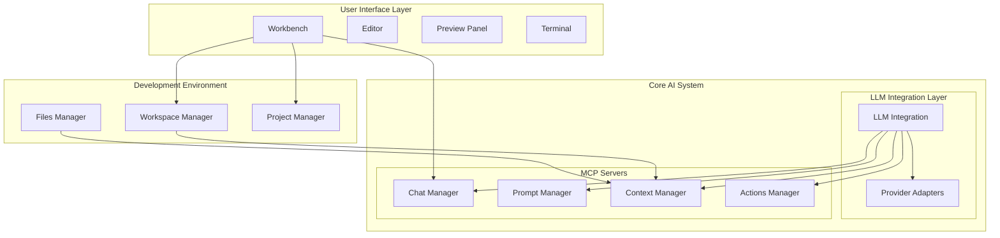
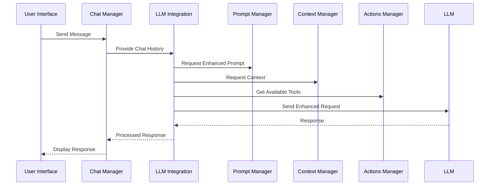
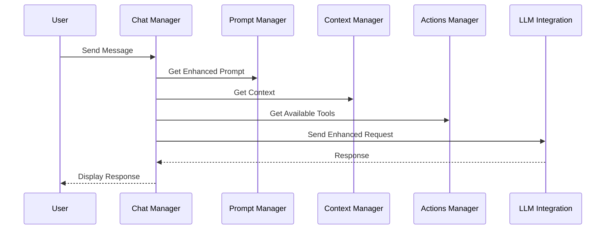
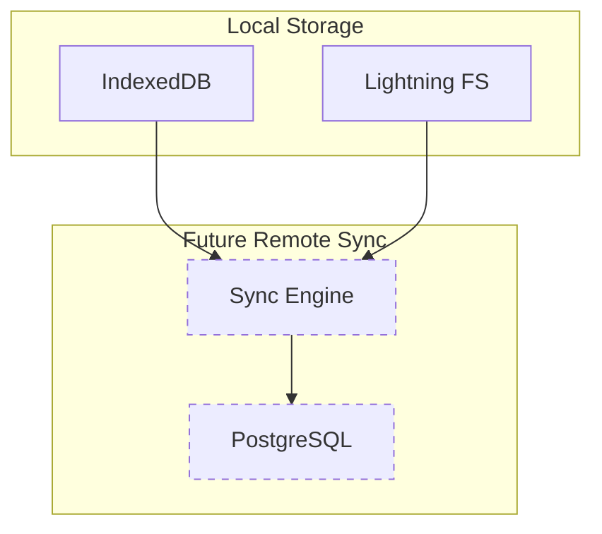

# Arc42 Architecture Description

## 1. Introduction and Goals

### 1.1 Requirements Overview

- Enable prompt-first development workflow.
- Provide a web-based IDE interface.
- Facilitate LLM-driven code generation and modification.
- Support code execution capabilities.

### 1.2 Quality Goals

- Best-in-class developer experience with a local-first approach and optimistic UI.
- Efficient LLM interaction to minimize latency and maximize throughput.
- Extensibility for future agent implementations.
- Seamless interaction between local and browser file systems.

### 1.3 Stakeholders

- **Developers**: Primary users of the IDE, requiring a seamless and efficient development experience.
- **LLM Operators**: Responsible for ensuring efficient and effective LLM interactions.
- **Peer developers**: Might collaborate on the same project.

## 2. Constraints

- Support multiple LLM providers without increasing complexity.
- Ensure prompt construction requires context from the entire project.
- Allow users to customize prompt behavior for specific projects.

## 3. Context and Scope

### 3.1 Business Context

- The system is a web-based IDE that allows developers to interact with code using natural language.

### 3.2 Technical Context

- The system integrates with multiple LLM providers and supports a web-based execution environment.
- The system is designed local-first, with optional remote sync for backup and collaboration.

## 4. Solution Strategy

- Use a modular architecture with clear separation of responsibilities.
- Implement a robust file management system with synchronization capabilities.
- Provides a runtime to preview the project in the browser.
- Provide a unified interface for LLM interactions.

## 5. Building Block View

### 5.1 Component Architecture

### 5.2 Component Responsibilities

#### 5.2.1 Core AI System

##### LLM Integration (MCP Host)

- **Primary Responsibilities:**
  - Orchestrate LLM interactions
  - Coordinate between MCP servers
  - Manage provider connections
  - Handle request enhancement

##### Chat Manager (MCP Server)

- **Core Functions:**
  - Manage chat history
  - Handle message flow
  - Maintain conversation state

##### Prompt Manager (MCP Server)

- **Core Functions:**
  - Enhance prompts
  - Manage templates
  - Handle customizations

##### Context Manager (MCP Server)

- **Core Functions:**
  - Provide file context
  - Gather workspace state
  - Assemble project information

##### Actions Manager (MCP Server)

- **Core Functions:**
  - Provide tool interfaces
  - Handle action execution
  - Manage permissions

#### 5.2.2 Development Environment

##### Files Manager

- **Core Functions:**
  - Handle file operations
  - Manage synchronization
  - Support version control

##### Workspace Manager

- **Core Functions:**
  - Manage IDE state
  - Handle user preferences
  - Coordinate views

##### Project Manager

- **Core Functions:**
  - Handle project setup
  - Manage dependencies
  - Configure resources

### 5.3 Communication Flow

## 6. Runtime View

### 6.1 LLM Interaction Flow

## 7. Storage Architecture

**Storage Strategy:**

- **Local-First Approach**
  - Primary data storage in browser
  - Offline-capable
  - Fast, responsive interactions
- **Future Remote Sync**
  - Optional cloud synchronization
  - Bidirectional change tracking
  - Conflict resolution mechanism

## 8. Cross-Cutting Concepts

### 8.1 MCP Protocol Concepts

- Standardized context transmission
- Secure resource access
- Flexible provider integration
- Comprehensive error management

## 9. Architecture Decisions

- Use of modular architecture for clear separation of responsibilities.
- Integration with multiple LLM providers through a unified interface.
- Use of TypeScript over Python as we will be using the same languague and tooling thoughout the stack.
- Use a monorepo approach to manage the project as integration layer for the components as this allows for better refactoring and flexible context-creation when developing the application with an LLM itself.

## 10. Quality Requirements

- **Extensibility**: Easy to add new LLM providers and agentic capabilities.
- **User Experience**: Best-in-class developer experience which allows for a consistent and efficient workflow with user- and agentic interaction interweaved.
- **Portability**: The application should be able to run on any device with a modern browser, packaged as a desktop application or in a containerized environment.

## 11. Risks and Technical Debt

- Potential complexity in managing specifics of multiple LLM providers.
- Ensuring seamless synchronization between local and browser file systems.

## 12. Glossary

- **LLM**: Large Language Model.
- **IDE**: Integrated Development Environment.
- **WebContainer**: A containerized environment for executing code in the browser.
