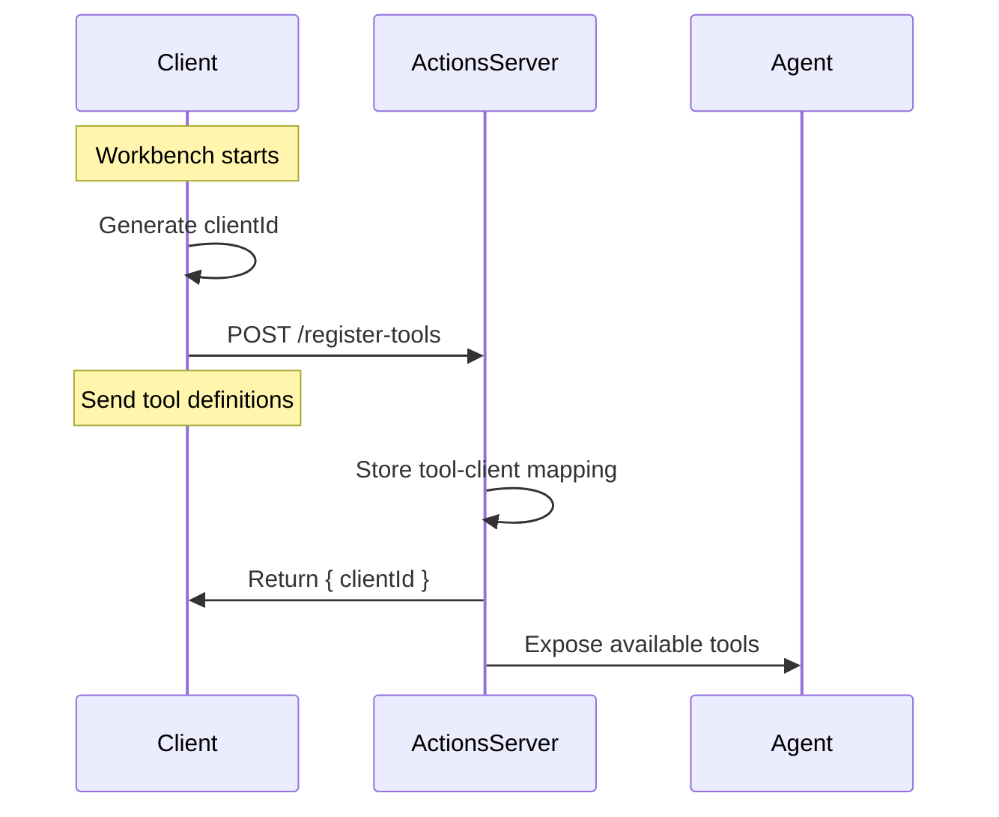
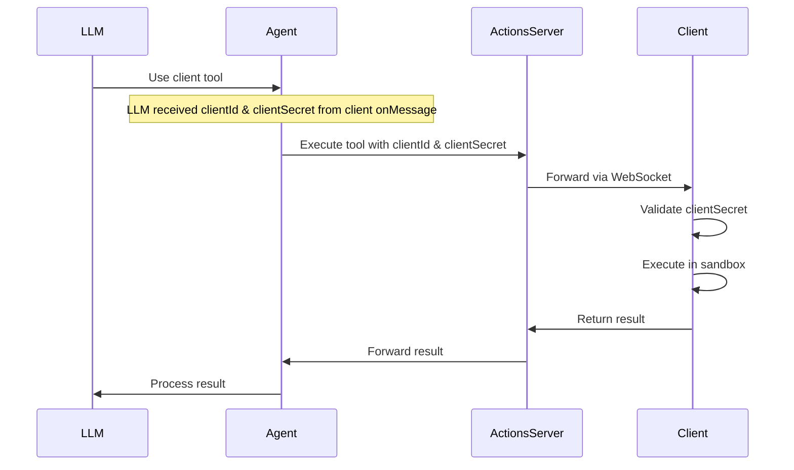

# Actions Server

## Purpose

The Actions Server enables server-side LLM agents to safely interact with client-side tools running in browser sandboxes. It:
- Provides a WebSocket endpoint for client connections
- Manages client-specific tool registrations
- Exposes client tools to server-side agents
- Proxies tool executions between agents and clients

## System Flow

### 1. Initial Setup & Tool Registration


### 2. Tool Execution


## Core Components

### 1. WebSocket Connection Manager
```typescript
interface ClientConnection {
  clientId: string;
  connection: WebSocket;
  tools: Map<string, ProxiedTool>;
  status: 'connected' | 'disconnected';
}

class WebSocketManager {
  private connections: Map<string, ClientConnection>;
  
  async handleConnection(ws: WebSocket, clientId: string): Promise<void>;
  async handleDisconnection(clientId: string): Promise<void>;
  async sendToClient(clientId: string, message: ServerMessage): Promise<void>;
}
```

### 2. Tool Registry
```typescript
interface ProxiedTool {
  name: string;
  description: string;
  parameters: JSONSchema;
  clientId: string;
  execute: (params: unknown) => Promise<unknown>;
}

class ToolRegistry {
  private tools: Map<string, ProxiedTool>;
  
  async registerTools(clientId: string, tools: Tool[]): Promise<void>;
  async getToolsForClient(clientId: string): Promise<ProxiedTool[]>;
  async unregisterClientTools(clientId: string): Promise<void>;
}
```

### 3. MCP Server Integration
```typescript
interface McpToolDefinition {
  name: string;
  description: string;
  parameters: {
    clientId: string;
    clientSecret: string;
    [key: string]: unknown;
  };
}

class McpServer {
  private toolRegistry: ToolRegistry;
  
  async registerTools(tools: McpToolDefinition[]): Promise<void>;
  async executeTool(toolName: string, params: unknown): Promise<unknown>;
}
```

## Security Implementation

### 1. Client Registration
```typescript
interface RegistrationResponse {
  clientId: string;
}

class ActionsManager {
  private clientId: string;
  private clientSecret: string;

  constructor() {
    this.clientSecret = generateSecret(); // Generate secret locally
  }

  async registerTools(tools: McpToolDefinition[]): Promise<void> {
    const response = await fetch('/api/register-tools', {
      method: 'POST',
      body: JSON.stringify(tools)
    });
    const { clientId } = await response.json();
    this.clientId = clientId;
  }

  // Method to expose credentials to LLM/Agent
  getToolCredentials(): { clientId: string; clientSecret: string } {
    return {
      clientId: this.clientId,
      clientSecret: this.clientSecret
    };
  }
}
```

### 2. Tool Execution Validation
```typescript
class ActionsManager {
  private validateToolExecution(params: unknown): boolean {
    const { clientId, clientSecret } = params as { clientId: string; clientSecret: string };
    return clientId === this.clientId && clientSecret === this.clientSecret;
  }

  async handleToolExecution(params: unknown): Promise<unknown> {
    if (!this.validateToolExecution(params)) {
      throw new Error('Invalid client credentials');
    }
    // Execute tool...
  }
}
```

## Message Protocol

### Client Messages
```typescript
interface ClientMessage {
  type: 'TOOL_RESPONSE' | 'ERROR';
  payload: {
    clientId: string;
    tools?: Tool[];
    result?: unknown;
    error?: string;
  };
}
```

### Server Messages
```typescript
interface ServerMessage {
  type: 'TOOL_REQUEST' | 'ERROR';
  payload: {
    toolName: string;
    parameters: {
      clientId: string;
      clientSecret: string;
      [key: string]: unknown;
    };
    requestId: string;
  };
}
```

## Implementation Example

### 1. Server Setup
```typescript
const server = new ActionsServer({
  port: 3000,
  mcpOptions: {
    // MCP server configuration
  }
});

await server.start();
```

### 2. Client Connection
```typescript
const client = new ActionsClient(ws, {
  clientId: 'unique-client-id',
  tools: [
    {
      name: 'writeFile',
      description: 'Write to sandboxed filesystem',
      parameters: {
        type: 'object',
        properties: {
          path: { type: 'string' },
          content: { type: 'string' }
        }
      }
    }
  ]
});
```

### 3. Agent Usage
```typescript
const actions = ActionsManager.getInstance();
const result = await actions.executeToolCall('writeFile', {
  path: '/example.txt',
  content: 'Hello'
});
```

## Security & Error Handling

### Authentication
```typescript
interface AuthConfig {
  token: string;
  origin: string;
  rateLimit: number;
}

class AuthManager {
  async validateConnection(auth: AuthConfig): Promise<boolean>;
  async validateRequest(clientId: string): Promise<boolean>;
}
```

### Error Handling
```typescript
class ErrorHandler {
  static handleConnectionError(error: Error): void;
  static handleToolError(error: Error): void;
  static handleProtocolError(error: Error): void;
}
```