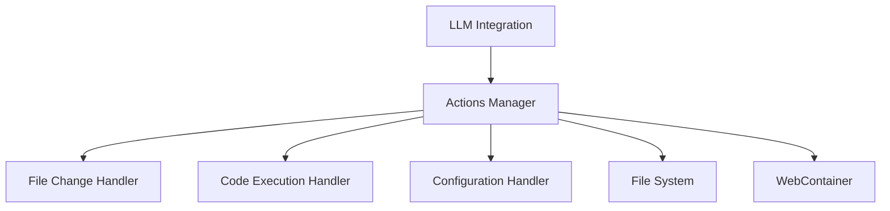

# Actions Package

## Overview
Interprets and executes various types of actions derived from LLM responses, providing a flexible and extensible action management system.

## System Diagram


## Core Components

### 1. Actions Manager
- **Responsibilities**:
  - Parse LLM responses into executable actions
  - Coordinate action execution
  - Handle action results
  - Manage action lifecycle
  - Provide pluggable action handler system

### 2. File Change Handler
- **Responsibilities**:
  - Manage file operations
  - Create git commits
  - Implement atomic changes
  - Handle rollback mechanisms

### 3. Code Execution Handler
- **Responsibilities**:
  - Run code in sandboxed environment
  - Capture execution output
  - Manage execution context
  - Provide safe code execution capabilities

### 4. Configuration Handler
- **Responsibilities**:
  - Update IDE settings
  - Manage project configurations
  - Handle environment variables
  - Provide configuration change tracking

## Key Design Decisions
- Pluggable action handler architecture
- Comprehensive action validation
- Atomic action execution
- Rollback and error recovery support

## Action Interface
```typescript
interface Action {
  type: ActionType;
  payload: unknown;
  metadata: ActionMetadata;
}

interface ActionHandler<T = unknown> {
  canHandle(action: Action): boolean;
  execute(action: Action): Promise<T>;
  validate(action: Action): Promise<boolean>;
  rollback(action: Action): Promise<void>;
}
```

## External Relationships
- Receives actions from LLM Integration
- Interfaces with File System
- Provides execution context to WebContainer
- Supports Chat Context tracking

## Action Types
- File Changes
- Code Execution
- Configuration Updates
- Project Scaffolding
- Custom Extension Actions

## Performance Considerations
- Minimal overhead action processing
- Efficient handler dispatching
- Concurrent action support
- Lightweight validation mechanisms

## Security Features
- Action authorization
- Resource limit enforcement
- Sandboxed execution environments
- Comprehensive logging and auditing

## Usage
```typescript
// Example of action execution
const action: Action = {
  type: 'FILE_CHANGE',
  payload: {
    changes: [{ 
      type: 'CREATE', 
      path: 'src/example.ts', 
      content: 'console.log("Hello, World!");' 
    }]
  }
};

const result = await actionsManager.executeAction(action);
```

## Future Enhancements
- Machine learning-based action prediction
- Advanced rollback strategies
- Distributed action execution
- Enhanced action composition 