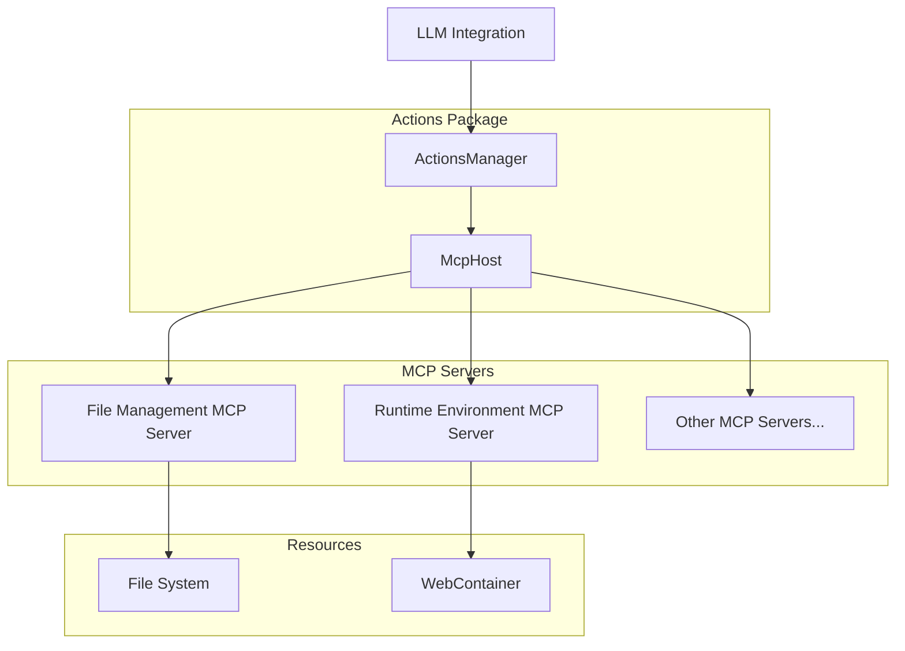

# Actions Package

## Overview

Manages and executes actions derived from LLM responses through a centralized ActionsManager, which serves as the single entry point for tool registration and execution via the Model Context Protocol (MCP).

## System Diagram



## Core Components

### 1. Actions Manager

- **Responsibilities**:
  - Serve as a singleton entry point for all action management
  - Initialize and maintain the McpHost instance
  - Manage MCP server registration and lifecycle
  - Provide tool discovery and execution APIs
  - Coordinate action execution across various handlers
  - Handle action results and provide standardized error handling
  - Manage action lifecycle

### 2. McpHost

- **Responsibilities**:
  - Maintain the registry of MCP servers
  - Route tool calls to appropriate servers
  - Provide standardized error handling and formatting
  - Manage server transport and communication
  - Provide a unified interface for tool execution

## Integrated MCP Servers

### 1. File Management MCP Server

- **Server Name**: `file_management`
- **Description**: File management operations for reading, writing, and manipulating files
- **Tools Provided**:
  - `read_file`: Read contents of a file
  - `write_file`: Write content to a file
  - `list_files`: List files in a directory
  - `delete_item`: Delete a file or directory
  - `create_directory`: Create a new directory
  - `stat`: Get information about a file or directory
- **Integration**: Registered with ActionsManager during initialization, provides file system operations to the Orchestrator

### 2. Runtime Environment MCP Server

- **Server Name**: `runtime_environment`
- **Description**: Runtime environment operations for executing commands
- **Tools Provided**:
  - `execute_command`: Execute a command in the runtime environment with options for:
    - Working directory
    - Environment variables
    - Timeout settings
- **Integration**: Registered with ActionsManager during initialization, provides command execution capabilities to the Orchestrator

### Integration with Orchestrator

The MCP servers are integrated into the system through the following flow:

1. During application bootstrap:

   - ActionsManager initializes the McpHost
   - Each MCP server is registered with the ActionsManager
   - ActionsManager maintains the server registry through McpHost

2. Tool Discovery:

   - Orchestrator requests available tools from ActionsManager
   - ActionsManager aggregates tools from all registered MCP servers
   - Tools are provided to the Orchestrator for LLM interaction

3. Tool Execution:
   - Orchestrator receives tool calls from LLM
   - Tool calls are forwarded to ActionsManager
   - ActionsManager routes calls to appropriate MCP servers
   - Results are returned through the same chain

## Key Design Decisions

- Singleton pattern for ActionsManager to provide a central access point
- Centralized MCP server registration through ActionsManager
- Clean separation between LLM communication and tool execution
- Pluggable action handler architecture
- Comprehensive action validation
- Atomic action execution
- Rollback and error recovery support

## MCP Integration Flow


## Action and Tool Interface

```typescript
interface Action {
  type: ActionType;
  payload: unknown;
  metadata: ActionMetadata;
}

interface ActionHandler<T = unknown> {
  canHandle(action: Action): boolean;
  execute(action: Action): Promise<T>;
  validate(action: Action): Promise<boolean>;
  rollback(action: Action): Promise<void>;
}

// ActionsManager API for MCP tool integration
interface ActionsManager {
  getInstance(): ActionsManager;
  initialize(): Promise<void>;
  getAvailableTools(): Promise<Tool[]>;
  executeToolCall(
    name: string,
    args: Record<string, unknown>
  ): Promise<{ result: unknown; error?: string }>;
  registerServer(server: McpServer, name: string): Promise<void>;
}
```

## External Relationships

- Provides tool discovery and execution to LLM Integration
- Manages MCP servers for file operations, code execution, and runtime environment
- Interfaces with File System
- Provides execution context to WebContainer
- Supports Chat Context tracking

## Action Types

- File Changes
- Code Execution
- Configuration Updates
- Project Scaffolding
- Custom Extension Actions

## Performance Considerations

- Minimal overhead action processing
- Efficient tool call routing
- Concurrent action support
- Optimized tool discovery caching
- Lightweight validation mechanisms

## Security Features

- Standardized action authorization
- Centralized resource limit enforcement
- Sandboxed execution environments
- Comprehensive logging and auditing

## Usage

```typescript
// Getting the ActionsManager singleton
const actionsManager = ActionsManager.getInstance();

// Initializing all MCP servers during application bootstrap
await actionsManager.initialize();

// Executing a tool call from the LLM
const result = await actionsManager.executeToolCall("read_file", {
  path: "src/example.ts"
});

// Traditional action execution
const action: Action = {
  type: "FILE_CHANGE",
  payload: {
    changes: [
      {
        type: "CREATE",
        path: "src/example.ts",
        content: 'console.log("Hello, World!");'
      }
    ]
  }
};

const actionResult = await actionsManager.executeAction(action);
```

## Future Enhancements

- Extensible plugin system for third-party MCP servers
- Advanced error recovery strategies
- Machine learning-based action prediction
- Distributed action execution
- Enhanced action composition
