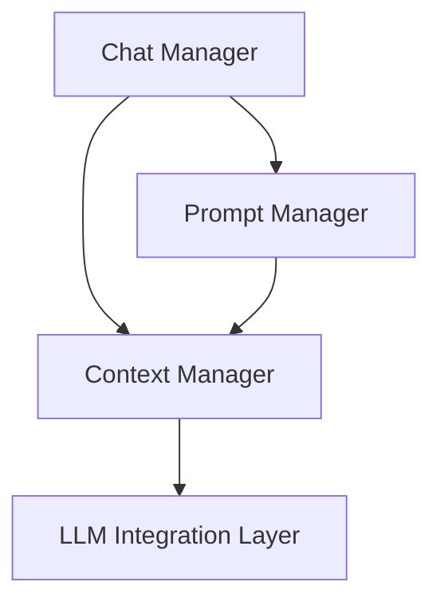

# Chat Context Package

## Overview

Manages the conversational context and prompt generation for the AI-driven development environment.

## System Diagram



## Core Components

### 1. Chat Manager

- **Responsibilities**:
  - Handle message processing
  - Coordinate with Context Manager
  - Process LLM responses
  - Manage conversation flow

### 2. Context Manager

- **Responsibilities**:
  - Assemble comprehensive context for LLM interactions
  - Manage message history
  - Handle context optimization
  - Implement MCP-compliant context server

### 3. Prompt Manager

- **Responsibilities**:
  - Manage and customize prompts
  - Construct compiled prompts
  - Store prompt templates
  - Enable prompt customization

## Key Design Decisions

- Modular architecture with clear separation of concerns
- Flexible context source management
- Support for multiple context types
  - File context
  - Documentation context
  - Chat history
  - Workspace state

## External Relationships

- Interfaces with LLM Integration Layer
- Provides context for Actions Manager
- Supports project-specific prompt customization

## Performance Considerations

- Token budget management
- Context source prioritization
- Efficient context assembly

## Future Enhancements

- Advanced context tracking
- Machine learning-based context optimization
- Cross-session context preservation

## Usage

```typescript
// Example of context retrieval
const context = await contextManager.assembleContext(conversationHistory);
const prompt = promptManager.compilePrompt(context);
```
