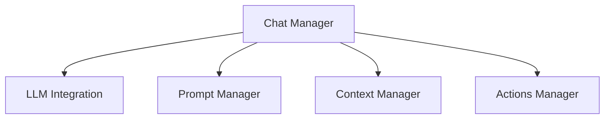

# Chat Management Package

## Overview

Manages the chat history and message flow between the user and LLM. This package is responsible for maintaining the conversation state and coordinating with other components to enhance LLM interactions.

## System Diagram



## Core Responsibilities

### Chat Manager

- **Message Management**:
  - Store and manage chat history
  - Handle message threading and conversation flow
  - Maintain conversation state and metadata

- **Coordination**:
  - Request prompt enhancements from Prompt Manager
  - Gather context from Context Manager
  - Collect available tools from Actions Manager
  - Send enhanced requests to LLM Integration

- **Response Handling**:
  - Process LLM responses
  - Update conversation state
  - Handle error scenarios

## External Dependencies

- **Prompt Manager**: For prompt enhancement and optimization
- **Context Manager**: For additional context from files and workspace
- **Actions Manager**: For tool interfaces
- **LLM Integration**: For LLM communication

## Usage

```typescript
// Example usage
const chatManager = new ChatManager({
  promptManager,
  contextManager,
  actionsManager,
  llmIntegration
});

// Send message
await chatManager.sendMessage({
  content: "Please help me with this code",
  type: "user"
});
```

## Performance Considerations

- Efficient chat history management
- Optimized coordination with other components
- Smart caching of frequently used data

## Future Enhancements

- Advanced conversation threading
- Multi-user chat support
- Conversation branching
