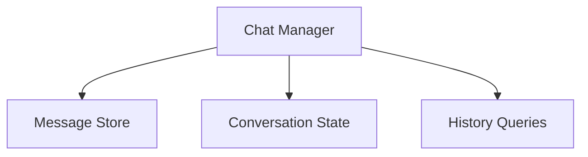

# Chat Management Package

## Overview

Manages chat history and conversation state. This package provides a simple interface for storing and retrieving chat messages, without any protocol-specific implementation.

## System Diagram



## Core Responsibilities

### Message Storage

- Store and retrieve chat messages
- Track conversation state
- Provide filtered history queries

### Data Types

#### Messages

- User messages
- Assistant responses
- System messages

#### Conversation State

- Creation time
- Last update
- Message count
- Optional metadata

## Usage

```typescript
import { ChatManager } from "@piddie/chat-management";

// Create manager
const manager = new ChatManager();

// Add message
const msg = await manager.addMessage({
  conversationId: "conv-1",
  role: "user",
  content: "Hello"
});

// Get history
const history = await manager.getHistory("conv-1", {
  limit: 10,
  before: new Date()
});

// Get state
const state = await manager.getState("conv-1");
```

## Integration

This package is protocol-agnostic and can be used with any communication layer. For MCP integration, use the ChatServer from the llm-integration package.

## Performance Considerations

- Efficient message storage
- Fast history retrieval
- Optimized state tracking

## Future Enhancements

- Persistent storage
- Message threading
- Advanced filtering
- Conversation metadata
