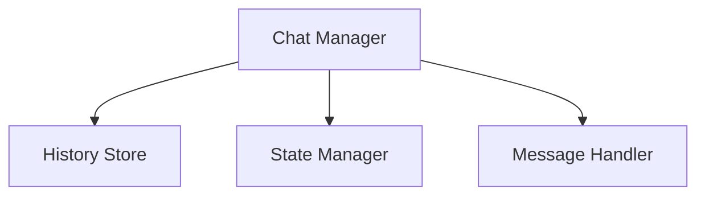

# Chat Management Package

## Overview

Manages chat history and message flow between users and LLMs. This package focuses on maintaining conversation state and providing a clean interface for message handling.

## System Diagram

## Core Responsibilities

### Message Management

- Store and manage chat history
- Handle message threading and conversation flow
- Maintain conversation state and metadata
- Provide clean interfaces for message retrieval

### Message Types

- User messages
- LLM responses
- System notifications
- Error messages

## External Relationships

- Provides chat history to LLM Integration
- Receives processed responses from LLM Integration
- Maintains conversation state

## Performance Considerations

- Efficient chat history management
- Smart message caching
- Optimized state updates

## Future Enhancements

- Advanced conversation threading
- Multi-user chat support
- Conversation branching
