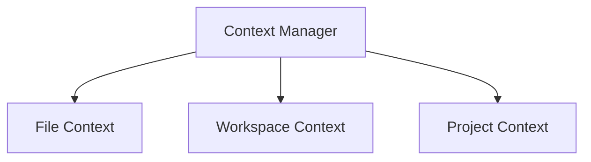

# Context Management Package

## Overview

Provides relevant context from files, workspace state, and other sources to enhance LLM interactions. This package focuses on gathering and optimizing contextual information.

## System Diagram

## Core Responsibilities

### Context Management

- **Context Collection**:
  - Gather file contents
  - Collect workspace state
  - Assemble project information

- **Context Optimization**:
  - Prioritize relevant context
  - Manage token budget
  - Remove redundant information

- **Context Types**:
  - File context (current and related files)
  - Workspace context (IDE state)
  - Project context (configuration, dependencies)

## Performance Considerations

- Smart context caching
- Incremental context updates
- Efficient context filtering

## Future Enhancements

- Advanced context relevance scoring
- Cross-session context preservation
- ML-based context optimization
