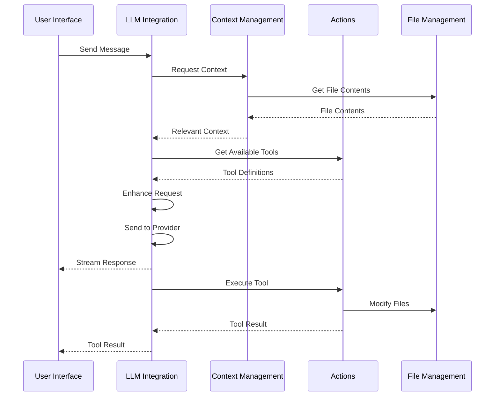

# Core AI System Implementation Summary

This document provides a comprehensive overview of the Core AI System implementation for the web-based code editor, explaining how the components work together and how they can be adapted from the Cline VS Code extension.

## System Architecture

The Core AI System consists of three main packages:

1. **LLM Integration**: Orchestrates LLM interactions and manages provider connections
2. **Context Management**: Provides relevant context from files, workspace, and project
3. **Actions**: Interprets and executes actions derived from LLM responses

These packages work together through the Model Context Protocol (MCP), which provides a standardized way for components to communicate.

## Adaptation from Cline VS Code Extension

### Components to Reuse

1. **Provider Adapters**: The provider adapter pattern from `packages/cline/src/api` can be reused with minimal changes.
2. **MCP Implementation**: The MCP client and server implementation can be adapted for browser environments.
3. **File System Abstractions**: The browser-native file system implementation can be reused directly.

### Components to Adapt

1. **VS Code API Dependencies**: Replace VS Code-specific APIs with browser-compatible alternatives.
2. **UI Layer**: Replace VS Code webview with web-based UI components.
3. **Terminal Integration**: Replace VS Code terminal with browser-based terminal emulation.

### Components to Create

1. **Browser-Based Execution Environment**: Create a sandboxed environment for code execution in the browser.
2. **Web-Based File System**: Implement a web-based file system that works with the browser's File System Access API.
3. **Web-Based UI**: Create a web-based UI using Vue3 and Shoelace as specified in the architecture.

## Integration Flow

## Key Differences from VS Code Extension

1. **Browser Environment**: The web-based editor runs in a browser environment, which has different capabilities and limitations compared to VS Code.
2. **File System Access**: The web-based editor uses the browser's File System Access API instead of Node.js file system.
3. **Code Execution**: The web-based editor uses a sandboxed environment for code execution instead of the local system.
4. **UI Framework**: The web-based editor uses Vue3 and Shoelace instead of VS Code's webview.

## Implementation Strategy

### Phase 1: Core Infrastructure

1. Set up the project structure and build system
2. Implement the MCP client and server
3. Create the file system abstractions

### Phase 2: Component Development

1. Implement the LLM Integration package
2. Implement the Context Management package
3. Implement the Actions package

### Phase 3: Integration and UI

1. Connect the components through MCP
2. Create the web-based UI
3. Implement the code execution environment

### Phase 4: Testing and Refinement

1. Create unit tests for each component
2. Implement integration tests
3. Optimize performance and user experience

## Conclusion

By adapting the Cline VS Code extension's architecture and components, we can create a powerful web-based code editor with agentic capabilities. The modular design allows for easy extension and customization, while the MCP protocol ensures seamless communication between components.

The implementation plans for each package provide detailed guidance on how to implement the core AI system, with a focus on browser compatibility, security, and performance.
