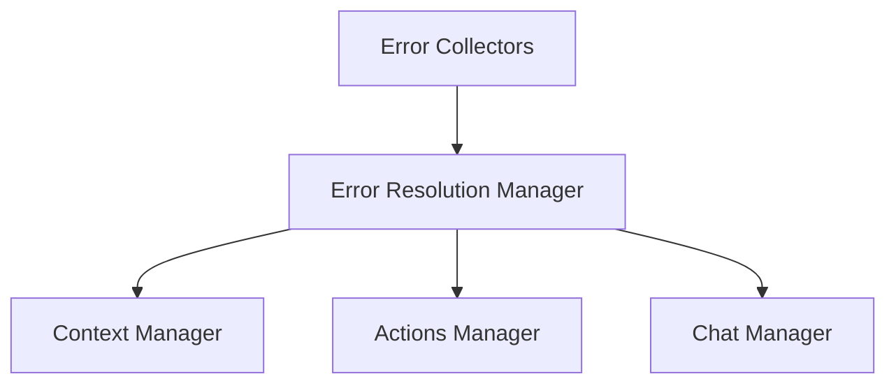

# Error Resolution Package

## Overview
Provides intelligent error handling and resolution by converting runtime errors, build failures, and other issues into structured context for LLM-assisted debugging.

## System Diagram


## Core Components

### 1. Error Resolution Manager
- **Responsibilities**:
  - Capture and normalize errors from various sources
  - Create structured error context
  - Coordinate resolution attempts
  - Track error history
  - Provide error context to LLM interactions
  - Manage rollback processes

### 2. Error Collectors
#### WebContainer Collector
- **Captures**:
  - Runtime errors
  - Build failures
  - Package manager issues
  - Process crashes
  - Resource exhaustion

#### Editor Collector
- **Captures**:
  - Syntax errors
  - Type errors
  - Linting issues
  - Formatting problems

#### Action Collector
- **Captures**:
  - LLM action failures
  - File operation errors
  - Git operation issues
  - Invalid state transitions

## Key Design Decisions
- Comprehensive error context assembly
- Modular error collection
- Intelligent resolution strategies
- Automated and guided resolution support

## Error Context Structure
```typescript
interface ErrorContext {
  source: ErrorSource;
  type: ErrorType;
  stackTrace: string[];
  relatedFiles: string[];
  environmentState: Record<string, unknown>;
  previousResolutionAttempts: ResolutionAttempt[];
}
```

## External Relationships
- Provides error context to Chat Manager
- Interfaces with Context Manager
- Coordinates with Actions Manager for resolution
- Supports WebContainer monitoring

## Resolution Strategies
1. Automatic Resolution
   - Analyze error patterns
   - Apply known fixes
   - Rollback if necessary

2. Guided Manual Resolution
   - Provide detailed error context
   - Suggest potential solutions
   - Interactive resolution workflow

## Performance Considerations
- Minimal overhead error tracking
- Efficient context assembly
- Lightweight resolution attempts
- Caching of resolution strategies

## Security Features
- Sanitized error reporting
- Controlled resolution actions
- Comprehensive logging
- Prevent sensitive information exposure

## Usage
```typescript
// Example of error resolution
const errorContext = errorResolutionManager.captureError(runtimeError);
const resolutionSuggestions = await chatManager.requestResolution(errorContext);
const resolvedAction = await actionsManager.executeResolution(resolutionSuggestions);
```

## Future Enhancements
- Machine learning-based error prediction
- Advanced resolution pattern recognition
- Cross-project error knowledge base
- Automated test case generation for errors

## Monitoring and Reporting
- Detailed error analytics
- Resolution success tracking
- Performance impact assessment
- Continuous improvement mechanisms 