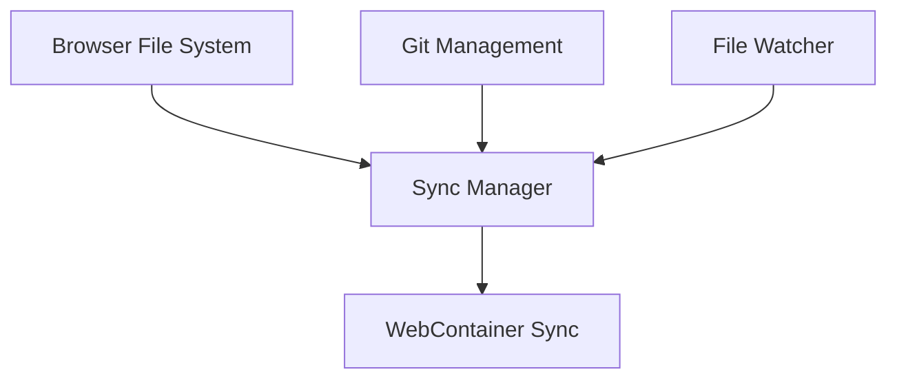

# File System Package

## Overview

Provides a robust file management system that works across browser and local file systems with comprehensive synchronization capabilities.

## System Diagram



## Core Components

### 1. Browser File System (Lightning FS)

- **Responsibilities**:
  - Provide POSIX-like file system in browser
  - Store file contents in IndexedDB
  - Handle file read/write operations
  - Manage file metadata

### 2. Git Management (isomorphic-git)

- **Responsibilities**:
  - Track file versions
  - Handle branching and merging
  - Manage commit history
  - Resolve conflicts

### 3. Sync Manager

- **Responsibilities**:
  - Coordinate synchronization between local and browser filesystem
  - Track file modification states
  - Queue and batch sync operations
  - Handle sync conflicts

### 4. File Watcher

- **Responsibilities**:
  - Monitor local file system changes
  - Detect browser file system changes
  - Trigger sync operations
  - Maintain change history

## Key Design Decisions

- Bidirectional synchronization
- Atomic file operations
- Persistent storage across sessions
- Conflict resolution strategies

## External Relationships

- Interfaces with WebContainer
- Provides file context to Chat Context Package
- Supports Actions Manager file operations

## Synchronization Flow

1. Detect file changes
2. Convert file system representations
3. Apply changes to target system
4. Resolve potential conflicts
5. Update change history

## Performance Considerations

- Efficient change detection
- Minimal overhead synchronization
- Caching of file metadata
- Incremental updates

## Conflict Resolution Strategies

- Auto-merge for compatible changes
- Manual resolution for complex conflicts
- Versioning and change tracking

## Usage

```typescript
// Example of file synchronization
const fileChanges = await syncManager.syncFiles(localChanges);
await gitManagement.commitChanges(fileChanges);
```

## Future Enhancements

- Advanced conflict resolution
- Machine learning-based merge strategies
- Enhanced cross-platform support
