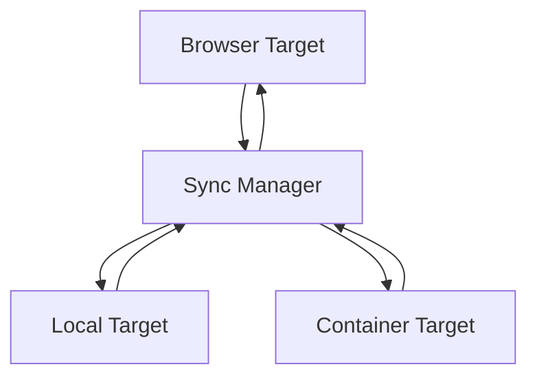
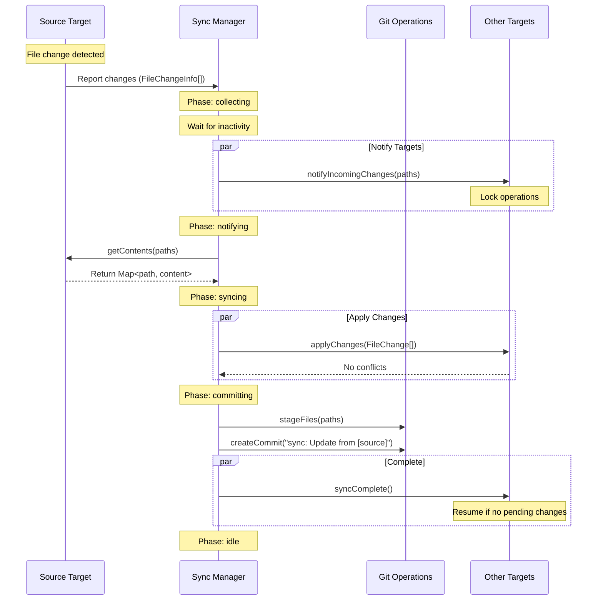
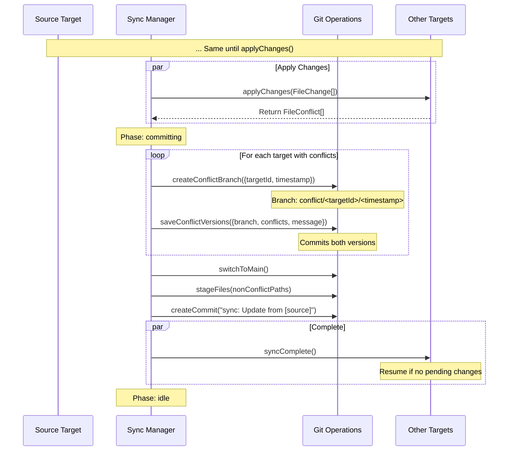
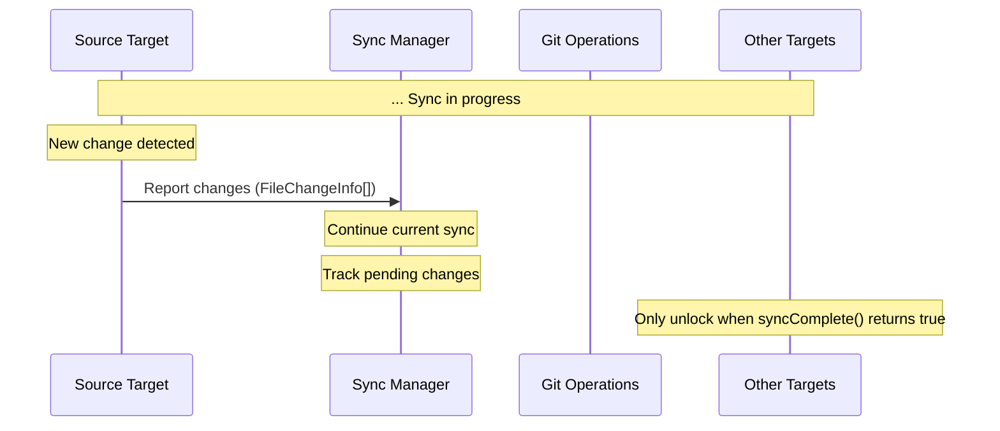
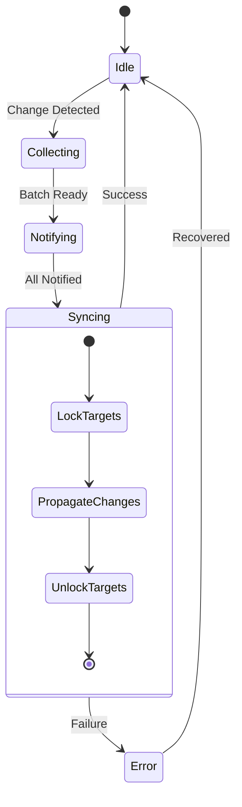

# File System Package

## Overview

Provides a robust file management system that works across browser and local file systems with comprehensive synchronization capabilities and integrated version control.

## System Architecture



## Core Components

### 1. Sync Manager

- **Responsibilities**:
  - Coordinates synchronization between targets
  - Manages target registration and lifecycle
  - Tracks sync status and phase
  - Handles conflict detection and resolution

### 2. Sync Targets

Each environment implements the SyncTarget interface:

- **Browser Target**:

  - Manages browser-based filesystem
  - Handles file watching and change detection
  - Stores files in IndexedDB

- **Local Target**:

  - Interfaces with local filesystem
  - Handles file watching
  - Manages file permissions

- **Container Target**:
  - Manages WebContainer filesystem
  - Handles container-specific operations

## Synchronization Process

### 1. Happy Path (No Conflicts)



### 2. Conflict Handling



### 3. Changes During Sync



### State Management

The sync process is tracked through phases and target states:

```typescript
type SyncPhase =
  | "idle"
  | "collecting" // waiting for inactivity
  | "notifying" // notifying targets
  | "syncing" // applying changes
  | "committing" // git operations
  | "error";

interface TargetState {
  id: string;
  type: "browser" | "local" | "container";
  lockState: LockState;
  pendingChanges: number;
  lastSyncTime?: number;
  status: "idle" | "collecting" | "notifying" | "syncing" | "error";
  error?: string;
}
```

### Configuration

The file management service can be configured through:

```typescript
interface FileManagementConfig {
  paths?: {
    include: string[]; // Paths to include
    ignore: string[]; // Paths to ignore
  };
  sync?: {
    inactivityDelay: number; // Wait time after last change
    maxBatchSize: number; // Max changes per batch
  };
}
```

### Error Handling

Errors are handled through specific error classes:

```typescript
// Sync errors
class SyncError extends Error {
  constructor(
    message: string,
    code:
      | "INITIALIZATION_FAILED"
      | "LOCK_FAILED"
      | "CONTENT_RETRIEVAL_FAILED"
      | "APPLY_FAILED"
      | "WATCH_FAILED"
  );
}

// Git errors
class GitError extends Error {
  constructor(
    message: string,
    code: "STAGE_FAILED" | "COMMIT_FAILED" | "BRANCH_FAILED" | "SWITCH_FAILED"
  );
}
```

## Error Handling

- Targets can recover from failed operations
- Sync Manager maintains system consistency
- Locked state prevents data corruption
- Clear completion signals

## Git Operations

Git operations are handled explicitly through the Git interface:

```typescript
interface GitOperations {
  commit(message: string): Promise<string>;
  checkout(branch: string): Promise<void>;
  status(): Promise<{
    branch: string;
    modified: string[];
    staged: string[];
  }>;
  history(path: string): Promise<
    Array<{
      hash: string;
      message: string;
      timestamp: number;
      changes: string[];
    }>
  >;
}
```

### Git Integration Flow

1. **Normal Changes**

   ```typescript
   // After successful sync
   await git.commit("sync: Update files from [source target]");
   ```

2. **Conflict Handling**
   ```typescript
   // When conflicts are detected
   await git.checkout("conflict/[timestamp]");
   await git.commit("conflict: Store conflicting versions\n\nPaths: [paths]");
   await git.checkout("main"); // Return to main branch
   ```

### Commit Messages

- Clear prefix indicating operation type (`sync:`, `conflict:`)
- Source target identification
- Affected paths in commit body
- Timestamp for conflict branches

## Usage Example

```typescript
// Register targets with specific filters
syncManager.registerTarget(
  new BrowserTarget({
    relevantPaths: ["src/**/*", "public/**/*"]
  })
);

syncManager.registerTarget(
  new ContainerTarget({
    ignorePaths: ["dist/**/*", "node_modules/**/*"]
  })
);

// Git operations are explicit
const git = new GitOperations();
await git.commit("feat: Initial commit");
```

## State Management

The system maintains detailed state information for all sync targets and operations.



### Target States

Each sync target maintains its own state:

```typescript
interface TargetState {
  id: string;
  type: "browser" | "local" | "container";
  lockState: LockState;
  pendingChanges: number;
  lastSyncTime?: number;
  status: "idle" | "collecting" | "notifying" | "syncing" | "error";
  error?: string;
}
```

### Lock Management

Targets use a timeout-based locking mechanism:

```typescript
// Lock target with timeout
await target.lock(5000, "Preparing for sync");

// Check lock state
const lockState = target.getLockState();
if (
  lockState.isLocked &&
  Date.now() - lockState.lockedSince > lockState.lockTimeout
) {
  // Handle timeout
  await target.forceUnlock();
}
```

### Error Recovery

The system provides mechanisms for handling lock failures:

1. **Timeout-based Locks**

   - All locks require timeout specification
   - Automatic unlock after timeout
   - Prevents indefinite locks

2. **Force Unlock**

   - Emergency unlock capability
   - Can be triggered per target or globally
   - Use with caution - may cause inconsistencies

3. **State Recovery**
   ```typescript
   // Example of recovery flow
   try {
     await syncManager.resume();
   } catch (error) {
     await syncManager.forceUnlockAll();
     // Handle recovery
   }
   ```

### Monitoring

The sync manager provides detailed status information:

```typescript
const status = syncManager.getStatus();
console.log(
  `Sync Progress: ${status.progress.processed}/${status.progress.total}`
);
status.targets.forEach((state, targetId) => {
  console.log(`Target ${targetId}: ${state.status}`);
});
```
