# File System Package

## Overview

Provides a robust file management system that works across browser and local file systems with comprehensive synchronization capabilities and integrated version control.


## System Architecture

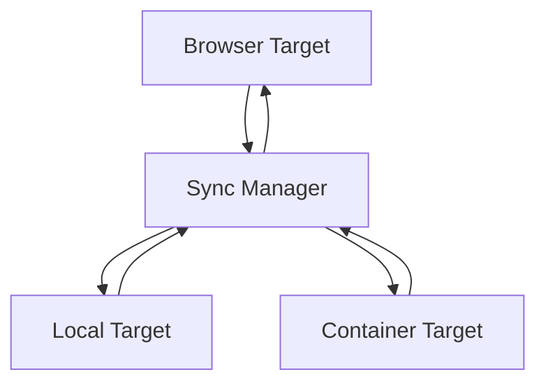

## Core Components

### 1. Sync Manager

- **Responsibilities**:
  - Coordinates synchronization between targets
  - Manages target registration and lifecycle
  - Tracks sync status and phase
  - Manages primary/secondary target roles
  - Handles sync failures and recovery

### 2. Sync Targets

Each environment implements the SyncTarget interface:

- **Browser Target**:

  - Manages browser-based filesystem
  - Handles file watching and change detection
  - Stores files in IndexedDB

- **Local Target**:

  - Interfaces with local filesystem
  - Handles file watching
  - Manages file permissions

- **Container Target**:
  - Manages WebContainer filesystem
  - Handles container-specific operations

## Synchronization Process

### Component Architecture and Interactions

The synchronization system consists of three main components that work together hierarchically:

1. **FileSyncManager** orchestrates the overall sync process

   - Coordinates between targets
   - Manages conflict resolution
   - Tracks global sync state

2. **SyncTarget** manages individual target synchronization

   - Handles change detection
   - Manages sync operations
   - Controls target-specific state
   - Manages filesystem locking during sync

3. **FileSystem** provides low-level file operations
   - Manages file access
   - Controls write permissions
   - Ensures data consistency

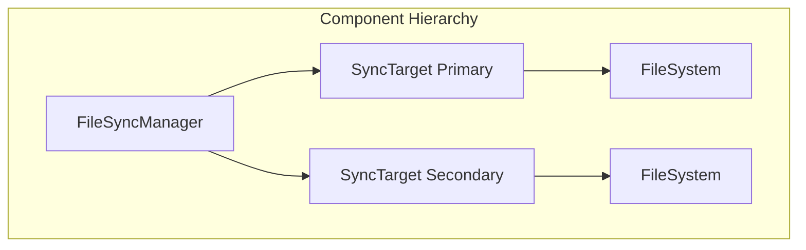

### State Machines

Each component maintains its own state machine, coordinating through well-defined interfaces:

#### 1. FileSystem States

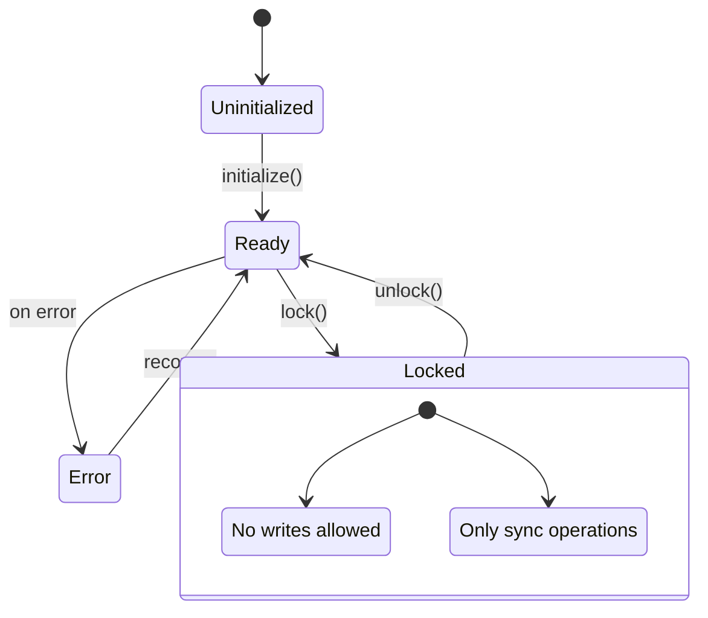

#### 2. SyncTarget States

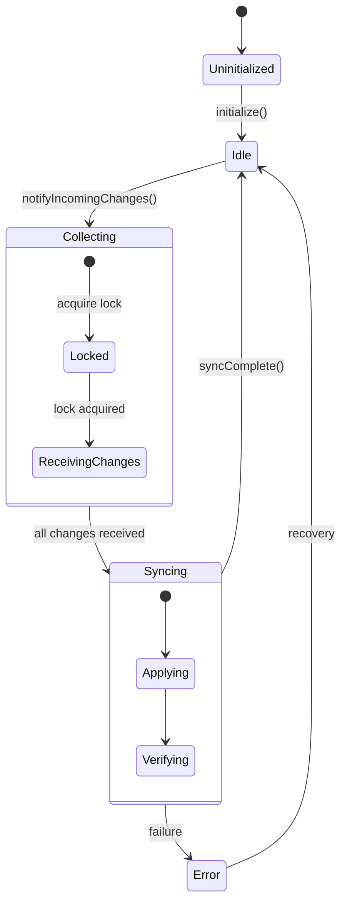

#### 3. FileSyncManager States

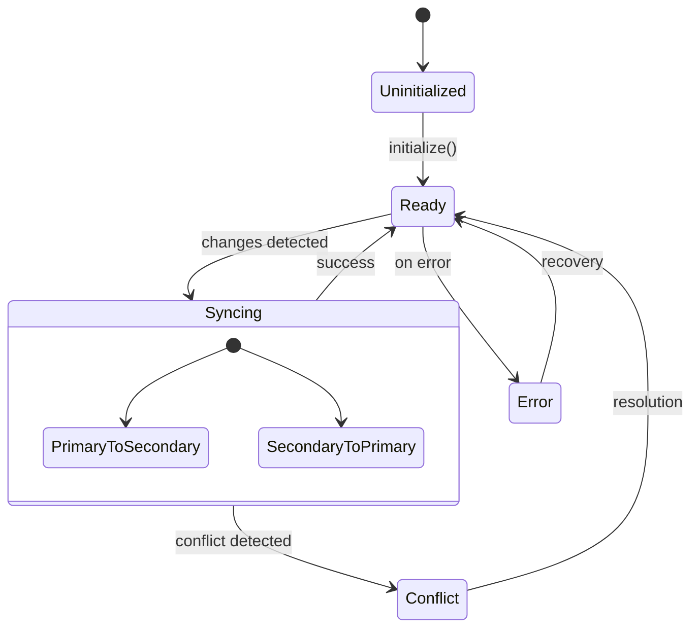

### Locking and State Transitions

The sync process involves several state transitions coordinated between components:

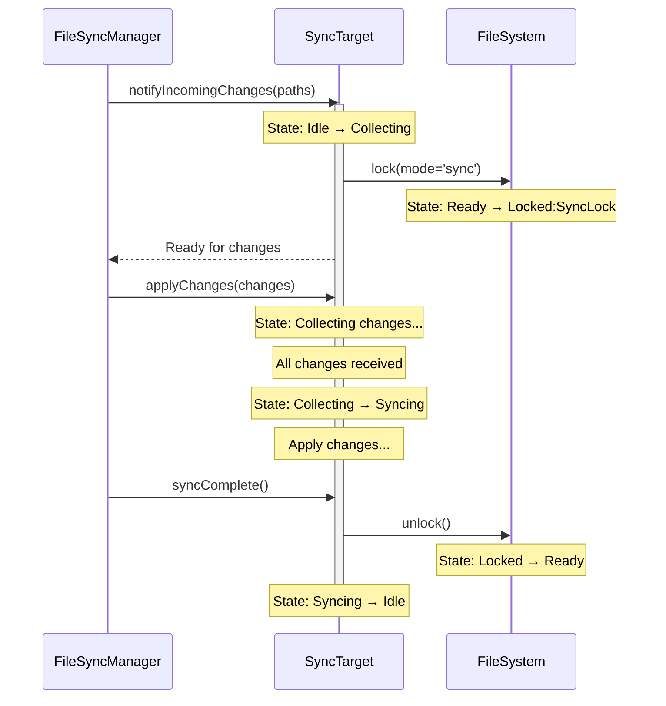

### Primary/Secondary Target Concept

The sync system operates with a primary target that acts as the source of truth. All other targets are secondary and can be reinitialized from the primary if needed.

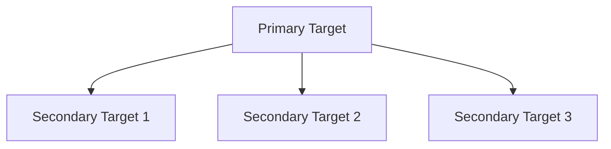

### Sync States

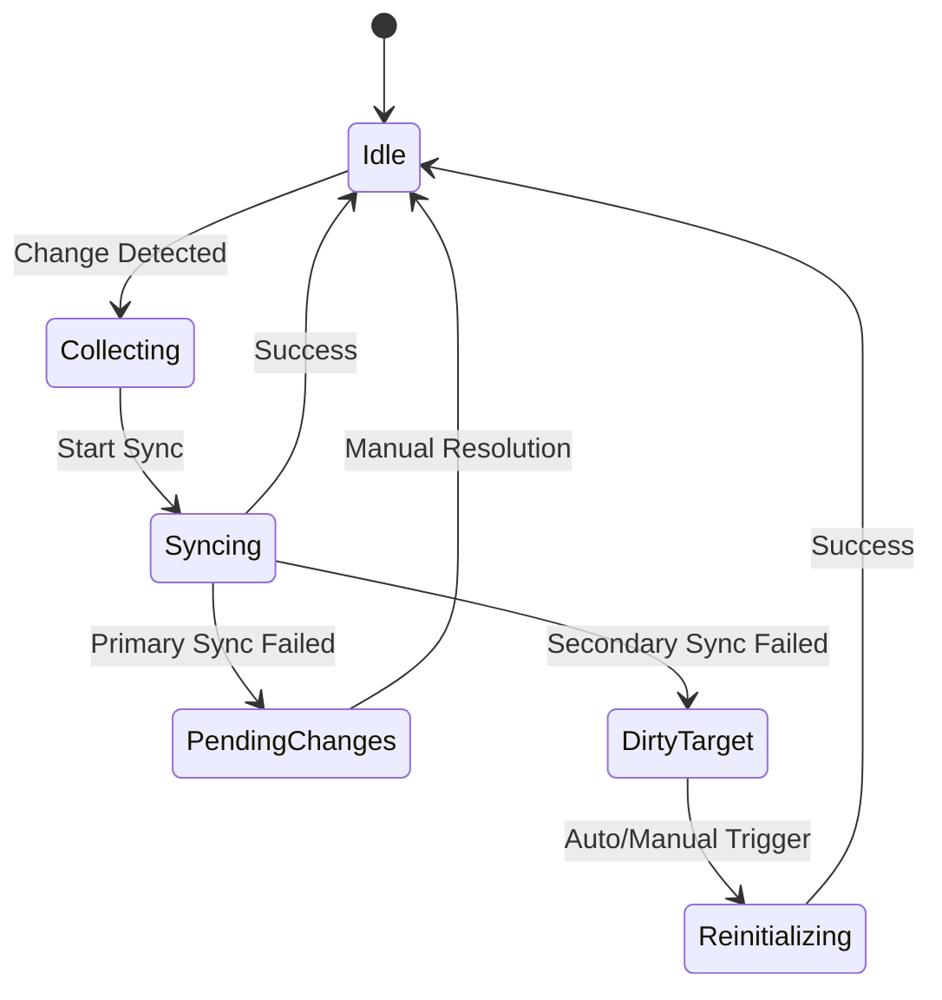

### Sync Flows

#### 1. Primary Target Changes

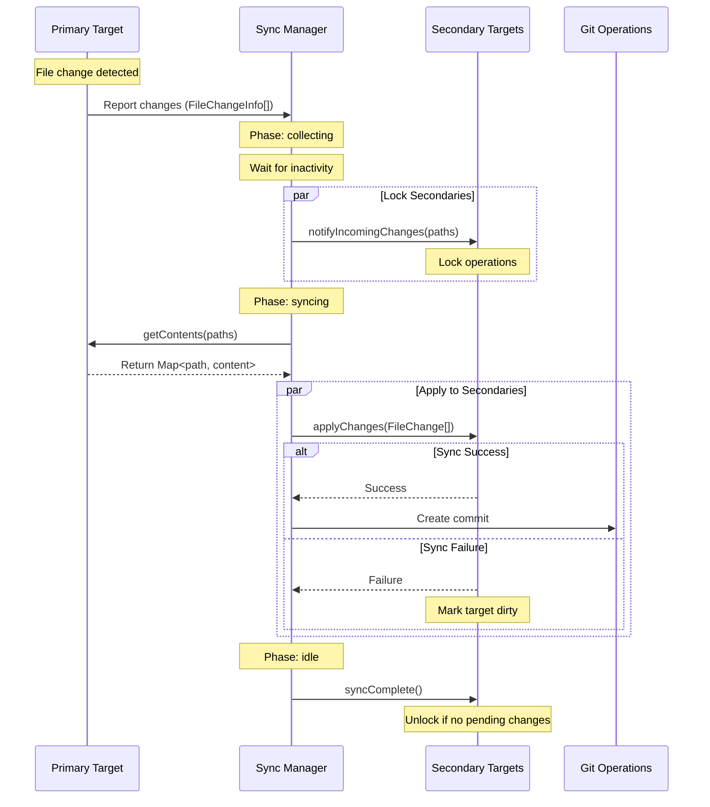

#### 2. Secondary Target Changes

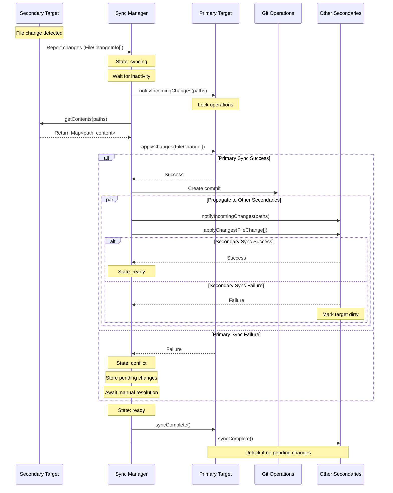

### Recovery and Resolution Process

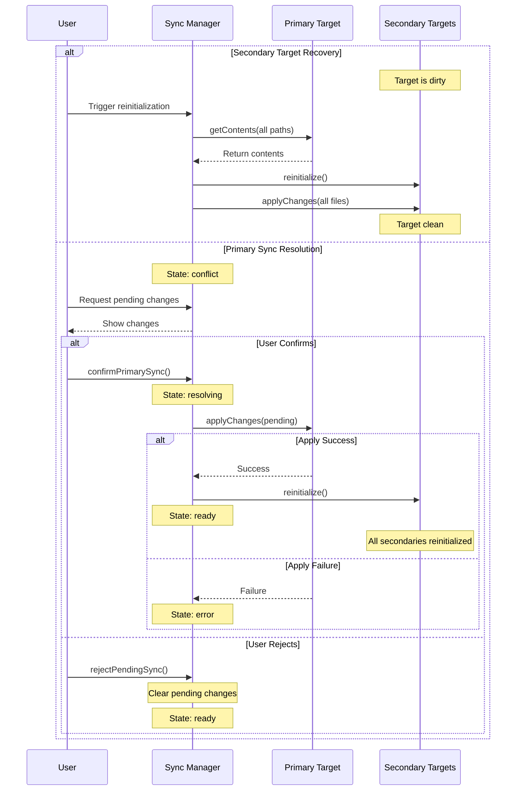

### Conflict Resolution and Primary Target Overwrite

The sync system uses a primary target overwrite strategy to maintain consistency across all targets. This approach is based on several key principles:

1. **Primary Target as Source of Truth**

   - The primary target serves as the authoritative source for the entire system
   - All secondary targets must eventually converge to match the primary's state
   - This ensures a clear, deterministic resolution path for conflicts

2. **Resolution States**

   ```mermaid
   stateDiagram-v2
       [*] --> Conflict: Sync Failure
       Conflict --> Resolving: confirmPrimarySync()
       Resolving --> Ready: Success
       Resolving --> Error: Failure
       Ready --> [*]
   ```

3. **Resolution Process Flow**

   ```mermaid
   sequenceDiagram
       participant U as User
       participant SM as Sync Manager
       participant P as Primary Target
       participant S as Secondary Targets

       Note over SM: State: conflict
       U->>SM: View pending changes
       SM-->>U: Display changes
       U->>SM: confirmPrimarySync()

       Note over SM: State: resolving
       SM->>P: Apply changes

       alt Success
           SM->>S: Reinitialize all secondaries
           Note over S: Full sync from primary
           SM->>SM: Clear pending changes
           Note over SM: State: ready
       else Failure
           Note over SM: State: error
           SM-->>U: Report error
       end
   ```

4. **Consistency Guarantees**

   - **Atomic Updates**: Changes to the primary target are atomic - they either fully succeed or fail
   - **Transactional Behavior**: The resolution process is transactional:
     1. Lock primary target
     2. Apply changes
     3. On success: reinitialize all secondaries
     4. On failure: rollback to previous state
   - **State Tracking**: The system maintains explicit states during resolution:
     - `conflict`: Initial state when changes need resolution
     - `resolving`: Actively applying changes to primary
     - `ready`: Resolution complete, system consistent
     - `error`: Resolution failed, needs recovery

5. **Recovery Strategy**

   ```mermaid
   graph TD
       A[Detect Conflict] --> B{Primary Update}
       B -->|Success| C[Reinitialize Secondaries]
       B -->|Failure| D[Error State]
       C --> E[System Ready]
       D --> F[Manual Recovery]
       F --> A
   ```

6. **Benefits of Primary Overwrite**

   - **Deterministic Resolution**: Clear path to consistency
   - **Simple Mental Model**: Primary always wins
   - **Easy Recovery**: Secondary targets can always be reinitialized
   - **Data Safety**: No automatic merging or loss of changes
   - **User Control**: Explicit confirmation required for resolution

7. **Implementation Details**
   - Primary target maintains file state including:
     - File hashes for content verification
     - Timestamps for change detection
     - Size and metadata for validation
   - Secondary targets track their sync state:
     - Last successful sync timestamp
     - Pending changes
     - Current sync status
   - Resolution process ensures:
     - All file operations are completed
     - Proper error handling
     - State machine transitions
     - Lock management

This approach ensures that the system can always return to a consistent state through a well-defined process, with the primary target serving as the ultimate source of truth.

## Large File Handling

The system uses a streaming approach to handle large files efficiently, separating metadata from content.

### File Change Flow

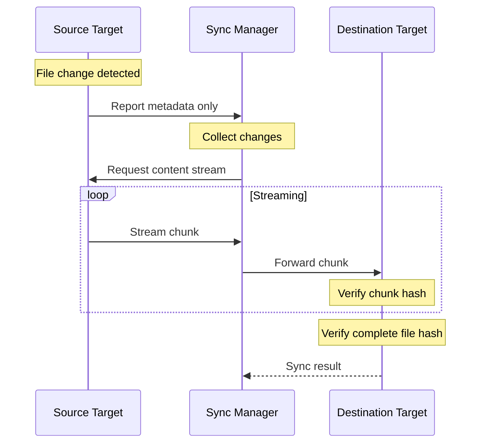

### Metadata and Streaming

1. **Change Detection**

   ```mermaid
   graph TD
       A[File Change] --> B[Extract Metadata]
       B --> C[Calculate Hash]
       B --> D[Determine Size]
       C --> E[Report to Manager]
       D --> E
   ```

2. **Content Transfer**
   ```mermaid
   graph TD
       A[Request Content] --> B[Create Stream]
       B --> C[Read Chunk]
       C --> D{More Data?}
       D -->|Yes| E[Send Chunk]
       E --> C
       D -->|No| F[Close Stream]
   ```

### Key Components

1. **File Metadata**

   - Path information
   - File hash for verification
   - File size for progress tracking
   - Modification timestamp
   - Change type (create/modify/delete)

2. **Content Streaming**

   - Chunk-based transfer
   - Individual chunk hashes
   - Progress tracking
   - Resource management
   - Memory efficient

3. **Verification**
   - Per-chunk hash verification
   - Complete file hash validation
   - Size verification
   - Atomic operations

### Implementation Details

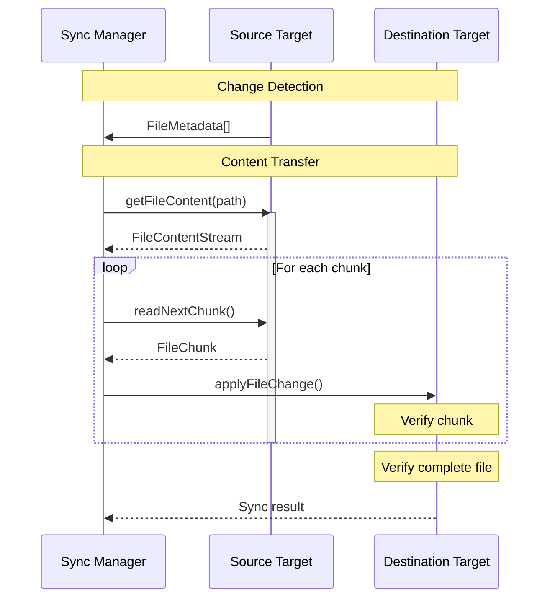

### Benefits

1. **Memory Efficiency**

   - Only metadata in memory
   - Streaming content transfer
   - Controlled resource usage

2. **Progress Tracking**

   - Chunk-level progress
   - Size-based progress
   - Time estimation

3. **Data Integrity**

   - Hash verification
   - Atomic operations
   - Error recovery

4. **Resource Management**
   - Controlled streaming
   - Proper cleanup
   - Error handling

### Error Handling

1. **Stream Failures**

   ```mermaid
   graph TD
       A[Stream Error] --> B{Error Type}
       B -->|Read| C[Source Error]
       B -->|Write| D[Destination Error]
       B -->|Transfer| E[Network Error]
       C --> F[Cleanup & Retry]
       D --> F
       E --> F
   ```

2. **Recovery Strategies**
   - Chunk retry
   - Stream restart
   - Partial file recovery
   - Clean rollback

## Git Operations

Git operations are handled explicitly through the Git interface:

```typescript
interface GitOperations {
  commit(message: string): Promise<string>;
  checkout(branch: string): Promise<void>;
  status(): Promise<{
    branch: string;
    modified: string[];
    staged: string[];
  }>;
  history(path: string): Promise<
    Array<{
      hash: string;
      message: string;
      timestamp: number;
      changes: string[];
    }>
  >;
}
```

### Git Integration Flow

1. **Normal Changes**

   ```typescript
   // After successful sync
   await git.commit("sync: Update files from [source target]");
   ```
