# File System Package

## Overview

Provides a robust file management system that works across browser and local file systems with comprehensive synchronization capabilities and integrated version control.


## System Architecture

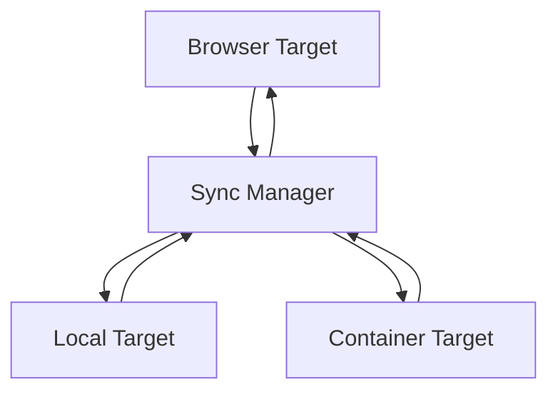

## Core Components

### 1. Sync Manager

- **Responsibilities**:
  - Coordinates synchronization between targets
  - Manages target registration and lifecycle
  - Tracks sync status and phase
  - Manages primary/secondary target roles
  - Handles sync failures and recovery

### 2. Sync Targets

Each environment implements the SyncTarget interface:

- **Browser Target**:

  - Manages browser-based filesystem
  - Handles file watching and change detection
  - Stores files in IndexedDB

- **Local Target**:

  - Interfaces with local filesystem
  - Handles file watching
  - Manages file permissions

- **Container Target**:
  - Manages WebContainer filesystem
  - Handles container-specific operations

## Synchronization Process

### Component Architecture and Interactions

The synchronization system consists of three main components that work together hierarchically:

1. **FileSyncManager** orchestrates the overall sync process

   - Coordinates between targets
   - Manages conflict resolution
   - Tracks global sync state

2. **SyncTarget** manages individual target synchronization

   - Handles change detection
   - Manages sync operations
   - Controls target-specific state
   - Manages filesystem locking during sync

3. **FileSystem** provides low-level file operations
   - Manages file access
   - Controls write permissions
   - Ensures data consistency

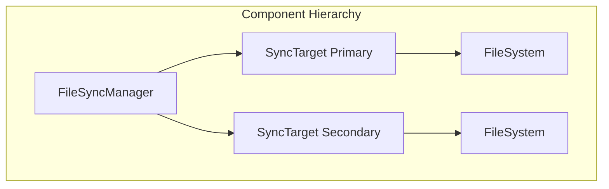

### State Machines

Each component maintains its own state machine, coordinating through well-defined interfaces:

#### 1. FileSystem States

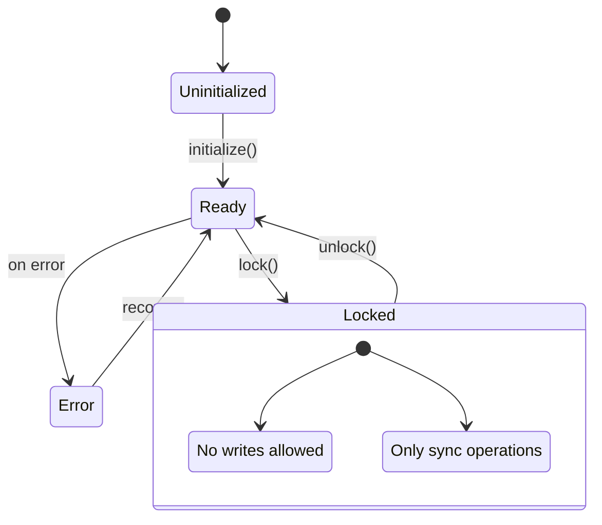

#### 2. SyncTarget States

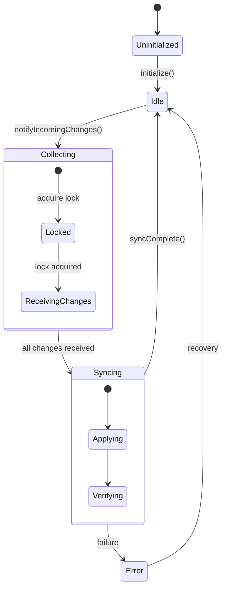

#### 3. FileSyncManager States

The sync manager implements a state machine to track and manage the synchronization process:

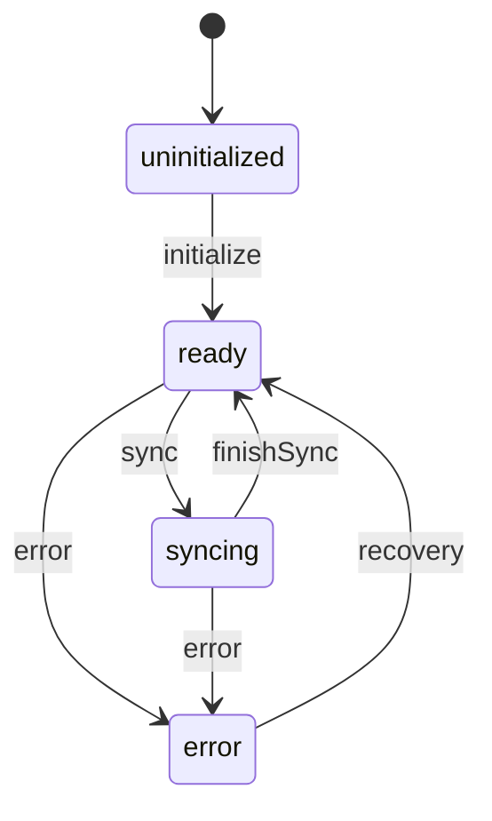

States:

- **uninitialized**: Initial state before the manager is initialized
- **ready**: Manager is ready to handle sync operations
- **syncing**: Active sync operation in progress
- **error**: Error state when sync operations fail

Transitions:

- **initialize**: Transition from uninitialized to ready when manager is initialized
- **sync**: Begin a sync operation when changes are detected
- **finishSync**: Complete a sync operation successfully
- **error**: Enter error state due to sync failure
- **recovery**: Recover from error state using resolution strategies

The state machine ensures that:

- Each target maintains its own state and error information
- Targets can independently recover from errors
- The sync manager coordinates overall system health
- The system transitions to ready only when all targets are healthy

This approach provides clear error states and recovery paths while allowing partial system operation during recovery.

### Locking and State Transitions

The sync process involves several state transitions coordinated between components:

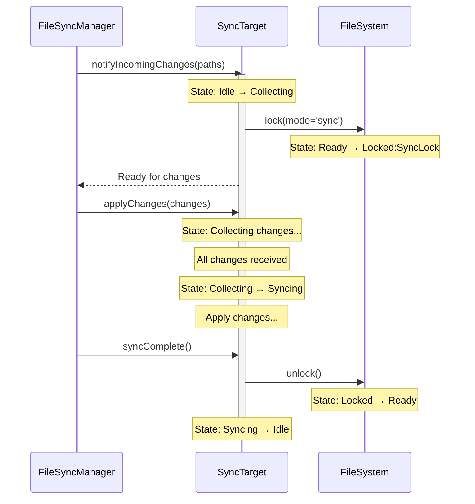

### Primary/Secondary Target Concept

The sync system operates with a primary target that acts as the source of truth. All other targets are secondary and can be reinitialized from the primary if needed.

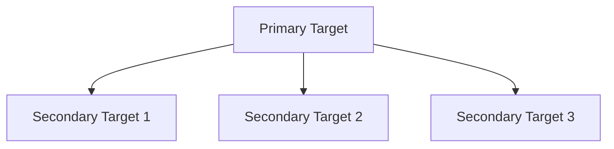

### Ignore Mechanism

The sync system includes a flexible ignore mechanism that allows excluding files and directories from synchronization based on patterns. This is implemented through a dedicated `IgnoreService` that follows these principles:

1. **Centralized Pattern Management**

   ```mermaid
   graph TD
       IS[Ignore Service] --> PT[Primary Target]
       IS --> ST1[Secondary Target 1]
       IS --> ST2[Secondary Target 2]
       IS[Ignore Service] --> FSM[File Sync Manager]
   ```

2. **Pattern Application Points**

   - During file watching to prevent change detection for ignored files
   - During sync operations to skip ignored files
   - During full target synchronization
   - At both source and destination targets

3. **Hierarchical Filtering**

   ```mermaid
   graph TD
       subgraph "Ignore Flow"
           FD[File Detected] --> IC{Is Ignored?}
           IC -->|Yes| Skip[Skip File]
           IC -->|No| Process[Process Change]
           Process --> Sync[Sync to Targets]
           Sync --> TIC{Is Ignored?}
           TIC -->|Yes| SkipTarget[Skip Target]
           TIC -->|No| Apply[Apply Change]
       end
   ```

4. **Error Handling**

   - Graceful degradation if ignore checks fail
   - Logging of pattern matching errors
   - Fallback to including files if pattern check fails
   - Non-blocking operation to maintain sync reliability

5. **Pattern Propagation**
   - Patterns are set at the manager level
   - Automatically propagated to all targets during registration
   - Updated across all targets when patterns change
   - Maintained consistently across the sync system

This mechanism ensures that:

- Files matching ignore patterns are consistently excluded across the system
- Performance is optimized by filtering early in the sync process
- The system remains robust even if ignore pattern matching fails
- Ignore patterns can be updated without disrupting active synchronization

### Sync States

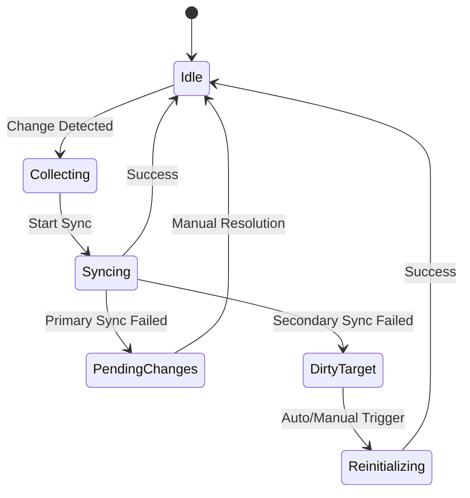

### Sync Flows

#### 1. Primary Target Changes

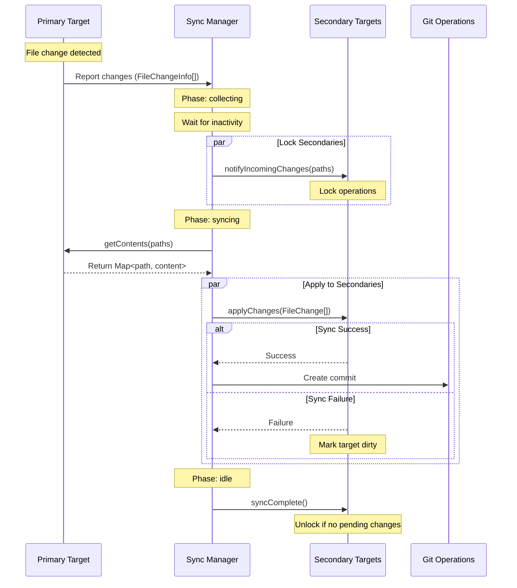

#### 2. Secondary Target Changes

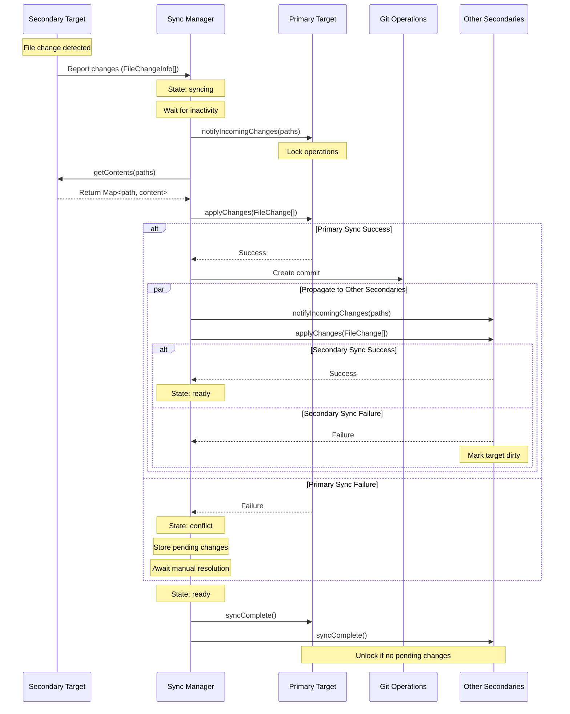

### Recovery and Resolution Process

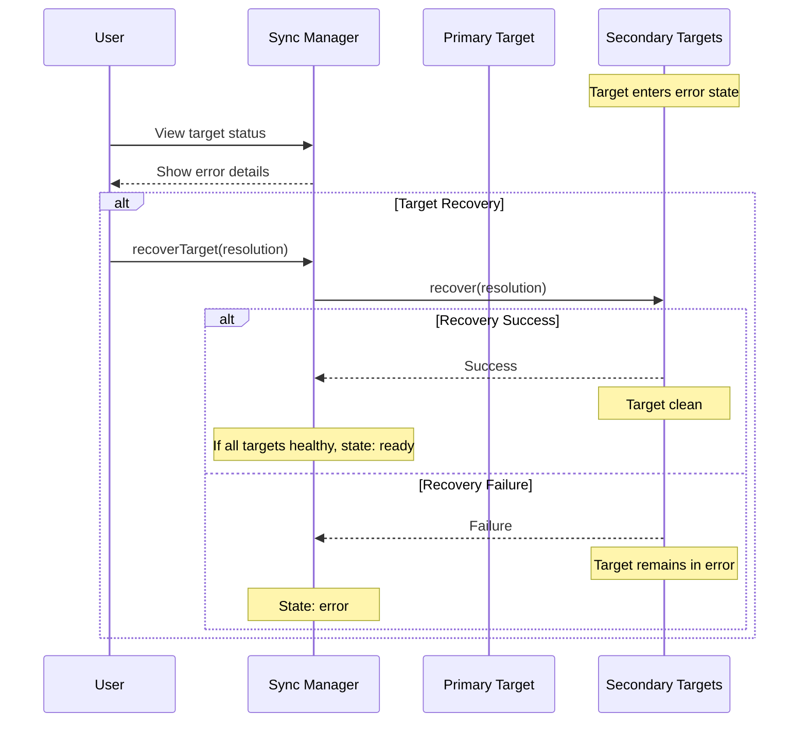

### Error Recovery and Target Resolution

The sync system uses a robust error recovery strategy to maintain consistency across all targets. This approach is based on several key principles:

1. **Target State Management**

   - Each target maintains its own state and error information
   - Targets can independently recover from errors
   - The sync manager coordinates overall system state

2. **Resolution States**

   ```mermaid
   stateDiagram-v2
       [*] --> Ready: Initialize
       Ready --> Syncing: Changes detected
       Syncing --> Ready: Sync complete
       Ready --> Error: Sync failure
       Syncing --> Error: Sync failure
       Error --> Ready: Recovery success
   ```

3. **Recovery Process Flow**

   ```mermaid
   sequenceDiagram
       participant U as User
       participant SM as Sync Manager
       participant T as Target

       Note over T: State: error
       U->>SM: View target status
       SM-->>U: Display error
       U->>SM: recoverTarget(resolution)

       Note over SM: Begin recovery
       SM->>T: recover(resolution)

       alt Success
           T-->>SM: Success
           Note over T: Target recovered
           Note over SM: If all targets healthy: ready
       else Failure
           T-->>SM: Failure
           Note over T: Remains in error
           Note over SM: State: error
       end
   ```

4. **Consistency Guarantees**

   - **Independent Recovery**: Each target can recover independently
   - **Transactional Behavior**: The recovery process is transactional:
     1. Apply resolution strategy
     2. Reset target state
     3. On success: return to normal operation
     4. On failure: maintain error state
   - **State Tracking**: The system maintains explicit states during recovery:
     - `error`: Target needs recovery
     - `idle`: Target operating normally
     - `ready`: System fully operational
     - `syncing`: Active sync in progress

5. **Recovery Strategy**

   ```mermaid
   graph TD
       A[Detect Error] --> B{Apply Resolution}
       B -->|Success| C[Reset Target State]
       B -->|Failure| D[Maintain Error]
       C --> E[Resume Operations]
       D --> F[Await Recovery]
       F --> A
   ```

6. **Benefits of Independent Recovery**

   - **Granular Control**: Each target can be recovered independently
   - **Simple Mental Model**: Clear error states and recovery paths
   - **Flexible Resolution**: Different strategies for different errors
   - **System Resilience**: Partial system operation during recovery
   - **User Control**: Explicit recovery actions

7. **Implementation Details**
   - Targets maintain error state including:
     - Error type and message
     - Last successful operation
     - Available resolution strategies
   - Sync manager coordinates recovery:
     - Tracks overall system health
     - Transitions to ready when all targets healthy
     - Manages sync operations during recovery

### Progress Indication

The sync system provides comprehensive progress tracking through a flexible event system. Progress events are emitted during various phases of the synchronization process:

### Progress Event Types

1. **Collecting**

   ```typescript
   {
     type: "collecting";
     totalFiles: number;
     collectedFiles: number;
     currentFile: string;
   }
   ```

   Emitted during the initial phase when gathering files to sync.

2. **Syncing**

   ```typescript
   {
     type: "syncing";
     totalFiles: number;
     syncedFiles: number;
     currentFile: string;
   }
   ```

   Emitted for each file being synchronized between targets.

3. **Streaming**

   ```typescript
   {
     type: "streaming";
     totalBytes: number;
     processedBytes: number;
     currentFile: string;
   }
   ```

   Emitted during file content transfer, providing byte-level progress.

4. **Completing**

   ```typescript
   {
     type: "completing";
     totalFiles: number;
     successfulFiles: number;
     failedFiles: number;
   }
   ```

   Emitted when synchronization is finishing, summarizing results.

5. **Error**
   ```typescript
   {
     type: "error";
     currentFile: string;
     error: Error;
     phase: "collecting" | "syncing" | "streaming";
   }
   ```
   Emitted when an error occurs during any phase.

### Progress Tracking Usage

```typescript
// Add a progress listener
const removeListener = syncManager.addProgressListener((progress) => {
  switch (progress.type) {
    case "collecting":
      console.log(
        `Collecting files: ${progress.collectedFiles}/${progress.totalFiles}`
      );
      break;
    case "syncing":
      console.log(
        `Syncing ${progress.currentFile}: ${progress.syncedFiles}/${progress.totalFiles} files`
      );
      break;
    case "streaming":
      console.log(
        `Transferring ${progress.currentFile}: ${progress.processedBytes}/${progress.totalBytes} bytes`
      );
      break;
    case "completing":
      console.log(
        `Sync complete: ${progress.successfulFiles}/${progress.totalFiles} files succeeded`
      );
      break;
    case "error":
      console.error(
        `Error in ${progress.phase} phase: ${progress.error.message}`
      );
      break;
  }
});

// Later: Remove the listener when no longer needed
removeListener();
```

## Large File Handling

The system uses native ReadableStream for efficient file transfer, providing built-in streaming capabilities:

### File Transfer Flow

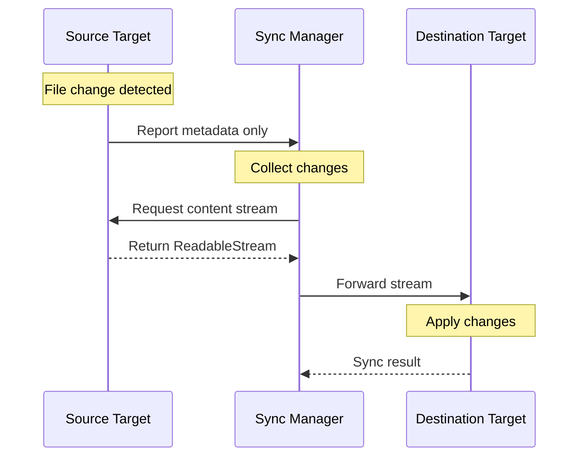

### Key Components

1. **File Metadata**

   - Path information
   - File hash for verification
   - File size for progress tracking
   - Modification timestamp
   - Change type (create/modify/delete)

2. **Content Streaming**

   - Native ReadableStream support
   - Progress tracking
   - Resource management
   - Memory efficient

3. **Verification**
   - Complete file hash validation
   - Size verification
   - Atomic operations

### Benefits

1. **Memory Efficiency**

   - Only metadata in memory
   - Streaming content transfer
   - Controlled resource usage

2. **Progress Tracking**

   - Byte-level progress
   - Time estimation
   - Detailed status updates

3. **Data Integrity**

   - Hash verification
   - Atomic operations
   - Error recovery

4. **Resource Management**
   - Controlled streaming
   - Proper cleanup
   - Error handling

## Git Operations

Git operations are handled explicitly through the Git interface:

```typescript
interface GitOperations {
  commit(message: string): Promise<string>;
  checkout(branch: string): Promise<void>;
  status(): Promise<{
    branch: string;
    modified: string[];
    staged: string[];
  }>;
  history(path: string): Promise<
    Array<{
      hash: string;
      message: string;
      timestamp: number;
      changes: string[];
    }>
  >;
}
```

### Git Integration Flow

1. **Normal Changes**

   ```typescript
   // After successful sync
   await git.commit("sync: Update files from [source target]");
   ```
