# File System Package

## Overview

Provides a robust file management system that works across browser and local file systems with comprehensive synchronization capabilities and integrated version control.


## System Architecture

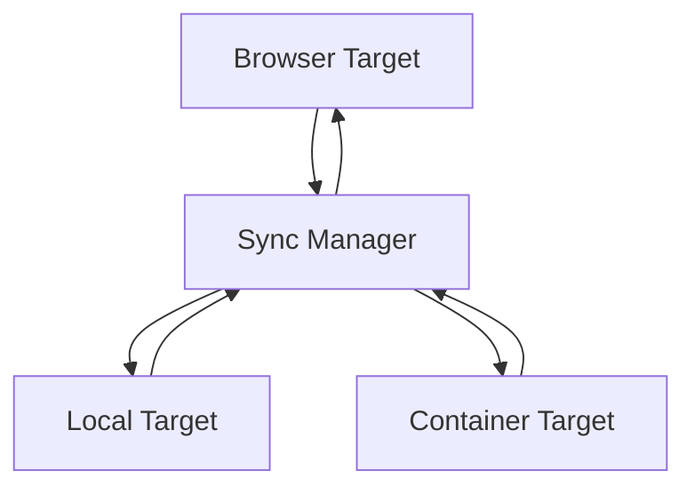

## Core Components

### 1. Sync Manager

- **Responsibilities**:
  - Coordinates synchronization between targets
  - Manages target registration and lifecycle
  - Tracks sync status and phase
  - Manages primary/secondary target roles
  - Handles sync failures and recovery

### 2. Sync Targets

Each environment implements the SyncTarget interface:

- **Browser Target**:

  - Manages browser-based filesystem
  - Handles file watching and change detection
  - Stores files in IndexedDB

- **Local Target**:

  - Interfaces with local filesystem
  - Handles file watching
  - Manages file permissions

- **Container Target**:
  - Manages WebContainer filesystem
  - Handles container-specific operations

## Synchronization Process

### Component Architecture and Interactions

The synchronization system consists of three main components that work together hierarchically:

1. **FileSyncManager** orchestrates the overall sync process

   - Coordinates between targets
   - Manages conflict resolution
   - Tracks global sync state

2. **SyncTarget** manages individual target synchronization

   - Handles change detection
   - Manages sync operations
   - Controls target-specific state
   - Manages filesystem locking during sync

3. **FileSystem** provides low-level file operations
   - Manages file access
   - Controls write permissions
   - Ensures data consistency

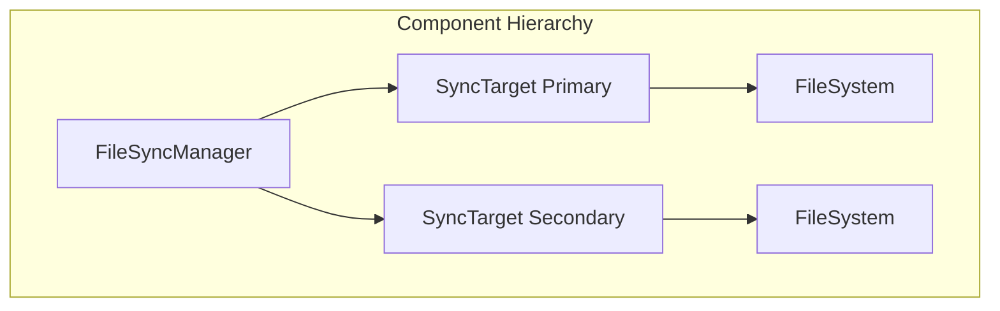

### State Machines

Each component maintains its own state machine, coordinating through well-defined interfaces:

#### 1. FileSystem States

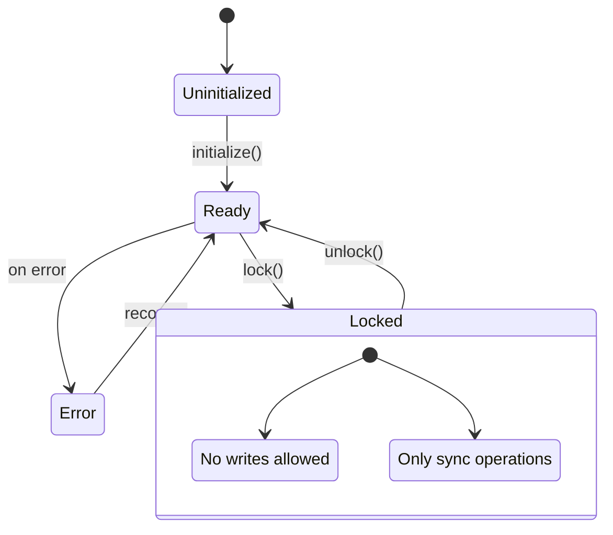

#### 2. SyncTarget States

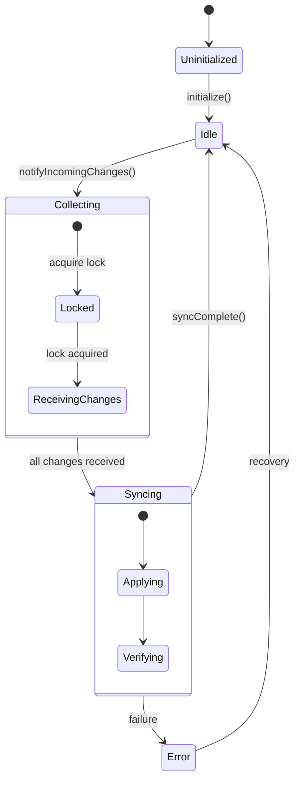

#### 3. FileSyncManager States

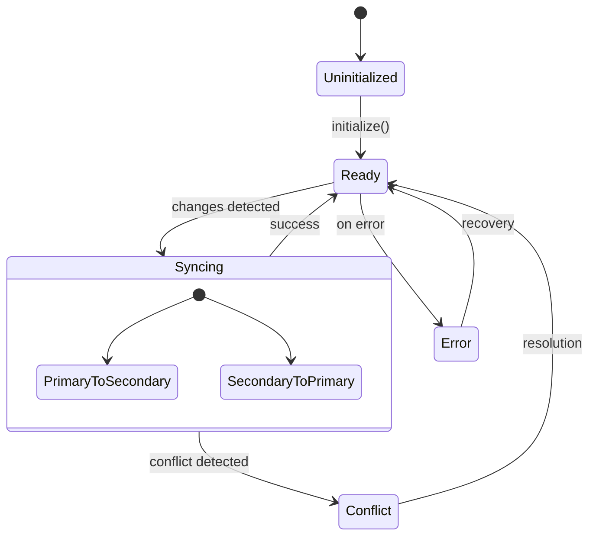

### Locking and State Transitions

The sync process involves several state transitions coordinated between components:

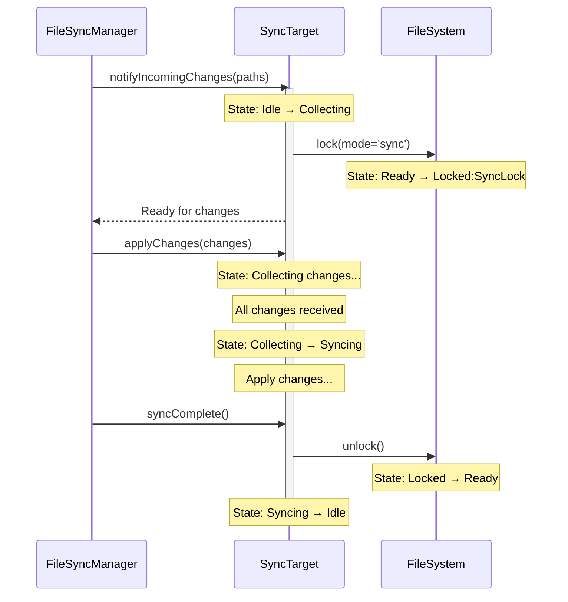

### Primary/Secondary Target Concept

The sync system operates with a primary target that acts as the source of truth. All other targets are secondary and can be reinitialized from the primary if needed.

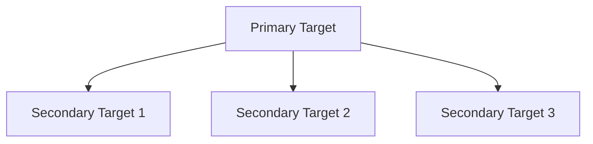

### Sync States

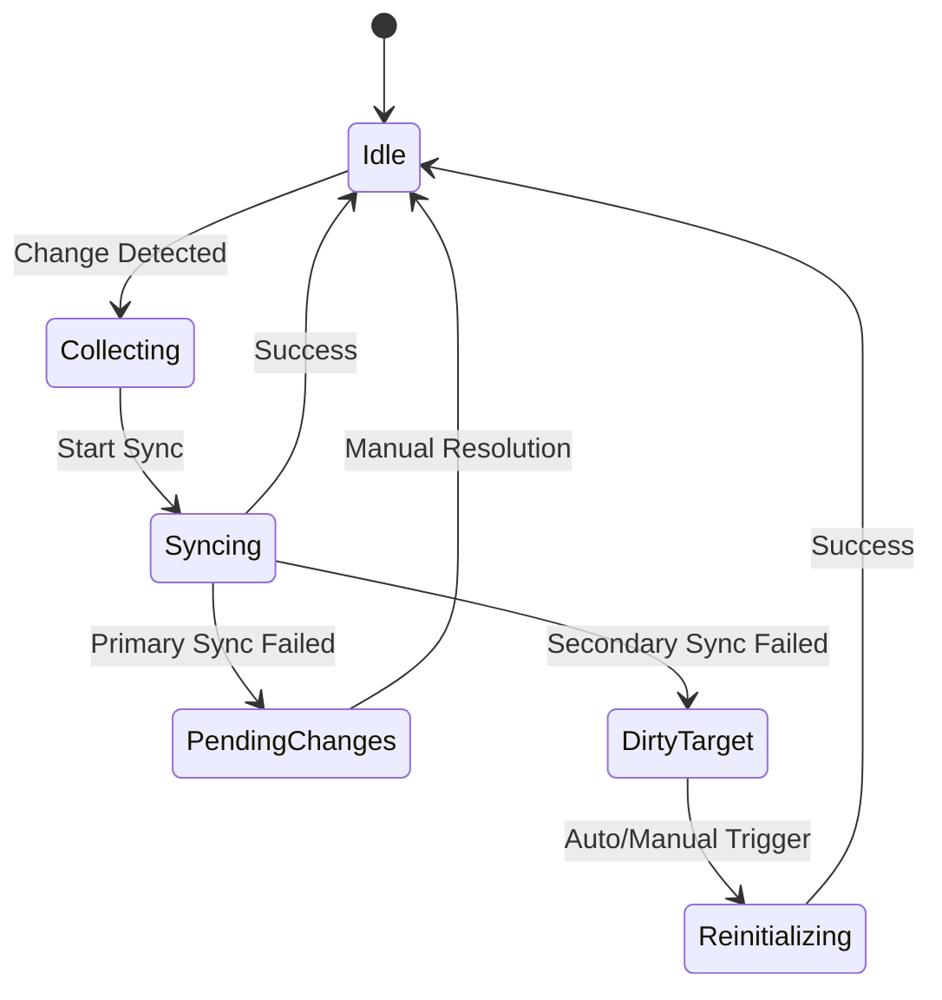

### Sync Flows

#### 1. Primary Target Changes

```mermaid
sequenceDiagram
    participant P as Primary Target
    participant SM as Sync Manager
    participant S as Secondary Targets
    participant Git as Git Operations

    Note over P: File change detected
    P->>SM: Report changes (FileChangeInfo[])

    Note over SM: Phase: collecting
    Note over SM: Wait for inactivity

    par Lock Secondaries
        SM->>S: notifyIncomingChanges(paths)
        Note over S: Lock operations
    end

    Note over SM: Phase: syncing
    SM->>P: getContents(paths)
    P-->>SM: Return Map<path, content>

    par Apply to Secondaries
        SM->>S: applyChanges(FileChange[])

        alt Sync Success
            S-->>SM: Success
            SM->>Git: Create commit
        else Sync Failure
            S-->>SM: Failure
            Note over S: Mark target dirty
        end
    end

    Note over SM: Phase: idle
    SM->>S: syncComplete()
    Note over S: Unlock if no pending changes
```

#### 2. Secondary Target Changes

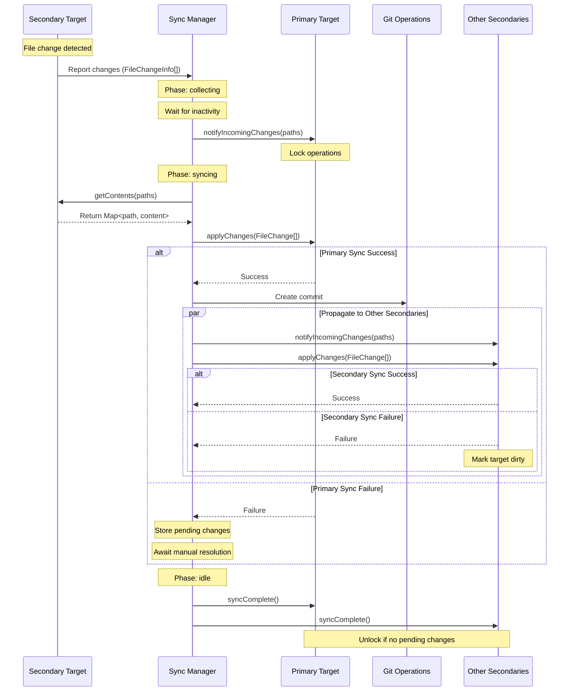

### Recovery Process

#### Recovery Scenarios

1. **Secondary Target Failure**

   - Secondary target marked as "dirty"
   - Continues operating with other targets
   - Requires reinitialization from primary

2. **Primary Target Failure**
   - Changes remain pending
   - User can:
     - Review pending changes
     - Confirm primary sync (reinitialize secondaries)
     - Reject pending sync

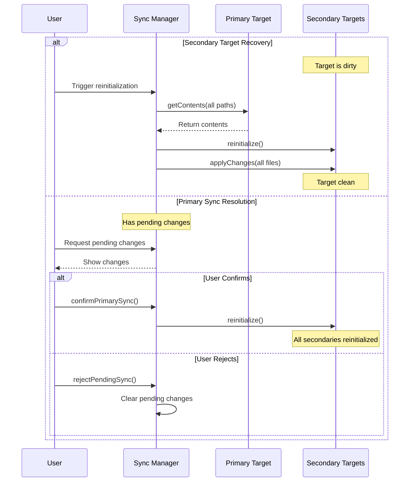

### Key Features

1. **Clear Source of Truth**

   - Primary target maintains definitive state
   - Secondary targets can be reinitialized
   - Predictable sync flow

2. **Deterministic Recovery**

   - Simple recovery paths
   - No complex partial states
   - User control over data loss scenarios

3. **State Management**
   - Clear target roles
   - Explicit dirty state tracking
   - Pending change management

## Large File Handling

The system uses a streaming approach to handle large files efficiently, separating metadata from content.

### File Change Flow

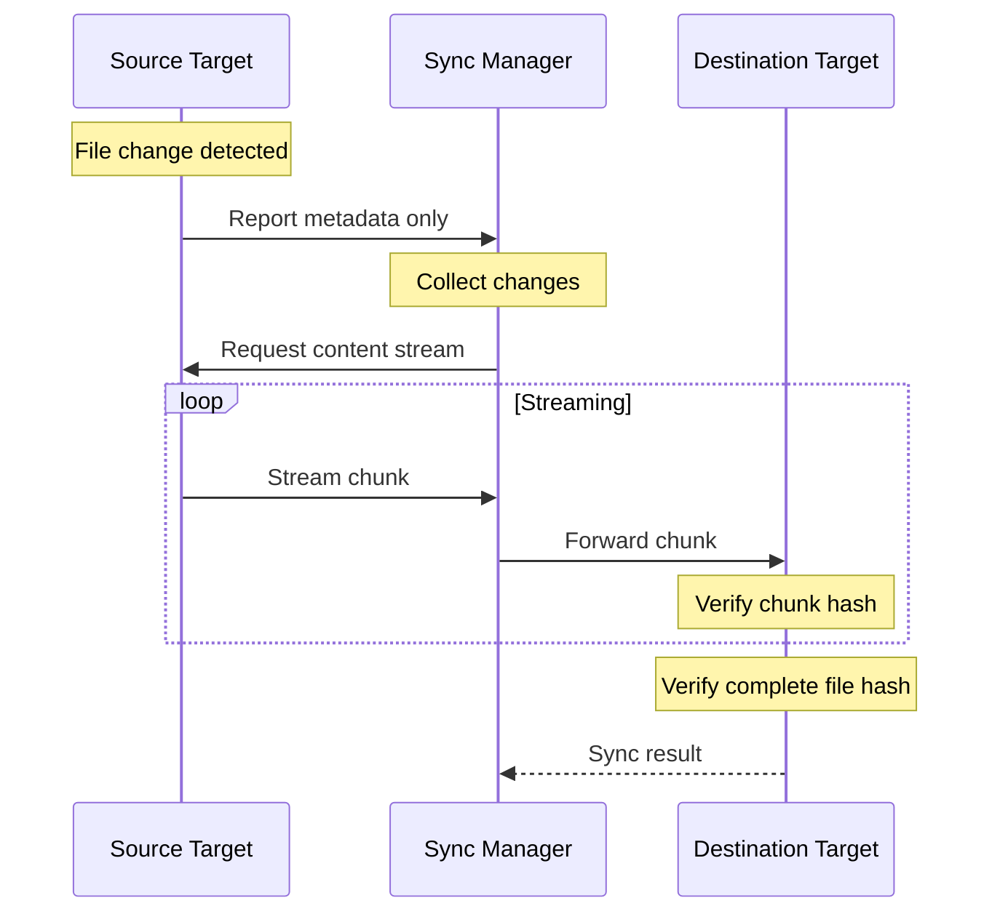

### Metadata and Streaming

1. **Change Detection**

   ```mermaid
   graph TD
       A[File Change] --> B[Extract Metadata]
       B --> C[Calculate Hash]
       B --> D[Determine Size]
       C --> E[Report to Manager]
       D --> E
   ```

2. **Content Transfer**
   ```mermaid
   graph TD
       A[Request Content] --> B[Create Stream]
       B --> C[Read Chunk]
       C --> D{More Data?}
       D -->|Yes| E[Send Chunk]
       E --> C
       D -->|No| F[Close Stream]
   ```

### Key Components

1. **File Metadata**

   - Path information
   - File hash for verification
   - File size for progress tracking
   - Modification timestamp
   - Change type (create/modify/delete)

2. **Content Streaming**

   - Chunk-based transfer
   - Individual chunk hashes
   - Progress tracking
   - Resource management
   - Memory efficient

3. **Verification**
   - Per-chunk hash verification
   - Complete file hash validation
   - Size verification
   - Atomic operations

### Implementation Details

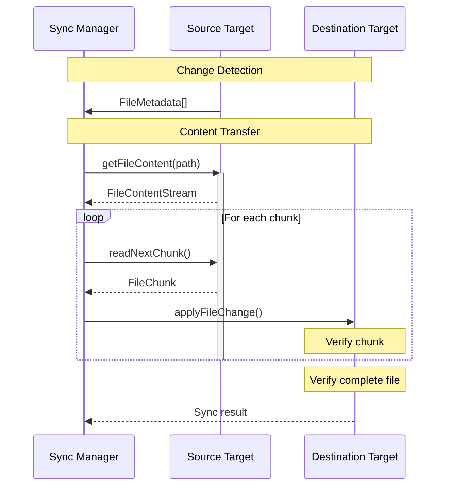

### Benefits

1. **Memory Efficiency**

   - Only metadata in memory
   - Streaming content transfer
   - Controlled resource usage

2. **Progress Tracking**

   - Chunk-level progress
   - Size-based progress
   - Time estimation

3. **Data Integrity**

   - Hash verification
   - Atomic operations
   - Error recovery

4. **Resource Management**
   - Controlled streaming
   - Proper cleanup
   - Error handling

### Error Handling

1. **Stream Failures**

   ```mermaid
   graph TD
       A[Stream Error] --> B{Error Type}
       B -->|Read| C[Source Error]
       B -->|Write| D[Destination Error]
       B -->|Transfer| E[Network Error]
       C --> F[Cleanup & Retry]
       D --> F
       E --> F
   ```

2. **Recovery Strategies**
   - Chunk retry
   - Stream restart
   - Partial file recovery
   - Clean rollback

## Git Operations

Git operations are handled explicitly through the Git interface:

```typescript
interface GitOperations {
  commit(message: string): Promise<string>;
  checkout(branch: string): Promise<void>;
  status(): Promise<{
    branch: string;
    modified: string[];
    staged: string[];
  }>;
  history(path: string): Promise<
    Array<{
      hash: string;
      message: string;
      timestamp: number;
      changes: string[];
    }>
  >;
}
```

### Git Integration Flow

1. **Normal Changes**

   ```typescript
   // After successful sync
   await git.commit("sync: Update files from [source target]");
   ```

2. **Conflict Handling**
   ```typescript
   // When conflicts are detected
   await git.checkout("conflict/[timestamp]");
   await git.commit("conflict: Store conflicting versions\n\nPaths: [paths]");
   await git.checkout("main"); // Return to main branch
   ```

### Commit Messages

- Clear prefix indicating operation type (`sync:`, `conflict:`)
- Source target identification
- Affected paths in commit body
- Timestamp for conflict branches

## Usage Example

```typescript
// Register targets with specific filters
syncManager.registerTarget(
  new BrowserTarget({
    relevantPaths: ["src/**/*", "public/**/*"]
  })
);

syncManager.registerTarget(
  new ContainerTarget({
    ignorePaths: ["dist/**/*", "node_modules/**/*"]
  })
);

// Git operations are explicit
const git = new GitOperations();
await git.commit("feat: Initial commit");
```

## State Management

The system maintains detailed state information for all sync targets and operations.

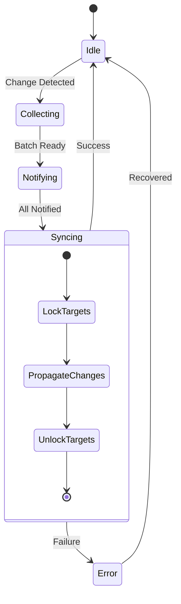

### Target States

Each sync target maintains its own state:

```typescript
interface TargetState {
  id: string;
  type: "browser" | "local" | "container";
  lockState: LockState;
  pendingChanges: number;
  lastSyncTime?: number;
  status: "idle" | "collecting" | "notifying" | "syncing" | "error";
  error?: string;
}
```

### Lock Management

Targets use a timeout-based locking mechanism:

```typescript
// Lock target with timeout
await target.lock(5000, "Preparing for sync");

// Check lock state
const lockState = target.getLockState();
if (
  lockState.isLocked &&
  Date.now() - lockState.lockedSince > lockState.lockTimeout
) {
  // Handle timeout
  await target.forceUnlock();
}
```

### Error Recovery

The system provides mechanisms for handling lock failures:

1. **Timeout-based Locks**

   - All locks require timeout specification
   - Automatic unlock after timeout
   - Prevents indefinite locks

2. **Force Unlock**

   - Emergency unlock capability
   - Can be triggered per target or globally
   - Use with caution - may cause inconsistencies

3. **State Recovery**
   ```typescript
   // Example of recovery flow
   try {
     await syncManager.resume();
   } catch (error) {
     await syncManager.forceUnlockAll();
     // Handle recovery
   }
   ```

### Monitoring

The sync manager provides detailed status information:

```typescript
const status = syncManager.getStatus();
console.log(
  `Sync Progress: ${status.progress.processed}/${status.progress.total}`
);
status.targets.forEach((state, targetId) => {
  console.log(`Target ${targetId}: ${state.status}`);
});
```
