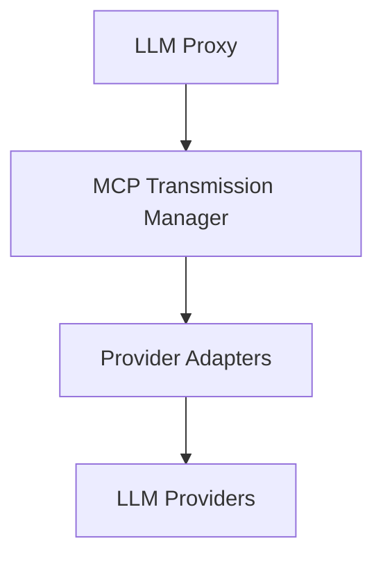

# LLM Integration Package

## Overview
Provides a unified, extensible interface for interacting with multiple Large Language Model providers.

## System Diagram


## Core Components

### 1. LLM Proxy
- **Responsibilities**:
  - Abstract different LLM providers
  - Provide OpenAI-compatible interface
  - Handle rate limiting and errors
  - Manage API authentication

### 2. MCP Transmission Manager
- **Responsibilities**:
  - Handle context transmission
  - Transform context for different providers
  - Manage protocol-level metadata
  - Implement context sanitization
  - Provide audit logging

### 3. Provider Adapters
- **Responsibilities**:
  - Implement provider-specific request transformations
  - Handle unique provider capabilities
  - Normalize responses across providers

## Key Design Decisions
- Protocol-agnostic context transmission
- Secure context handling
- Comprehensive error management
- Support for multiple LLM providers

## External Relationships
- Receives context from Chat Context Package
- Provides responses to Actions Manager
- Interfaces with project-specific configuration

## Performance Considerations
- Transmission optimization
- Provider selection strategies
- Context compression techniques

## Supported Providers
- OpenAI
- Anthropic
- Google AI
- Custom provider support

## Future Enhancements
- Advanced provider selection
- Machine learning-based routing
- Enhanced multi-provider support

## Usage
```typescript
// Example of LLM interaction
const response = await llmProxy.generateResponse({
  provider: 'openai',
  model: 'gpt-4',
  context: assembledContext
});
```

## Security Features
- API key management
- Request sanitization
- Comprehensive logging
- Rate limit handling 