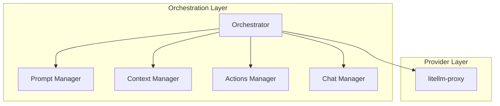

# LLM Integration Package

## Overview

Core orchestrator for LLM interactions, coordinating between different components to enhance LLM requests and managing interactions with the `litellm-proxy`.

## Components and Responsibilities

### 1. Types (`types.ts`)

Defines core types for LLM integration:

- `LlmMessage`: Represents a message sent to the LLM.
- `LlmResponse`: Represents a response from the LLM.
- `LlmProviderConfig`: Configuration for the LLM provider.
- `LlmClient`: Interface for the LLM client.

### 2. OpenAI LLM Client (`openai-client.ts`)

Implements the necessary interfaces to send messages and receive (streamed) responses:

- `OpenAiClient`: Sends messages to the OpenAI API and processes responses via the `litellm-proxy`.

### 3. Orchestrator (`orchestrator.ts`)

The central component that:

- Enhances requests with context and tools using the ModelContextProtocol (MCP) SDK.
- Processes response streams.
- Implements MCP host functionality.

### 4. Main Entry Point (`index.ts`)

Exports the public API:

- `createLlmAdapter`: Function to create an LLM adapter using the provided configuration.
- Types and interfaces.

## System Diagram

## Core Responsibilities

### MCP Host Implementation

- Coordinate with MCP servers:
  - Chat Manager for message history
  - Prompt Manager for enhancement
  - Context Manager for relevant context
  - Actions Manager for available tools

### Request Enhancement

- Assemble enhanced requests using:
  - Chat history
  - Enhanced prompts
  - Relevant context
  - Available tools

### LLM interaction

- Handle interactions with the `litellm-proxy`
- Manage API connections
- Handle rate limiting
- Format provider-specific requests

## External Relationships

- Acts as MCP Host for other components
- Manages LLM provider connections via the `litellm-proxy`
- Coordinates request enhancement flow

## Performance Considerations

- Efficient request assembly
- Smart provider selection
- Optimized context handling

## Future Enhancements

- Advanced request optimization
- Cross-provider load balancing
