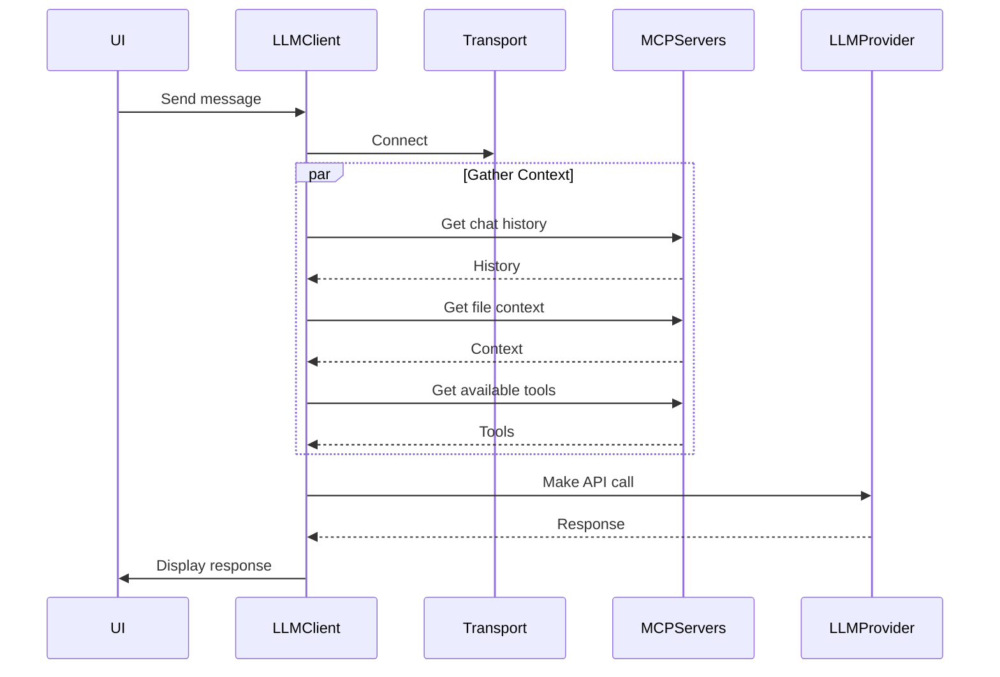

# LLM Integration Package

This package handles the integration with Large Language Models (LLMs) using the Model Context Protocol (MCP).

## Architecture

### Components

1. **LLMIntegrationHost**

   - Manages MCP servers and their lifecycle
   - Accepts injected transport layer
   - Maintains server registry

2. **MCP Servers**

   - Chat Management: Handles conversation history
   - Prompt Management: Manages prompt templates and enhancement
   - Context Management: Provides file/workspace context
   - Actions Management: Exposes available tools

3. **Transport Layer**

   - Handles communication between servers and clients
   - Can be stdio, HTTP/SSE, or custom implementation
   - Injected into host for flexibility

4. **LLM Client**
   - Connects to transport as MCP client
   - Gathers context from various servers
   - Makes actual LLM API calls

### Flow



### Usage Example

```typescript
// Create transport
const transport = new StdioServerTransport();

// Create and initialize host
const host = new LLMIntegrationHost(transport);
await host.initialize([
  { name: "chat", server: new ChatManagementServer() },
  { name: "prompt", server: new PromptManagementServer() },
  { name: "context", server: new ContextManagementServer() },
  { name: "actions", server: new ActionsManagementServer() }
]);

// Create LLM client
const llmClient = new McpClient(transport);

// Make LLM call with context
const response = await llmClient.chat({
  message: "User message",
  context: {
    history: await llmClient.request("chat", "get-history"),
    fileContext: await llmClient.request("context", "get-context"),
    tools: await llmClient.request("actions", "get-tools")
  }
});
```

## Benefits

1. **Decoupled Architecture**

   - Each component is independent
   - Easy to test and mock
   - Flexible transport layer

2. **Standardized Protocol**

   - Uses MCP for consistent communication
   - Can integrate third-party MCP servers
   - Well-defined interfaces

3. **Extensible**
   - Easy to add new servers
   - Support for multiple transport types
   - Pluggable LLM providers
