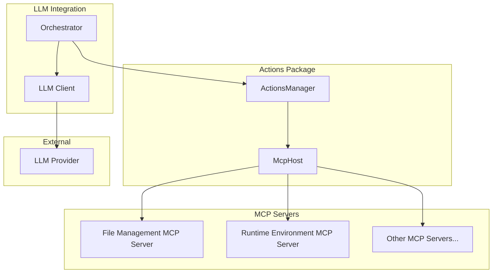
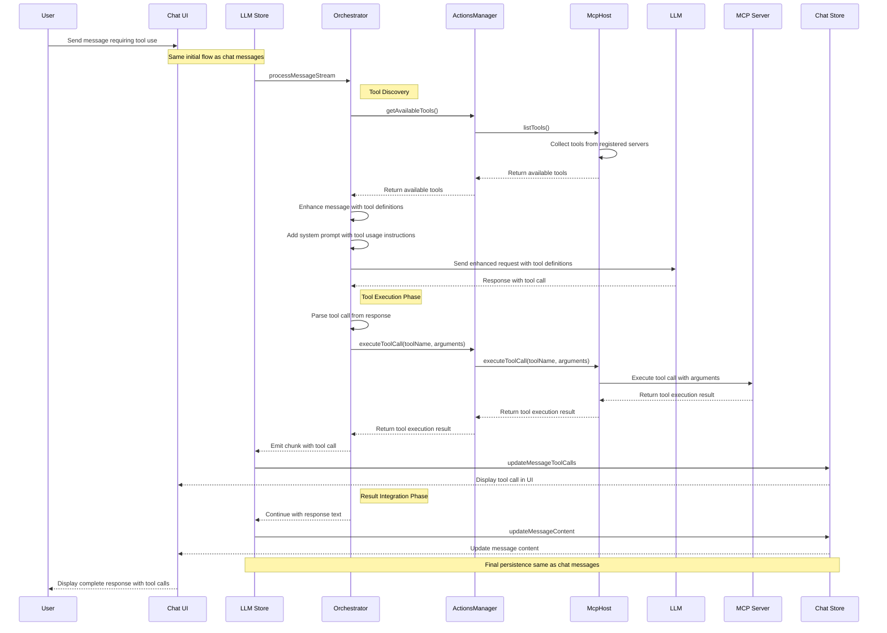
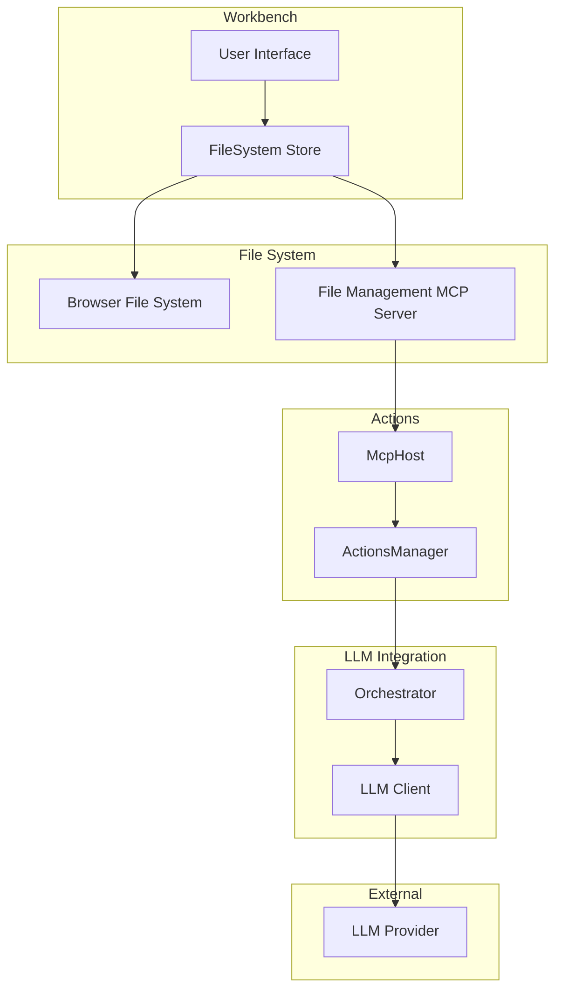
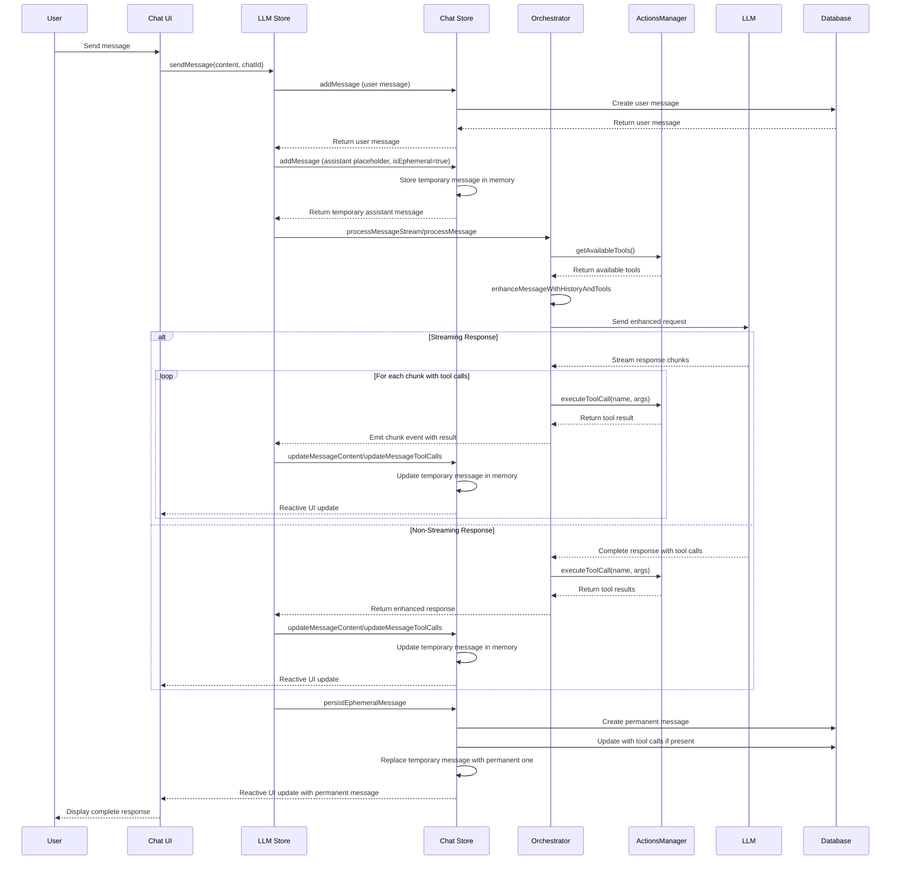
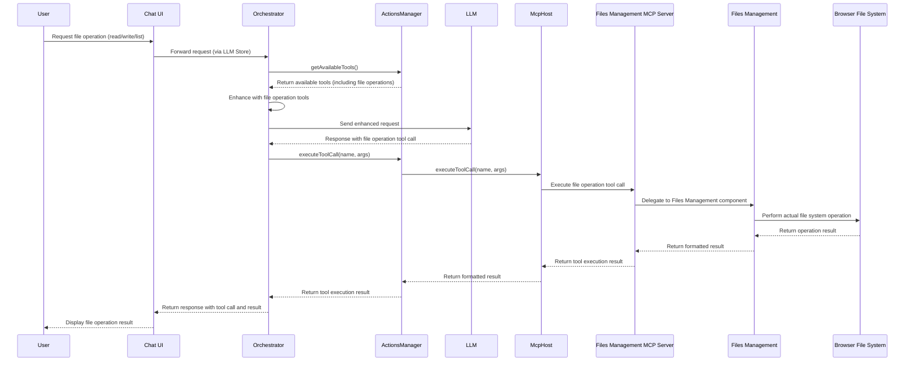
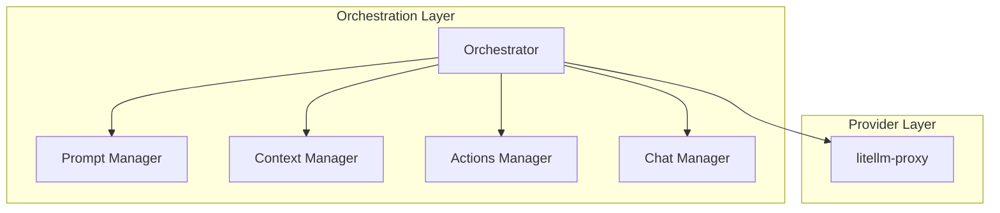

# LLM Integration Package

## Overview

Core orchestrator for LLM interactions, coordinating between different components to enhance LLM requests and managing interactions with the `litellm-proxy`. Focuses on LLM communication while delegating tool execution to the Actions package.

## Components and Responsibilities

### 1. Types (`types.ts`)

Defines core types for LLM integration:

- `LlmMessage`: Represents a message sent to the LLM.
- `LlmResponse`: Represents a response from the LLM.
- `LlmProviderConfig`: Configuration for the LLM provider.
- `LlmClient`: Interface for the LLM client.

### 2. LiteLLM LLM Client (`LiteLlmClient.ts`)

Implements the necessary interfaces to send messages and receive (streamed) responses:

- `LiteLlmClient`: Sends messages to the LiteLLM API and processes responses via the `litellm-proxy`.

### 3. Orchestrator (`Orchestrator.ts`)

The central component that:

- Enhances requests with context and tools using the ModelContextProtocol (MCP) SDK.
- Processes response streams.
- Delegates tool discovery and execution to the ActionsManager.

#### MCP Architecture

The MCP architecture follows these key principles:

1. **Separation of Concerns**: The Orchestrator focuses on LLM communication, while the ActionsManager handles tool registration and execution.

2. **Delegation Pattern**: The Orchestrator delegates all tool operations to the ActionsManager, avoiding direct MCP server interaction.

3. **Unified Tool Registry**: All available tools are registered and accessed through the ActionsManager, providing a single source of truth.

#### MCP Host-Client-Server Interaction Flow

The interaction between components follows this pattern:

1. **Initialization Phase**:
   - The ActionsManager initializes the McpHost and registers all MCP servers
   - The Orchestrator references the ActionsManager for tool discovery and execution

2. **Request Phase**:
   - User sends a message that might require tool execution
   - Orchestrator requests available tools from the ActionsManager
   - Orchestrator enhances the message with tool definitions
   - Enhanced message is sent to the LLM

3. **Response and Tool Execution Phase**:
   - LLM generates a response that includes tool calls
   - Orchestrator detects tool calls in the response
   - Orchestrator forwards tool execution requests to the ActionsManager
   - ActionsManager routes each request to the appropriate MCP server via McpHost
   - Results of the operations are returned to the Orchestrator

4. **Result Integration Phase**:
   - Orchestrator formats a response that includes both the LLM's text and the operation results
   - Final response is returned to the user

#### MCP Tool Interaction Pattern

#### System Prompt and Tool Definition

The Orchestrator injects a system prompt that instructs the LLM about available tools. This prompt:

1. Defines the available operations (file management, code execution, etc.)
2. Provides usage guidelines and examples
3. Sets expectations for when and how to use these tools

The system prompt is combined with formal tool definitions that specify:

- Tool names and descriptions
- Required and optional parameters
- Expected return values

#### MCP Integration for File Management

The architecture delegates file management operations to the ActionsManager, which manages the File Management MCP Server:

#### Dynamic Interaction for Chat Messages

In the chat interaction flow, the Orchestrator delegates tool execution to the ActionsManager:

#### File System Operations via MCP

File operations are routed through the ActionsManager, which delegates to the appropriate MCP server:

### 4. Main Entry Point (`index.ts`)

Exports the public API:

- `createLlmAdapter`: Function to create an LLM adapter using the provided configuration.
- Types and interfaces.

## System Diagram

## Core Responsibilities

### LLM Communication

- Handle interactions with the LLM provider:
  - Send enhanced requests
  - Process responses and streams
  - Parse tool calls from responses
  - Format tool results for display

### Request Enhancement

- Assemble enhanced requests using:
  - Chat history from Chat Manager
  - Enhanced prompts from Prompt Manager
  - Relevant context from Context Manager
  - Available tools from ActionsManager

### Tool Integration

- Discover available tools from ActionsManager
- Forward tool execution requests to ActionsManager
- Process tool execution results
- Integrate tool results into LLM responses

## External Relationships

- Uses ActionsManager for tool discovery and execution
- Manages LLM provider connections via the `litellm-proxy`
- Coordinates request enhancement flow

## Performance Considerations

- Efficient request assembly
- Smart provider selection
- Optimized context handling

## Future Enhancements

- Advanced request optimization
- Cross-provider load balancing
