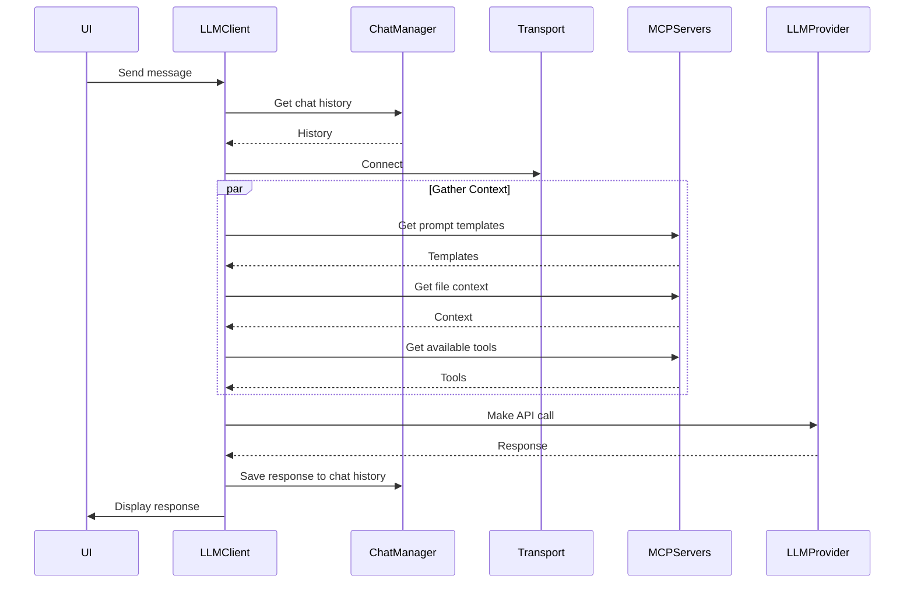

# LLM Integration Package

This package handles the integration with Large Language Models (LLMs) using the Model Context Protocol (MCP).

## Architecture

### Components

1. **LLMClient**

   - Makes LLM API calls with chat history
   - Uses ChatManager for conversation history
   - Formats messages in OpenAI format
   - Handles LLM-specific configuration

2. **LLMIntegrationHost**

   - Manages MCP servers and their lifecycle
   - Accepts injected transport layer
   - Maintains server registry

3. **MCP Servers**

   - Prompt Management: Manages prompt templates and enhancement
   - Context Management: Provides file/workspace context
   - Actions Management: Exposes available tools

4. **Transport Layer**
   - Handles communication between servers and clients
   - Can be stdio, HTTP/SSE, or custom implementation
   - Injected into host for flexibility

### Flow



## Dependencies

- **@piddie/chat-management**: Provides chat history management through ChatManager interface
- **@modelcontextprotocol/sdk**: MCP client for tool/prompt management
- **node-fetch**: For making HTTP requests to LLM API

## Usage Example

```typescript
// Create transport
const transport = new StdioServerTransport();

// Create and initialize host
const host = new LLMIntegrationHost(transport);
await host.initialize([
  { name: "prompt", server: new PromptManagementServer() },
  { name: "context", server: new ContextManagementServer() },
  { name: "actions", server: new ActionsManagementServer() }
]);

// Create LLM client
const llmClient = new LLMClient(
  chatManager, // From @piddie/chat-management
  mcpServerPath, // Path to MCP server
  baseUrl // Optional LLM API URL
);

// Connect to MCP server
await llmClient.connect();

// Send message with chat history
const response = await llmClient.chat(
  {
    message: "Hello",
    model: "gpt-4" // Optional
  },
  chatId
);

console.log(response.content);
```

## Benefits

1. **Decoupled Architecture**

   - Each component is independent
   - Easy to test and mock
   - Flexible transport layer

2. **Standardized Protocol**

   - Uses MCP for consistent communication
   - Can integrate third-party MCP servers
   - Well-defined interfaces

3. **Extensible**
   - Easy to add new servers
   - Support for multiple transport types
   - Pluggable LLM providers
