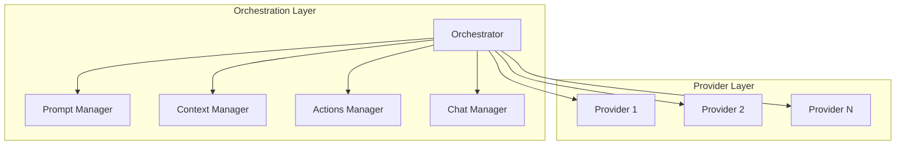

# LLM Integration Package

## Overview

Core orchestrator for LLM interactions, coordinating between different components to enhance LLM requests and managing multiple LLM providers.

## System Diagram

## Core Responsibilities

### MCP Host Implementation

- Coordinate with MCP servers:
  - Chat Manager for message history
  - Prompt Manager for enhancement
  - Context Manager for relevant context
  - Actions Manager for available tools

### Request Enhancement

- Assemble enhanced requests using:
  - Chat history
  - Enhanced prompts
  - Relevant context
  - Available tools

### Provider Management

- Handle multiple LLM providers
- Manage API connections
- Handle rate limiting
- Format provider-specific requests

## External Relationships

- Acts as MCP Host for other components
- Manages LLM provider connections
- Coordinates request enhancement flow

## Performance Considerations

- Efficient request assembly
- Smart provider selection
- Optimized context handling

## Future Enhancements

- Dynamic provider selection
- Advanced request optimization
- Cross-provider load balancing