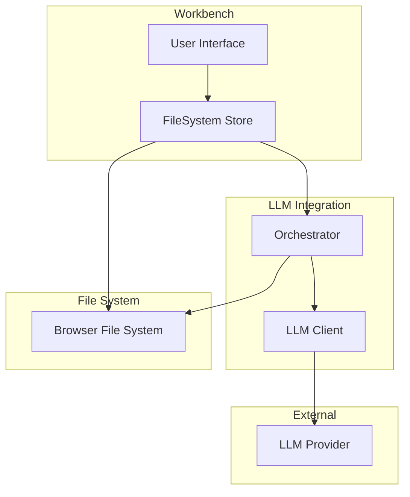
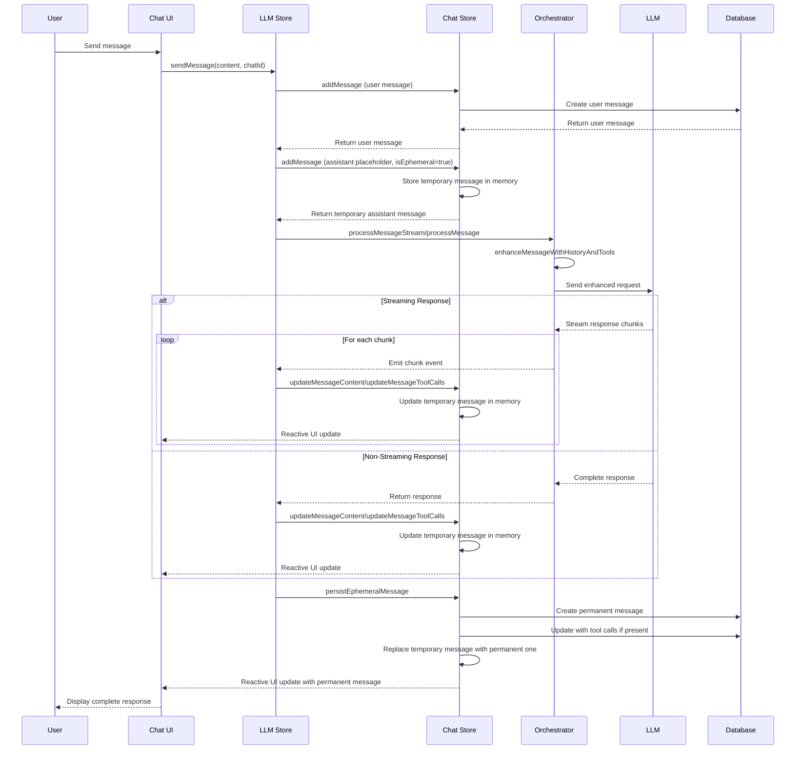
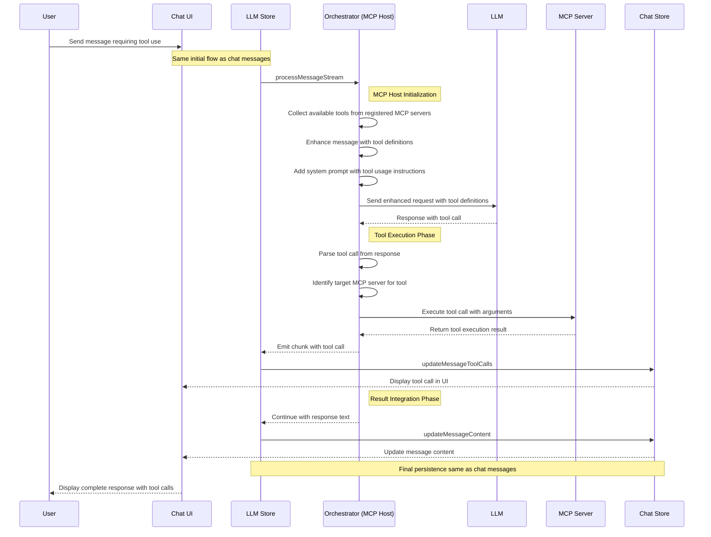
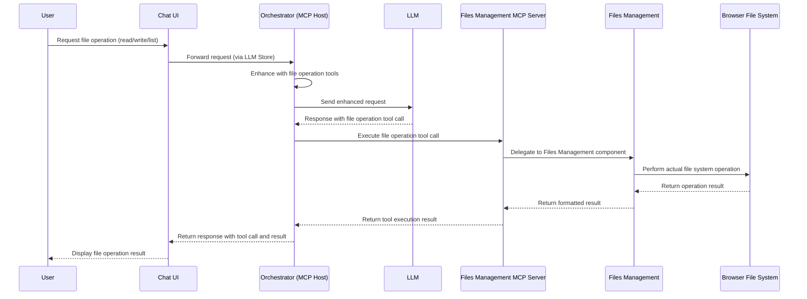
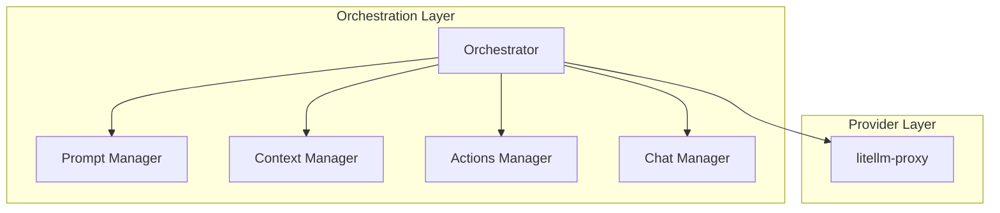

# LLM Integration Package

## Overview

Core orchestrator for LLM interactions, coordinating between different components to enhance LLM requests and managing interactions with the `litellm-proxy`.

## Components and Responsibilities

### 1. Types (`types.ts`)

Defines core types for LLM integration:

- `LlmMessage`: Represents a message sent to the LLM.
- `LlmResponse`: Represents a response from the LLM.
- `LlmProviderConfig`: Configuration for the LLM provider.
- `LlmClient`: Interface for the LLM client.

### 2. LiteLLM LLM Client (`LiteLlmClient.ts`)

Implements the necessary interfaces to send messages and receive (streamed) responses:

- `LiteLlmClient`: Sends messages to the LiteLLM API and processes responses via the `litellm-proxy`.

### 3. Orchestrator (`Orchestrator.ts`)

The central component that:

- Enhances requests with context and tools using the ModelContextProtocol (MCP) SDK.
- Processes response streams.
- Implements MCP host functionality.

#### System Prompt and Tool Definition

The Orchestrator injects a system prompt that instructs the LLM about available file management tools. This prompt:

1. Defines the available file operations (read, write, list, delete, create)
2. Provides usage guidelines and examples
3. Sets expectations for when and how to use these tools

The system prompt is combined with formal tool definitions that specify:

- Tool names and descriptions
- Required and optional parameters
- Expected return values

#### MCP Integration for File Management

The Orchestrator serves as an MCP host that connects the LLM with file management capabilities. This integration enables the LLM to read, write, and manipulate files in the browser's file system.

#### Dynamic Interaction for Chat Messages

#### MCP Tool Interaction Pattern

The Model Context Protocol (MCP) enables the LLM to interact with various tools and services through a standardized interface. The Orchestrator acts as an MCP Host that coordinates these interactions.

#### File System Operations via MCP

File operations are a specific implementation of the MCP tool interaction pattern. The Orchestrator interacts with the Files Management MCP Server, which delegates operations to the Files Management component.

The Files Management MCP Server provides a standardized interface for file operations that abstracts away the underlying file system implementation. This allows the LLM to interact with files without needing to know the details of the file system. The server implements tools such as:

- `read_file`: Read the contents of a file
- `write_file`: Write content to a file
- `list_files`: List files in a directory
- `delete_file`: Delete a file
- `create_directory`: Create a new directory

When the LLM needs to perform a file operation, it generates a tool call with the appropriate tool name and arguments. The Orchestrator routes this call to the Files Management MCP Server, which delegates the operation to the Files Management component. The component then performs the actual file system operation using the Browser File System API and returns the result.

This architecture provides a clean separation of concerns and allows the LLM to interact with the file system in a controlled and secure manner.

#### MCP Host-Client-Server Interaction Flow

For file operations (e.g., writing files), the interaction follows this sequence:

1. **Initialization Phase**:

   - The Orchestrator (MCP Host) receives the BrowserFileSystem instance from the workbench
   - Tool definitions are registered with the LLM client
   - System prompt is configured to instruct the LLM about available tools

2. **Request Phase**:

   - User sends a message requesting a file operation
   - Orchestrator enhances the message with context and tool definitions
   - Enhanced message is sent to the LLM

3. **Response and Tool Execution Phase**:

   - LLM generates a response that includes a tool call (e.g., write_file)
   - Orchestrator detects the tool call in the response
   - Orchestrator executes the file operation using the BrowserFileSystem
   - Results of the operation are captured

4. **Result Integration Phase**:
   - Orchestrator formats a new response that includes both the LLM's text and the operation results
   - Final response is returned to the user

### 4. Main Entry Point (`index.ts`)

Exports the public API:

- `createLlmAdapter`: Function to create an LLM adapter using the provided configuration.
- Types and interfaces.

## System Diagram

## Core Responsibilities

### MCP Host Implementation

- Coordinate with MCP servers:
  - Chat Manager for message history
  - Prompt Manager for enhancement
  - Context Manager for relevant context
  - Actions Manager for available tools

### Request Enhancement

- Assemble enhanced requests using:
  - Chat history
  - Enhanced prompts
  - Relevant context
  - Available tools

### LLM interaction

- Handle interactions with the `litellm-proxy`
- Manage API connections
- Handle rate limiting
- Format provider-specific requests

## External Relationships

- Acts as MCP Host for other components
- Manages LLM provider connections via the `litellm-proxy`
- Coordinates request enhancement flow

## Performance Considerations

- Efficient request assembly
- Smart provider selection
- Optimized context handling

## Future Enhancements

- Advanced request optimization
- Cross-provider load balancing
