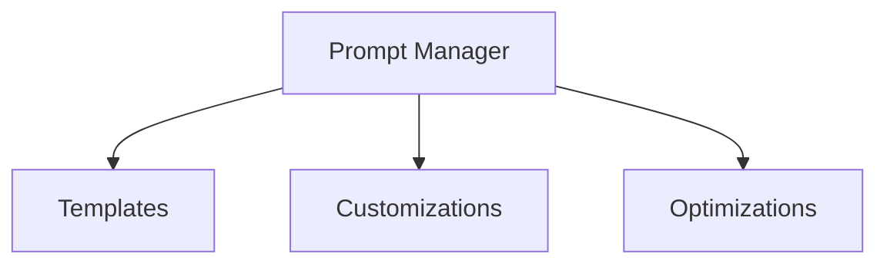

# Prompt Management Package

## Overview

Handles prompt engineering, optimization, and customization for LLM interactions. Acts as an MCP server providing prompt enhancement capabilities.

## System Diagram

## Core Responsibilities

### MCP Server Implementation

- Expose prompt enhancement capabilities
- Handle prompt template requests
- Provide customization interface

### Template Management

- Store and manage prompt templates
- Support project-specific templates
- Handle template versioning

### Prompt Optimization

- Apply best practices
- Optimize token usage
- Enhance clarity and specificity

### Customization

- Support user-defined prompts
- Handle project-specific customizations
- Manage prompt variants

## Performance Considerations

- Template caching
- Efficient prompt compilation
- Smart template selection

## Future Enhancements

- ML-based prompt optimization
- Advanced template management
- Context-aware prompt selection
