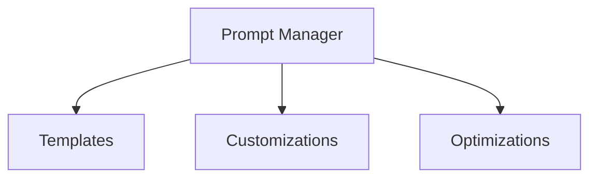

# Prompt Management Package

## Overview

Handles prompt engineering, optimization, and customization for LLM interactions. This package focuses on improving the quality and effectiveness of prompts sent to the LLM.

## System Diagram



## Core Responsibilities

### Prompt Enhancement

- **Template Management**:
  - Store and manage prompt templates
  - Support project-specific templates
  - Handle template versioning

- **Prompt Optimization**:
  - Apply best practices
  - Optimize token usage
  - Enhance clarity and specificity

- **Customization**:
  - Support user-defined prompts
  - Handle project-specific customizations
  - Manage prompt variants

## Usage

```typescript
// Example usage
const promptManager = new PromptManager();

// Enhance a prompt
const enhancedPrompt = await promptManager.enhance({
  basePrompt: "Help with code",
  context: {
    projectType: "typescript",
    task: "debugging"
  }
});
```

## Performance Considerations

- Template caching
- Efficient prompt compilation
- Smart template selection

## Future Enhancements

- ML-based prompt optimization
- Advanced template management
- Context-aware prompt selection
