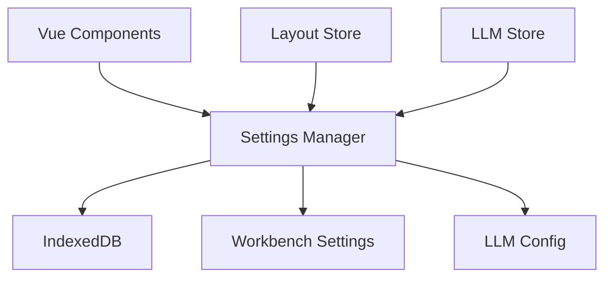

# Settings Package

## Overview

Provides persistent application settings management using IndexedDB for browser-based storage. The package manages two main types of settings:

1. Workbench UI settings (layout, panel dimensions)
2. LLM (Language Model) configuration settings

## Architecture



## Core Components

### SettingsManager

Single source of truth for application settings, providing:

- Typed settings access and updates
- Default values
- Migration handling
- Data serialization

```typescript
// Usage example
import { settingsManager } from "@piddie/settings";

// Get settings
const config = await settingsManager.getLlmConfig();
const layout = await settingsManager.getWorkbenchSetting(
  WorkbenchSettingKey.FILE_EXPLORER_WIDTH
);

// Update settings
await settingsManager.updateWorkbenchSetting(
  WorkbenchSettingKey.FILE_EXPLORER_WIDTH,
  250
);
```

## Settings Schema

### Workbench Settings

- File explorer width/collapse state
- Chat panel width/collapse state
- Selected LLM provider
- LLM configuration

### LLM Configuration

- API key
- Base URL
- Default/selected model
- Provider type
- Available models

## Usage

The package exports a singleton `settingsManager` instance that should be used throughout the application:

```typescript
import { settingsManager } from "@piddie/settings";
```

## Design Decisions

1. Uses IndexedDB for persistent storage
2. Single manager instance for consistent state
3. Type-safe settings access
4. Automatic migration handling
5. Default values for all settings
