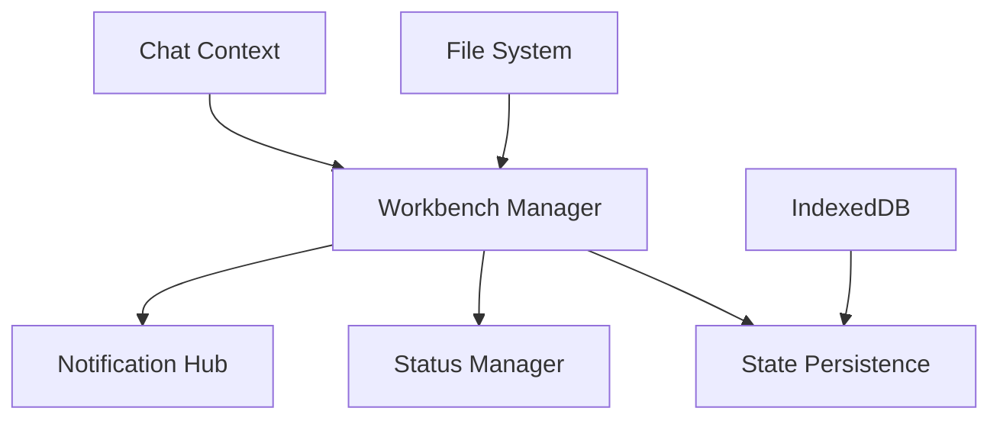

# Workbench Package

## Overview
Manages the overall IDE workspace state, persisting user preferences and session information across browser refreshes with comprehensive state management capabilities.

## System Diagram


## Core Components

### 1. Workbench Manager
- **Responsibilities**:
  - Manage workspace layout configuration
  - Track open files and tabs
  - Persist terminal sessions
  - Maintain preview states
  - Manage active project context
  - Track recent files/actions
  - Preserve scroll positions
  - Handle panel visibility states

### 2. State Persistence
- **Responsibilities**:
  - Automatically save workspace state
  - Enable session recovery
  - Persist layout configurations
  - Maintain cross-session continuity
  - Use IndexedDB for storage

### 3. Status Manager
- **Responsibilities**:
  - Aggregate status updates
  - Manage notification lifecycle
  - Handle stream subscriptions
  - Coordinate status display
  - Provide centralized status tracking

### 4. Notification Hub
- **Responsibilities**:
  - Display notifications
  - Manage notification lifecycle
  - Group related notifications
  - Handle notification actions
  - Provide progress tracking

## Key Design Decisions
- Comprehensive state preservation
- Minimal performance overhead
- Flexible layout management
- Robust notification system

## State Persistence Flow
```typescript
interface WorkspaceState {
  openFiles: string[];
  activeProject: string;
  terminalSessions: TerminalSession[];
  layoutConfig: LayoutConfiguration;
  recentActions: Action[];
}
```

## External Relationships
- Interfaces with File System
- Supports Chat Context tracking
- Provides state context to other components
- Enables cross-component state management

## Performance Considerations
- Debounced state updates
- Efficient storage mechanisms
- Minimal serialization overhead
- Incremental state tracking

## Security Features
- Secure state encryption
- Controlled state access
- Privacy-focused storage
- Sanitized state preservation

## Usage
```typescript
// Example of state management
const currentState = workbench.captureState();
await workbench.persistState(currentState);

// Restoring previous session
const previousState = await workbench.restoreState();
workbench.applyState(previousState);
```

## Future Enhancements
- Cloud synchronization of workspace state
- Machine learning-based state prediction
- Advanced state versioning
- Cross-device state migration

## Monitoring and Analytics
- State change tracking
- Performance impact assessment
- User interaction patterns
- Workspace optimization suggestions 